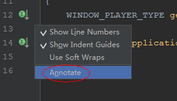
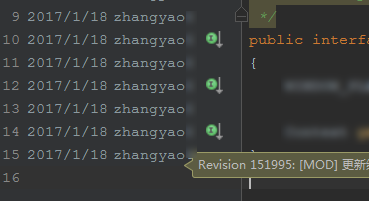
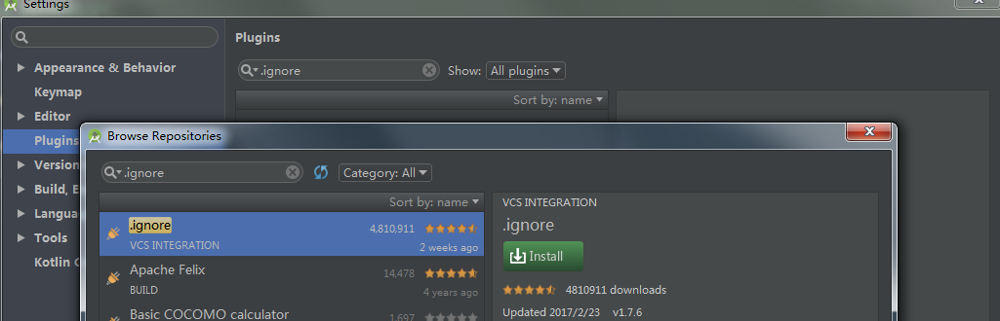
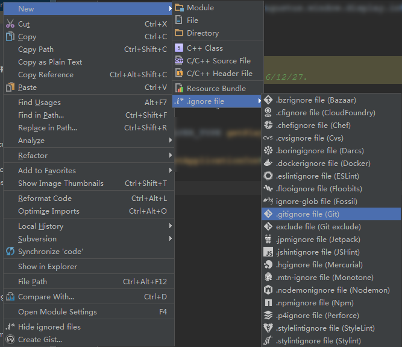

俗话说的好 **“工欲善其事，必先利其器”**，想必*Android Studio*（后面简称`AS`）已成为主流标准的开发工具了，相信大家已经使用的相当顺手了，在这里我给大家介绍几个AS的功能或者插件，也许可以帮大家进一步提升工作效率。

<!--more-->

## Annotate

在团队协作开发过程中，很多时候都需要知道某行代码最近一次是谁修改的，又是因为什么原因而修改，我们当然可以选择在团队即时通讯的群里或者直接在办公室大声询问，也或者可以通过其它工具查看这个文件的历史版本提交记录，但是这样通常非常的耗时和麻烦，结果难免会是群里没人响应你，大声询问嫌弃你，而如果这行代码提交过久，还需要你查阅很久以前的某个提交版本，心累啊。

现在告诉大家一个好方法，使用AS提供的`Annotate`功能（前提工程是使用版本控制的），如下图所示，用鼠标右键单击左边栏，在弹出的菜单中选择`Annotate`。

如果你是在AS中首次使用版本控制，会弹出对话框让你输入用户名和密码，输入成功后，会如下图显示的结果，就能发现是谁改动的代码了，其中包括代码提交的日期，作者名字，以及将鼠标悬浮在对应的行上面，还能看见这次提交的简介信息。

单击对应的行，还会弹出这次提交的更详细信息（包含涉及的所有文件）的对话框。

## .ignore插件

`.ignore` 插件可以方便的生成不同的版本控制系统需要忽略的文件，这样可以提交代码的时候得到一个干净的文件修改记录，在AS的插件页面中搜索`.ignore`并安装即可，如下图：

点击Install安装插件，完成后右击Android工程，按下图添加你对应的版本控制系统的`.ignore`文件即可。

---

`作者：Zyao89；转载请保留此行，谢谢；`
