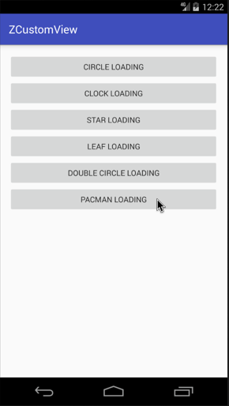

Android自定义动画系列五，今天来分享第五个自定义Loaidng动画（PacManBuilder），名字就叫`PacMan`吧，哎，这个动画并不是我想要的结果，还是老规矩先介绍，后上图。

**实现效果图在最后，GIF有点大，手机流量请三思。**

<!--more-->

## 介绍

首先依旧是声明，做这些动画的初衷是为了学习和分享，所以希望大家可以指点错误，让我更好的进步。从这里起，我做一个系列的加载动画（截止时间：我放弃的时候）。
上一个动画链接：[Android自定义加载动画-画两个圈圈](https://zyao89.cn/2017/03/25/Android自定义加载动画-DoubleCircleBuilder/)

## 正文

灵感来源于生活，生活的源泉就是游戏了。所以今天分享的动画就是吃豆豆的主角了，废话不多说了，直接来源码，如下：

首先初始化

```java
    @Override
    protected void initParams(Context context)
    {
        float outR = getAllSize();
        float inR = outR * 0.7f;
        mMaxMoveRange = getIntrinsicWidth() + 2 * inR; //移动距离范围
        initPaint();//圆范围
        mMouthAngle = MAX_MOUTH_ANGLE;//嘴度数
        HorizontalAngle = 0;//水平翻转度数
        mDefaultStartMoveX = -mMaxMoveRange * 0.5f;//默认偏移量
        mMoveDistance = 0;//移动距离
        mOuterCircleRectF = new RectF(getViewCenterX() - inR, getViewCenterY() - inR, getViewCenterX() + inR, getViewCenterY() + inR);
    }

    private void initPaint()
    {
        mFullPaint = new Paint(Paint.ANTI_ALIAS_FLAG);
        mFullPaint.setStyle(Paint.Style.FILL);
        mFullPaint.setColor(Color.WHITE);
        mFullPaint.setDither(true);
        mFullPaint.setFilterBitmap(true);
        mFullPaint.setStrokeCap(Paint.Cap.ROUND);
        mFullPaint.setStrokeJoin(Paint.Join.ROUND);
    }

```

接着，是绘制了，先把画布向左平移，平移的距离是动态的，然后让画布旋转，旋转是水平翻转（角度是0或180），最后一步就是画出这张嘴了。如下：

```java
    @Override
    protected void onDraw(Canvas canvas)
    {
        canvas.save();
        canvas.translate(mDefaultStartMoveX + mMoveDistance, 0);
        canvas.rotate(HorizontalAngle, getViewCenterX(), getViewCenterY());
        canvas.drawArc(mOuterCircleRectF, mMouthAngle, 360 - mMouthAngle * 2, true, mFullPaint);
        canvas.restore();
    }

```

这里是动画参数回调的地方，分辨对左右两个方向的动画进行分开表现，后面是对嘴巴张开的角度单独进行动画。具体细节可前往Github上查看。

```java
    @Override
    protected void computeUpdateValue(@FloatRange(from = 0.0, to = 1.0) float animatedValue)
    {
        int half = FINAL_STATE / 2 + 1;
        float step = mMaxMoveRange / half;
        if (mCurrAnimatorState < half)//以下分为两个阶段
        {//向右
            HorizontalAngle = 0;
            mMoveDistance = mLastMoveDistance + step * animatedValue;
        }
        else
        {//向左
            HorizontalAngle = 180;
            mMoveDistance = mLastMoveDistance - step * animatedValue;
        }
        //嘴张开度数
        if (mCurrAnimatorState % 2 == 0)
        {
            mMouthAngle = (int) (MAX_MOUTH_ANGLE * (animatedValue)) + 5;
        }
        else
        {
            mMouthAngle = (int) (MAX_MOUTH_ANGLE * (1 - animatedValue)) + 5;
        }
    }

```

这里对循环进行了9个阶段分层，每个阶段都会计算出当前阶段动画位移的最大距离。具体可参考Github，网址在文章最下方。

```java

    @Override
    public void onAnimationRepeat(Animator animation)
    {
        if (++mCurrAnimatorState > FINAL_STATE)
        {//还原到第一阶段
            mCurrAnimatorState = 0;
        }
        //矫正
        int half = FINAL_STATE / 2 + 1;
        float stepRange = mMaxMoveRange / half;
        if (mCurrAnimatorState < half)
        {
            mLastMoveDistance = stepRange * mCurrAnimatorState;
        }
        else
        {
            mLastMoveDistance = stepRange * (half - mCurrAnimatorState % half);
        }
    }

```

## 总结

小伙伴们，要是想看更多细节，可以前往文章最下面的Github链接，如果大家觉得ok的话，希望能给个喜欢，最渴望的是在Github上给个star。谢谢了。

如果大家有什么更好的方案，或者想要实现的加载效果，可以给我留言或者私信我，我会想办法实现出来给大家。谢谢支持。

## 演示



Github：[zyao89/ZCustomView](https://github.com/zyao89/ZCustomView)

`作者：Zyao89；转载请保留此行，谢谢；`

个人博客：[zyao89.cn](http://zyao89.github.io)
