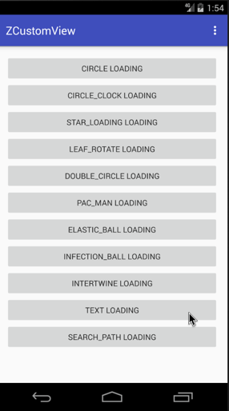
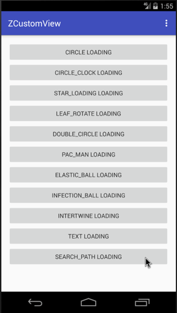

Android自定义动画系列十，先介绍下第九个Loading动画（TextBuilder），只是个简单的文字动画，不做仔细介绍了，效果如下：

<!--more-->



> 上一篇介绍了[Android自定义加载动画库zLoading](https://zyao89.cn/2017/04/10/Android自定义加载动画库zLoading/)的使用方式，欢迎戳入！

**重点：**今天来分享第十个自定义Loading动画（SearchPathBuilder），可用与对数据库的查询，或者对网络数据的获取搜索等操作的等待页面，效果如下。

## 效果图



## 正文

这个动画是运用Path和PathMeasure 来完成的，顾名思义，PathMeasure是一个用来测量Path的类，主要方法如下：

构造方法

方法名|释义
---|---
PathMeasure()|创建一个空的PathMeasure
PathMeasure(Path path, boolean forceClosed)|创建 PathMeasure 并关联一个指定的Path(Path需要已经创建完成)。

公共方法

返回值|方法名|释义
---|---|---
void|setPath(Path path, boolean forceClosed)|关联一个Path
boolean|isClosed()|是否闭合
float|getLength()|获取Path的长度
boolean|nextContour()|跳转到下一个轮廓
boolean|getSegment(float startD, float stopD, Path dst, boolean startWithMoveTo)|截取片段
boolean|getPosTan(float distance, float[] pos, float[] tan)|获取指定长度的位置坐标及该点切线值
boolean|getMatrix(float distance, Matrix matrix, int flags)|获取指定长度的位置坐标及该点Matrix

> **这里有三点需要注意的地方：**

1. 不论`forceClosed` 设置为何种状态(true 或者 false)， 都不会影响原有 `Path` 的状态，即 `Path` 与 `PathMeasure` 关联之后，之前的的 Path 不会有任何改变。
2. `forceClosed` 的设置状态可能会影响测量结果，如果 Path 未闭合但在与 `PathMeasure` 关联的时候设置 `forceClosed` 为 true 时，测量结果可能会比 Path 实际长度稍长一点，获取到到是该 Path 闭合时的状态。
3. 在使用 `getSegment` 时，更改 `mDrawPath` 的内容后可能绘制会出现问题，为了兼容性给 `mDrawPath` 添加一个单个操作，例如:  `mDrawPath.lineTo(0, 0);`

简单的方法介绍到这里，注释在代码里，下面看下代码：

```java
    //初始化画笔
    private void initPaint()
    {
        mPaint = new Paint(Paint.ANTI_ALIAS_FLAG);
        mPaint.setStyle(Paint.Style.STROKE);
        mPaint.setStrokeWidth(15);
        mPaint.setColor(Color.BLACK);
        mPaint.setDither(true);
        mPaint.setFilterBitmap(true);
        mPaint.setStrokeCap(Paint.Cap.ROUND);
        mPaint.setStrokeJoin(Paint.Join.ROUND);
    }

    //初始化
    private void initPathMeasure()
    {
        mDrawPath = new Path();//最终绘制的路径
        mPathMeasure = new PathMeasure();
    }

    //初始化路径
    private void initPaths()
    {
        float r = mR * 0.4f;//内圆半径

        mPath = new Path();//外圆路径
        mPath.addArc(new RectF(getViewCenterX() - mR, getViewCenterY() - mR, getViewCenterX() + mR, getViewCenterY() + mR), 45, 359.9f);
        mPathMeasure.setPath(mPath, false);
        float[] pos = new float[2];
        mPathMeasure.getPosTan(0, pos, null);

        mPathZoom = new Path();//内部放大镜路径
        mPathZoom.addArc(new RectF(getViewCenterX() - r, getViewCenterY() - r, getViewCenterX() + r, getViewCenterY() + r), 45, 359.9f);
        mPathZoom.lineTo(pos[0], pos[1]);
    }

    @Override
    protected void onDraw(Canvas canvas)
    {
        canvas.drawPath(mDrawPath, mPaint);
    }

    @Override
    protected void computeUpdateValue(ValueAnimator animation, @FloatRange(from = 0.0, to = 1.0) float animatedValue)
    {
        switch (mCurrAnimatorState)//状态切换
        {
            case 0:
            case 1://第一阶段
                resetDrawPath();//重置
                mPathMeasure.setPath(mPath, false);//绑定路径
                float stop = mPathMeasure.getLength() * animatedValue;
                float start = (float) (stop - ((0.5 - Math.abs(animatedValue - 0.5)) * 200f));
                mPathMeasure.getSegment(start, stop, mDrawPath, true);//截取片段
                break;
            case 2://第二阶段
                resetDrawPath();//重置
                mPathMeasure.setPath(mPath, false);
                stop = mPathMeasure.getLength() * animatedValue;
                start = 0;
                mPathMeasure.getSegment(start, stop, mDrawPath, true);
                break;
            case 3://第三阶段
                mPathMeasure.setPath(mPathZoom, false);
                stop = mPathMeasure.getLength();
                start = stop * (1 - animatedValue);
                mPathMeasure.getSegment(start, stop, mDrawPath, true);
                break;
            default:
                break;
        }
    }

    @Override
    public void onAnimationRepeat(Animator animation)
    {
        if (++mCurrAnimatorState > FINAL_STATE)
        {//还原到第一阶段
            mCurrAnimatorState = 0;
        }
    }

    //这里是复用重置，并且修复一个无法绘制的问题
    private void resetDrawPath()
    {
        mDrawPath.reset();
        mDrawPath.lineTo(0, 0);//不知道什么坑
    }
```

这里解释下getSegment，方法如下：

```java
 boolean getSegment (float startD, float stopD, Path dst, boolean startWithMoveTo)
```

参数| 作用| 备注
---|---|---
返回值(boolean)| 判断截取是否成功| true 表示截取成功，结果存入dst中，false 截取失败，不会改变dst中内容
startD| 开始截取位置距离 Path 起点的长度| 取值范围: 0 <= startD < stopD <= Path总长度
stopD| 结束截取位置距离 Path 起点的长度| 取值范围: 0 <= startD < stopD <= Path总长度
dst| 截取的 Path 将会添加到 dst 中| 注意: 是添加，而不是替换
startWithMoveTo| 起始点是否使用 moveTo| 用于保证截取的 Path 第一个点位置不变

## ZLoading库的使用方式

ZLoading库: [Android自定义加载动画库zLoading](https://zyao89.cn/2017/04/10/Android自定义加载动画库zLoading/)

## 总结

小伙伴们，要是想看更多细节，可以前往文章最下面的Github链接，如果大家觉得ok的话，希望能给个喜欢，最渴望的是在Github上给个star。谢谢了。

如果大家有什么更好的方案，或者想要实现的加载效果，可以给我留言或者私信我，我会想办法实现出来给大家。谢谢支持。

Github：[zyao89/ZCustomView](https://github.com/zyao89/ZCustomView)

`作者：Zyao89；转载请保留此行，谢谢；`

个人博客：[https://zyao89.cn](https://zyao89.cn)
