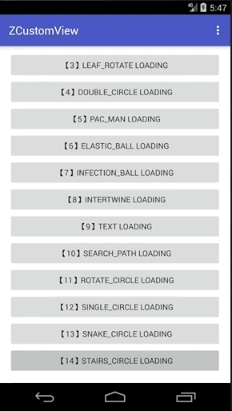

> Android自定义动画系列十四，今天来分享第14个自定义动画，一个递增的楼梯动画（STAIRS_CIRCLE），此动画灵感来自于评论区，很感谢。

## 介绍

废话不多说，先看看效果吧，如下：



## 正文

今天在简书收到了一个评论，内容大致如下：
> 可不可以来一个自增的阶梯动画？

看到这条评论后，我很激动，突然又有了当年写Android代码的热情了。虽然我已经一年多不在开发Android应用，但是Android带给我的激情，至今不曾忘却。

今晚再一次打开Android Studio，熟悉的界面，有点陌生的快捷键，哈哈。（编不下去...）

今晚抽空维护下以前的动画库，写了一个基类，新增了一个小动画，希望大家可以喜欢。

不过，我还是很希望大家可以多多留言，多多建议，多多评论。可以在任何地方。如果想让我能够看见，还是希望在 Github：[zyao89/ZCustomView](https://github.com/zyao89/ZCustomView) 项目里，或者 [我的个人网站博客](https://zyao89.cn) 里进行留言。

使用方式与以往一致，可参考[Android自定义加载动画库zLoading](../Android自定义加载动画库zLoading/README.md)

部分代码如下：

```java

/**
 * Created by zyao89 on 2018/3/10.
 * Contact me at 305161066@qq.com or zyao89@gmail.com
 * For more projects: https://github.com/zyao89
 * My Blog: https://zyao89.cn
 */
public class StairsPathBuilder extends BaseStateBuilder
{
    private final int FLOOR_NUM = 6;
    private Paint       mPaint;
    private float       mR;
    private Path        mPath;
    private Path        mPathFinal;
    private PathMeasure mPathMeasure;
    private Path        mDrawPath;

    @Override
    protected int getStateCount()
    {
        return 3;
    }

    @Override
    protected void initParams(Context context, Paint paint)
    {
        mPaint = paint;
        mR = getAllSize();
        initPathMeasure();
        initPaths();
    }

    private void initPaths()
    {
        mPath = new Path();
        float space = mR * 2 / FLOOR_NUM;
        float startXP = getViewCenterX() - mR;
        float startYP = getViewCenterY() + mR;

        mPath.moveTo(startXP, startYP);
        for (int i = 0; i < FLOOR_NUM; I++)
        {
            mPath.lineTo((i) * space + startXP, startYP - space * (i + 1));
            mPath.lineTo((i + 1) * space + startXP, startYP - space * (i + 1));
        }

        mPathFinal = new Path(mPath);
        mPathFinal.lineTo((FLOOR_NUM) * space + startXP, startYP);
        mPathFinal.lineTo(startXP, startYP);
    }

    private void initPathMeasure()
    {
        mDrawPath = new Path();
        mPathMeasure = new PathMeasure();
    }

    @Override
    protected void onComputeUpdateValue(ValueAnimator animation, float animatedValue, int state)
    {
        switch (state)
        {
            case 0:
            case 1:
                resetDrawPath();
                mPathMeasure.setPath(mPath, false);
                float stop = mPathMeasure.getLength() * animatedValue;
                float start = (float) (stop - ((0.5 - Math.abs(animatedValue - 0.5)) * 200f));
                mPathMeasure.getSegment(start, stop, mDrawPath, true);
                break;
            case 2:
                resetDrawPath();
                mPathMeasure.setPath(mPathFinal, false);
                stop = mPathMeasure.getLength() * animatedValue;
                start = 0;
                mPathMeasure.getSegment(start, stop, mDrawPath, true);
                break;
            case 3:
                resetDrawPath();
                mPathMeasure.setPath(mPathFinal, false);
                stop = mPathMeasure.getLength() * (1 - animatedValue);
                start = 0;
                mPathMeasure.getSegment(start, stop, mDrawPath, true);
                break;
            default:
                break;
        }
    }

    @Override
    protected void onDraw(Canvas canvas)
    {
        canvas.drawPath(mDrawPath, mPaint);
    }

    @Override
    protected void prepareStart(ValueAnimator valueAnimator)
    {
        valueAnimator.setInterpolator(new DecelerateInterpolator());
    }

    private void resetDrawPath()
    {
        mDrawPath.reset();
        mDrawPath.lineTo(0, 0);
    }
}
```

这次注释很少，请见谅我的懒。

## 总结

小伙伴们，要是想看更多细节，可以前往文章最下面的Github链接，如果大家觉得ok的话，希望能给个喜欢，最渴望的是在Github上给个star。谢谢了。

如果大家有什么更好的方案，或者想要实现的加载效果，可以给我留言或者私信我，我会想办法实现出来给大家。谢谢支持。

Github：[zyao89/ZCustomView](https://github.com/zyao89/ZCustomView)

`作者：Zyao89；转载请保留此行，谢谢；`

个人博客：[https://zyao89.cn](https://zyao89.cn)
