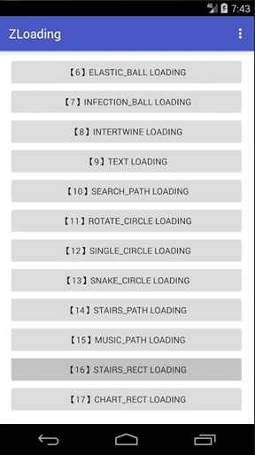

> Android自定义动画系列十六、十七，今天分享的是第16、17两个自定义动画。第16个递增的方块（STAIRS_RECT）。第17个跳动的柱状图（CHART_RECT）。

## 介绍

废话不多说，先看看效果吧，如下：

1. STAIRS_RECT 递增方块：


2. CHART_RECT 跳动的柱状图：


## 正文

今天为了完成任务，新增了两个小动画`递增方块` 和 `跳动的柱状图`，希望大家可以喜欢。

希望大家可以多多留言，多多建议，多多评论。可以在任何地方。如果想让我能够看见，还是希望在 Github：[zyao89/ZCustomView](https://github.com/zyao89/ZCustomView) 项目里，或 [我的博客](https://zyao89.cn) 里进行留言。

使用方式与以往一致，可参考[Android自定义加载动画库zLoading](../Android自定义加载动画库zLoading/README.md)

部分核心代码如下：

```java
/**
 * Created by zyao89 on 2018/3/17.
 * Contact me at 305161066@qq.com or zyao89@gmail.com
 * For more projects: https://github.com/zyao89
 * My Blog: https://zyao89.cn
 */
public class ChartRectBuilder extends BaseStateBuilder
{
    /**
     * 总数
     */
    private final int      SUM_NUM               = 5;
    /**
     * 动画间隔时长
     */
    private final int      ANIMATE_DURATION_TIME = 500;
    /**
     * 当前
     */
    private volatile int   mCurrStateNum         = 0;
    private volatile float mCurrAnimatedValue    = 0;
    private Paint mPaint;
    private float mR;
    private RectF mStairRectF;

    @Override
    protected int getStateCount()
    {
        return SUM_NUM + 1;
    }

    @Override
    protected void initParams(Context context, Paint paint)
    {
        mPaint = paint;
        mPaint.setStyle(Paint.Style.FILL_AND_STROKE);
        mR = getAllSize();
        mStairRectF = new RectF();
    }

    @Override
    protected void onComputeUpdateValue(ValueAnimator animation, float animatedValue, int state)
    {
        mCurrStateNum = state;
        mCurrAnimatedValue = animatedValue;
    }

    @Override
    protected void onDraw(Canvas canvas)
    {
        // 高度
        float floorHeight = mR * 2 / SUM_NUM;
        float space = floorHeight * 0.5f;
        // 起点
        float startXP = getViewCenterX() - mR;
        float startYP = getViewCenterY() + mR;

        // 清
        mStairRectF.setEmpty();
        for (int i = 0; i < SUM_NUM; I++)
        {
            if (i > mCurrStateNum)
            {// 限制层
                break;
            }
            float offsetHV = (0.5f - Math.abs(mCurrAnimatedValue - 0.5f)) * floorHeight;
            int j = i % 3;
            if (i == mCurrStateNum)
            {// 当前
                mStairRectF.set(startXP + i * floorHeight, startYP - (j + 1) * floorHeight * mCurrAnimatedValue, startXP + (i + 1) * floorHeight - space, startYP);
            }
            else
            {
                mStairRectF.set(startXP + i * floorHeight, startYP - (j + 1) * floorHeight - offsetHV, startXP + (i + 1) * floorHeight - space, startYP);
            }
            canvas.drawRect(mStairRectF, mPaint);
        }
    }

    @Override
    protected void prepareStart(ValueAnimator animation)
    {
        // 动画间隔
        animation.setDuration(ANIMATE_DURATION_TIME);
    }

    @Override
    protected void prepareEnd()
    {
        mCurrStateNum = 0;
        mCurrAnimatedValue = 0;
    }
}
```

注释很少，请见谅我的懒。

## 总结

小伙伴们，要是想看更多细节，可以前往文章最下面的Github链接，如果大家觉得ok的话，希望能给个喜欢，最渴望的是在Github上给个star。谢谢了。

如果大家有什么更好的方案，或者想要实现的加载效果，可以给我留言或者私信我，我会想办法实现出来给大家。谢谢支持。

Github：[zyao89/ZCustomView](https://github.com/zyao89/ZCustomView)

`作者：Zyao89；转载请保留此行，谢谢；`

个人博客：[https://zyao89.cn](https://zyao89.cn)
