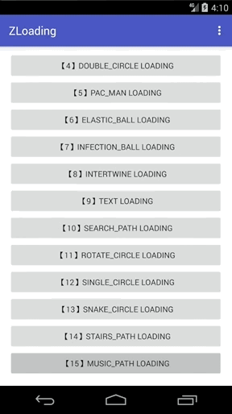

> Android自定义动画系列十五，今天来分享第15个自定义动画，一个跳动的音符动画（MUSIC_PATH）。

## 介绍

废话不多说，先看看效果吧，如下：



## 正文

今天又有一个新灵感，新增了一个小动画`跳动的音符`，希望大家可以喜欢。

希望大家可以多多留言，多多建议，多多评论。可以在任何地方。如果想让我能够看见，还是希望在 Github：[zyao89/ZCustomView](https://github.com/zyao89/ZCustomView) 项目里，或者 [我的个人网站博客](https://zyao89.cn) 里进行留言。

使用方式与以往一致，可参考[Android自定义加载动画库zLoading](../Android自定义加载动画库zLoading/README.md)

部分代码如下：

```java
/**
 * Created by zyao89 on 2018/3/11.
 * Contact me at 305161066@qq.com or zyao89@gmail.com
 * For more projects: https://github.com/zyao89
 * My Blog: https://zyao89.cn
 */
public class MusicPathBuilder extends BaseStateBuilder
{
    private final int MUSIC_LINE_COUNT = 5;
    private Paint mPaint;
    private float mR;

    private LinkedList<Path>       mMusicPaths;
    private LinkedList<Path>       mMusicDrawPaths;
    private PathMeasure            mPathMeasure;
    private LinkedList<MusicParam> mMusicParams;
    private boolean mOpenJump = false;

    private DecelerateInterpolator mDecelerateInterpolator;
    private BounceInterpolator     mBounceInterpolator;

    @Override
    protected int getStateCount()
    {
        return 3;
    }

    @Override
    protected void initParams(Context context, Paint paint)
    {
        mPaint = paint;
        mPaint.setStrokeWidth(2);
        mR = getAllSize();
        initPaths();
        initPathMeasure();
        initMusicParams();
        initInterpolator();
    }

    private void initPaths()
    {
        mMusicPaths = new LinkedList<Path>();
        // 线长
        float lineW = mR * 2;
        // 线间距
        float space = mR * 2 / MUSIC_LINE_COUNT;
        // 起点
        float startXP = getViewCenterX() - mR;
        float startYP = getViewCenterY() + mR;

        // 五线谱
        for (int i = 0; i < MUSIC_LINE_COUNT; I++)
        {
            Path path = new Path();
            path.moveTo(startXP, startYP - (i * space));
            path.lineTo(startXP + lineW, startYP - (i * space));
            mMusicPaths.add(path);
        }
    }

    private void initPathMeasure()
    {
        mMusicDrawPaths = new LinkedList<>();
        // 五线谱
        for (int i = 0; i < MUSIC_LINE_COUNT; I++)
        {
            Path drawPath = new Path();
            mMusicDrawPaths.add(drawPath);
        }

        mPathMeasure = new PathMeasure();
    }

    private void initMusicParams()
    {
        float musicWidth = mR * 0.2f;
        float musicHeight = mR;
        mMusicParams = new LinkedList<>();

        float musicPointHeight = mR * 2 / MUSIC_LINE_COUNT;
        float left = getViewCenterX() - musicWidth / 2;
        float right = getViewCenterX() + musicWidth / 2;
        float top = getViewCenterY() + musicHeight - musicPointHeight * 1.5f;
        float bottom = getViewCenterY() + musicHeight - musicPointHeight * 0.5f;

        RectF rectF = new RectF(left - mR * 0.5f, top, right - mR * 0.5f, bottom);
        float offsetX = (float) (musicWidth * 0.5 * Math.cos(75));
        PointF sPointF = new PointF(rectF.right + offsetX, rectF.centerY());
        PointF ePointF = new PointF(rectF.right + offsetX, rectF.centerY() - musicHeight);
        MusicParam musicParam = new MusicParam(rectF, sPointF, ePointF);
        mMusicParams.add(musicParam);

        rectF = new RectF(left + mR * 0.5f, top - musicPointHeight, right + mR * 0.5f, bottom - musicPointHeight);
        offsetX = (float) (musicWidth * 0.5 * Math.cos(75));
        sPointF = new PointF(rectF.right + offsetX, rectF.centerY());
        ePointF = new PointF(rectF.right + offsetX, rectF.centerY() - musicHeight);
        musicParam = new MusicParam(rectF, sPointF, ePointF);
        mMusicParams.add(musicParam);
    }

    private void initInterpolator()
    {
        mDecelerateInterpolator = new DecelerateInterpolator();
        mBounceInterpolator = new BounceInterpolator();
    }

    @Override
    protected void onComputeUpdateValue(ValueAnimator animation, float animatedValue, int state)
    {
        switch (state)
        {
            case 0:
                animation.setInterpolator(mDecelerateInterpolator);
                resetDrawPath();
                for (int i = 0; i < MUSIC_LINE_COUNT; I++)
                {
                    mPathMeasure.setPath(mMusicPaths.get(i), false);
                    if (i % 2 == 0)
                    {
                        float stop = mPathMeasure.getLength() * animatedValue;
                        float start = (float) (stop - ((0.5 - Math.abs(animatedValue - 0.5)) * 200f));
                        mPathMeasure.getSegment(start, stop, mMusicDrawPaths.get(i), true);
                    }
                    else
                    {
                        float stop = mPathMeasure.getLength() * (1 - animatedValue);
                        float start = (float) (stop - ((0.5 - Math.abs((1 - animatedValue) - 0.5)) * 200f));
                        mPathMeasure.getSegment(start, stop, mMusicDrawPaths.get(i), true);
                    }
                }
                break;
            case 1:
                resetDrawPath();
                for (int i = 0; i < MUSIC_LINE_COUNT; I++)
                {
                    mPathMeasure.setPath(mMusicPaths.get(i), false);
                    if (i % 2 == 0)
                    {
                        float stop = mPathMeasure.getLength() * animatedValue;
                        float start = 0;
                        mPathMeasure.getSegment(start, stop, mMusicDrawPaths.get(i), true);
                    }
                    else
                    {
                        float stop = mPathMeasure.getLength();
                        float start = mPathMeasure.getLength() * (1 - animatedValue);
                        mPathMeasure.getSegment(start, stop, mMusicDrawPaths.get(i), true);
                    }
                }
                break;
            case 2:
                animation.setInterpolator(mBounceInterpolator);
                // jump
                mOpenJump = true;
                // 线间距
                float space = mR * 2 / MUSIC_LINE_COUNT;
                for (int i = 0; i < mMusicParams.size(); I++)
                {
                    MusicParam musicParam = mMusicParams.get(i);
                    if (i % 2 == 0)
                    {
                        musicParam.setOffsetY(animatedValue * space);
                    }
                    else
                    {
                        musicParam.setOffsetY((1 - animatedValue) * space);
                    }
                }
                break;
            case 3:
                // jump
                mOpenJump = true;
                // 线间距
                space = mR * 2 / MUSIC_LINE_COUNT;
                for (int i = 0; i < mMusicParams.size(); I++)
                {
                    MusicParam musicParam = mMusicParams.get(i);
                    if (i % 2 == 0)
                    {
                        musicParam.setOffsetY((1 - animatedValue) * space);
                    }
                    else
                    {
                        musicParam.setOffsetY(animatedValue * space);
                    }
                }
                break;
            default:
                break;
        }
    }

    @Override
    protected void onDraw(Canvas canvas)
    {
        for (Path drawPath : mMusicDrawPaths)
        {
            canvas.drawPath(drawPath, mPaint);
        }
        if (mOpenJump)
        {
            drawMusic(canvas);
        }
    }

    private void drawMusic(Canvas canvas)
    {
        for (MusicParam musicParam : mMusicParams)
        {
            mPaint.setStrokeWidth(4);
            canvas.save();
            RectF oldCircleRectF = musicParam.getCircleRectF();
            RectF circleRectF = new RectF(oldCircleRectF);
            float offsetY = musicParam.getOffsetY();
            circleRectF.set(oldCircleRectF.left, oldCircleRectF.top - offsetY, oldCircleRectF.right, oldCircleRectF.bottom - offsetY);
            canvas.rotate(75, circleRectF.centerX(), circleRectF.centerY());
            mPaint.setStyle(Paint.Style.FILL_AND_STROKE);
            canvas.drawOval(circleRectF, mPaint);
            mPaint.setStyle(Paint.Style.STROKE);
            canvas.restore();

            PointF startPointF = musicParam.getLineStartPointF();
            PointF endPointF = musicParam.getLineEndPointF();
            canvas.drawLine(startPointF.x, startPointF.y - offsetY, endPointF.x, endPointF.y - offsetY, mPaint);
            mPaint.setStrokeWidth(2);
        }
    }

    private void resetDrawPath()
    {
        mOpenJump = false;
        for (Path path : mMusicDrawPaths)
        {
            path.reset();
            path.lineTo(0, 0);
        }
        for (MusicParam musicParam : mMusicParams)
        {
            musicParam.clear();
        }
    }

    static class MusicParam
    {
        private final RectF  mCircleRectF;
        private final PointF mLineStartPointF;
        private final PointF mLineEndPointF;
        private float mOffsetY = 0;

        MusicParam(RectF rectF, PointF sPointF, PointF ePointF)
        {
            mCircleRectF = rectF;
            mLineStartPointF = sPointF;
            mLineEndPointF = ePointF;
        }

        RectF getCircleRectF()
        {
            return mCircleRectF;
        }

        PointF getLineStartPointF()
        {
            return mLineStartPointF;
        }

        PointF getLineEndPointF()
        {
            return mLineEndPointF;
        }

        float getOffsetY()
        {
            return mOffsetY;
        }

        void setOffsetY(float v)
        {
            mOffsetY = v;
        }

        void clear()
        {
            mOffsetY = 0;
        }
    }
}
```

注释很少，请见谅我的懒。

## 总结

小伙伴们，要是想看更多细节，可以前往文章最下面的Github链接，如果大家觉得ok的话，希望能给个喜欢，最渴望的是在Github上给个star。谢谢了。

如果大家有什么更好的方案，或者想要实现的加载效果，可以给我留言或者私信我，我会想办法实现出来给大家。谢谢支持。

Github：[zyao89/ZCustomView](https://github.com/zyao89/ZCustomView)

`作者：Zyao89；转载请保留此行，谢谢；`

个人博客：[https://zyao89.cn](https://zyao89.cn)
