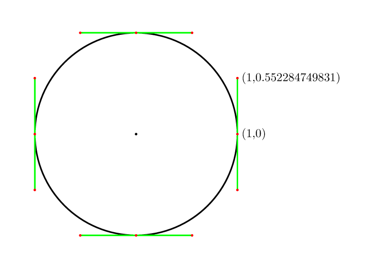
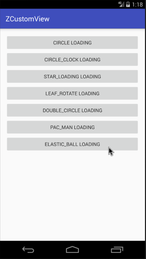

Android自定义动画系列六，今天来分享第六个自定义Loaidng动画（ElasticBallBuilder），我给他起了一个逼格很高的名字，叫`颤抖吧！球球`，这个动画让我绞尽脑汁，算数算的晕乎乎，不过结果还是很满意的，还是老规矩先介绍，效果图在最后面。

**实现效果图在最后，GIF有点大，手机流量请三思。**

> ⭐️这里我想问大家一个问题，这个最终效果图，是放在文章的 **开头** 好呢？还是放在 **结尾** 好呢？
大家评论里面给个建议吧。谢谢了。

<!--more-->

## 介绍

首先依旧是声明，做这些动画的初衷是为了学习和分享，所以希望大家可以指点错误，让我更好的进步。（系列加载动画的截止时间：我放弃的时候）。
上一个动画链接：[Android自定义加载动画-PacMan](https://zyao89.cn/2017/03/26/Android自定义加载动画-PacMan/)

## 正文

参数变量初始化，用处我都在代码里写了注释了，不懂得大家也可以问，有什么不对的，也希望大家帮忙指出，谢谢了。如下：

```java
    //动画间隔时间
    private static final long DURATION_TIME = 333;
    //最终阶段
    private static final int                     FINAL_STATE   = 2;
    //小球共5个位置
    private static final int                     SUM_POINT_POS = 5;
    //贝塞尔曲线常量
    private static final float                   PROP_VALUE    = 0.551915024494f;
    //小球点集合
    private final        LinkedList<CirclePoint> mBallPoints   = new LinkedList<>();
    //背景圆集合
    private final        LinkedList<CirclePoint> mBGCircles    = new LinkedList<>();
    private Paint mPaint;
    private float mBallR;
    private Path  mPath;
    //当前动画阶段
    private int mCurrAnimatorState = 0;
    //每个小球的偏移量
    private float mCanvasTranslateOffset;
    //当前状态是否翻转
    private boolean mIsReverse    = false;
    //当前小球的位置
    private int     mCurrPointPos = 0;
```

首先初始化参数，`mBallR` 为小球半径，`mCanvasTranslateOffset` 为小球之间的间距，`mPath` 路径，其它如注释：

```java
    @Override
    protected void initParams(Context context)
    {
        mBallR = getAllSize() / SUM_POINT_POS;
        mCanvasTranslateOffset = getIntrinsicWidth() / SUM_POINT_POS;
        mPath = new Path();
        initPaint(5);
        initPoints();
        initBGPoints();
    }

    /**
     * 背景圆点初始化
     */
    private void initBGPoints()
    {
        float centerX = getViewCenterX();
        float centerY = getViewCenterY();
        CirclePoint p_0 = new CirclePoint(centerX - mCanvasTranslateOffset * 2, centerY);
        CirclePoint p_1 = new CirclePoint(centerX - mCanvasTranslateOffset, centerY);
        CirclePoint p_2 = new CirclePoint(centerX, centerY);
        CirclePoint p_3 = new CirclePoint(centerX + mCanvasTranslateOffset, centerY);
        CirclePoint p_4 = new CirclePoint(centerX + mCanvasTranslateOffset * 2, centerY);

        p_0.setEnabled(false);//默认第一个圆不显示
        mBGCircles.add(p_0);
        mBGCircles.add(p_1);
        mBGCircles.add(p_2);
        mBGCircles.add(p_3);
        mBGCircles.add(p_4);
    }

```

这里很重要，很重要，重要。
这里初始化的是小球的各个点坐标，这里的小球是通过贝塞尔曲线绘制了，为了后面方便动画操作，所以球的绘制就会相对的繁琐了。

贝塞尔曲线画球的原理，如下：



具体标注点，请对照我注释中的P0～P11点，如下：

```java

    /**
     *      p10    p9      p8
     *      ------  ------
     * p11                     p7
     * |                       |
     * |                       |
     * p0 |      (0,0)         | p6
     * |                       |
     * |                       |
     * p1                      p5
     *      ------  ------
     *      p2      p3      p4
     */
    private void initPoints()
    {
        float centerX = getViewCenterX();
        float centerY = getViewCenterY();
        CirclePoint p_0 = new CirclePoint(centerX - mBallR, centerY);
        mBallPoints.add(p_0);
        CirclePoint p_1 = new CirclePoint(centerX - mBallR, centerY + mBallR * PROP_VALUE);
        mBallPoints.add(p_1);
        CirclePoint p_2 = new CirclePoint(centerX - mBallR * PROP_VALUE, centerY + mBallR);
        mBallPoints.add(p_2);
        CirclePoint p_3 = new CirclePoint(centerX, centerY + mBallR);
        mBallPoints.add(p_3);
        CirclePoint p_4 = new CirclePoint(centerX + mBallR * PROP_VALUE, centerY + mBallR);
        mBallPoints.add(p_4);
        CirclePoint p_5 = new CirclePoint(centerX + mBallR, centerY + mBallR * PROP_VALUE);
        mBallPoints.add(p_5);
        CirclePoint p_6 = new CirclePoint(centerX + mBallR, centerY);
        mBallPoints.add(p_6);
        CirclePoint p_7 = new CirclePoint(centerX + mBallR, centerY - mBallR * PROP_VALUE);
        mBallPoints.add(p_7);
        CirclePoint p_8 = new CirclePoint(centerX + mBallR * PROP_VALUE, centerY - mBallR);
        mBallPoints.add(p_8);
        CirclePoint p_9 = new CirclePoint(centerX, centerY - mBallR);
        mBallPoints.add(p_9);
        CirclePoint p_10 = new CirclePoint(centerX - mBallR * PROP_VALUE, centerY - mBallR);
        mBallPoints.add(p_10);
        CirclePoint p_11 = new CirclePoint(centerX - mBallR, centerY - mBallR * PROP_VALUE);
        mBallPoints.add(p_11);
    }

    /**
     * 初始化画笔
     */
    private void initPaint(float lineWidth)
    {
        mPaint = new Paint(Paint.ANTI_ALIAS_FLAG);
        mPaint.setStyle(Paint.Style.FILL_AND_STROKE);
        mPaint.setStrokeWidth(lineWidth);
        mPaint.setColor(Color.BLACK);
        mPaint.setDither(true);
        mPaint.setFilterBitmap(true);
        mPaint.setStrokeCap(Paint.Cap.ROUND);
        mPaint.setStrokeJoin(Paint.Join.ROUND);
    }

```

以下，开始了绘制工作了，`drawBG()` 绘制背景，在这里就不多介绍了；我们看下 `drawBall()` 方法，通过路径贝塞尔曲线绘制并连接一开始初始化的12个点坐标形成路径，最终绘制到画布上。

```java

    @Override
    protected void onDraw(Canvas canvas)
    {
        drawBG(canvas);
        drawBall(canvas);
    }

    /**
     * 绘制小球
     *
     * @param canvas
     */
    private void drawBall(Canvas canvas)
    {
        canvas.save();
        mPaint.setStyle(Paint.Style.FILL_AND_STROKE);
        float offsetX = mBGCircles.size() / 2 * mCanvasTranslateOffset;
        canvas.translate(-offsetX + mCanvasTranslateOffset * mCurrPointPos, 0);
        mPath.reset();
        mPath.moveTo(mBallPoints.get(0).getX(), mBallPoints.get(0).getY());
        mPath.cubicTo(mBallPoints.get(1).getX(), mBallPoints.get(1).getY(), mBallPoints.get(2).getX(), mBallPoints.get(2).getY(), mBallPoints.get(3).getX(), mBallPoints.get(3).getY());
        mPath.cubicTo(mBallPoints.get(4).getX(), mBallPoints.get(4).getY(), mBallPoints.get(5).getX(), mBallPoints.get(5).getY(), mBallPoints.get(6).getX(), mBallPoints.get(6).getY());
        mPath.cubicTo(mBallPoints.get(7).getX(), mBallPoints.get(7).getY(), mBallPoints.get(8).getX(), mBallPoints.get(8).getY(), mBallPoints.get(9).getX(), mBallPoints.get(9).getY());
        mPath.cubicTo(mBallPoints.get(10).getX(), mBallPoints.get(10).getY(), mBallPoints.get(11).getX(), mBallPoints.get(11).getY(), mBallPoints.get(0).getX(), mBallPoints.get(0).getY());
        canvas.drawPath(mPath, mPaint);
        canvas.restore();
    }

    /**
     * 绘制背景圆
     *
     * @param canvas
     */
    private void drawBG(Canvas canvas)
    {
        canvas.save();
        mPaint.setStyle(Paint.Style.STROKE);
        for (CirclePoint point : mBGCircles)
        {
            point.draw(canvas, mBallR, mPaint);
        }
        canvas.restore();
    }

```

这里是不同阶段对应的不同偏移量赋值，前三个阶段是针对顺序移动的操作，后三个阶段是对应的逆序时所需要的赋值操作，所有位移操作都是对小球的12点进行X轴方向的处理。

```java

    @Override
    protected void computeUpdateValue(ValueAnimator animation, @FloatRange(from = 0.0, to = 1.0) float animatedValue)
    {
        float offset = mCanvasTranslateOffset;
        int currState = mIsReverse ? mCurrAnimatorState + 3 : mCurrAnimatorState;
        switch (currState)
        {
            case 0:
                animation.setDuration(DURATION_TIME);
                animation.setInterpolator(new AccelerateInterpolator());
                mBallPoints.get(5).setOffsetX(animatedValue * offset);
                mBallPoints.get(6).setOffsetX(animatedValue * offset);
                mBallPoints.get(7).setOffsetX(animatedValue * offset);
                break;
            case 1:
                animation.setDuration(DURATION_TIME + 111);
                animation.setInterpolator(new DecelerateInterpolator());
                mBallPoints.get(2).setOffsetX(animatedValue * offset);
                mBallPoints.get(3).setOffsetX(animatedValue * offset);
                mBallPoints.get(4).setOffsetX(animatedValue * offset);
                mBallPoints.get(8).setOffsetX(animatedValue * offset);
                mBallPoints.get(9).setOffsetX(animatedValue * offset);
                mBallPoints.get(10).setOffsetX(animatedValue * offset);
                break;
            case 2:
                animation.setDuration(DURATION_TIME + 333);
                animation.setInterpolator(new BounceInterpolator());
                mBallPoints.get(0).setOffsetX(animatedValue * offset);
                mBallPoints.get(1).setOffsetX(animatedValue * offset);
                mBallPoints.get(11).setOffsetX(animatedValue * offset);
                break;
            case 3:
                animation.setDuration(DURATION_TIME);
                animation.setInterpolator(new AccelerateInterpolator());
                mBallPoints.get(0).setOffsetX((1 - animatedValue) * offset);
                mBallPoints.get(1).setOffsetX((1 - animatedValue) * offset);
                mBallPoints.get(11).setOffsetX((1 - animatedValue) * offset);
                break;
            case 4:
                animation.setDuration(DURATION_TIME + 111);
                animation.setInterpolator(new DecelerateInterpolator());
                mBallPoints.get(2).setOffsetX((1 - animatedValue) * offset);
                mBallPoints.get(3).setOffsetX((1 - animatedValue) * offset);
                mBallPoints.get(4).setOffsetX((1 - animatedValue) * offset);
                mBallPoints.get(8).setOffsetX((1 - animatedValue) * offset);
                mBallPoints.get(9).setOffsetX((1 - animatedValue) * offset);
                mBallPoints.get(10).setOffsetX((1 - animatedValue) * offset);
                break;
            case 5:
                animation.setDuration(DURATION_TIME + 333);
                animation.setInterpolator(new BounceInterpolator());
                mBallPoints.get(5).setOffsetX((1 - animatedValue) * offset);
                mBallPoints.get(6).setOffsetX((1 - animatedValue) * offset);
                mBallPoints.get(7).setOffsetX((1 - animatedValue) * offset);
                break;
        }
    }

```

在下面的方法中，对小球动画的各个阶段进行分布，各个点的偏移量进行重置，以及顺序倒序移动的切换逻辑进行判断，并且对背景圆也做了关联处理。

```java

    @Override
    public void onAnimationRepeat(Animator animation)
    {
        if (++mCurrAnimatorState > FINAL_STATE)
        {//还原到第一阶段
            mCurrAnimatorState = 0;

            /* 小球位置改变 */
            if (mIsReverse)
            {//倒序
                mCurrPointPos--;
            }
            else
            {//顺序
                mCurrPointPos++;
            }

            /* 重置并翻转动画过程 */
            if (mCurrPointPos >= SUM_POINT_POS - 1)
            {//倒序
                mIsReverse = true;
                mCurrPointPos = SUM_POINT_POS - 2;//I Don't Know
                for (int i = 0; i < mBGCircles.size(); i++)
                {
                    CirclePoint point = mBGCircles.get(i);
                    if (i == mBGCircles.size() - 1)
                    {
                        point.setEnabled(true);
                    }
                    else
                    {
                        point.setEnabled(false);
                    }

                }
            }
            else if (mCurrPointPos < 0)
            {//顺序
                mIsReverse = false;
                mCurrPointPos = 0;
                for (int i = 0; i < mBGCircles.size(); i++)
                {
                    CirclePoint point = mBGCircles.get(i);
                    if (i == 0)
                    {
                        point.setEnabled(false);
                    }
                    else
                    {
                        point.setEnabled(true);
                    }

                }
            }

            //每个阶段恢复状态，以及对背景圆的控制
            if (mIsReverse)
            {//倒序
                //恢复状态
                for (CirclePoint point : mBallPoints)
                {
                    point.setOffsetX(mCanvasTranslateOffset);
                }
                mBGCircles.get(mCurrPointPos + 1).setEnabled(true);
            }
            else
            {//顺序
                //恢复状态
                for (CirclePoint point : mBallPoints)
                {
                    point.setOffsetX(0);
                }
                mBGCircles.get(mCurrPointPos).setEnabled(false);
            }
        }
    }

```

圆点的内部类，封装了此动画中所涉及到的点和球的参数信息（小球的点与背景球都是复用此类的）

```java
    /**
     * 圆点内部类
     */
    private class CirclePoint
    {
        private final float mX;
        private final float mY;
        private float   mOffsetX = 0;
        private float   mOffsetY = 0;
        private boolean mEnabled = true;

        CirclePoint(float x, float y)
        {
            mX = x;
            mY = y;
        }

        float getX()
        {
            return mX + mOffsetX;
        }

        float getY()
        {
            return mY + mOffsetY;
        }

        void setOffsetX(float offsetX)
        {
            mOffsetX = offsetX;
        }

        void setOffsetY(float offsetY)
        {
            mOffsetY = offsetY;
        }

        public void setEnabled(boolean enabled)
        {
            mEnabled = enabled;
        }

        void draw(Canvas canvas, float r, Paint paint)
        {
            if (this.mEnabled)
            {
                canvas.drawCircle(this.getX(), this.getY(), r, paint);
            }
        }
    }

```

## 总结

小伙伴们，介绍就到这里了，要是想看更多细节，可以前往文章最下面的Github链接，如果大家觉得ok的话，希望能给个喜欢，最渴望的是在Github上给个star。谢谢了。

如果大家有什么更好的方案，或者想要实现的加载效果，可以给我留言或者私信我，我会想办法实现出来给大家。谢谢支持。

## 演示



Github：[zyao89/ZCustomView](https://github.com/zyao89/ZCustomView)

`作者：Zyao89；转载请保留此行，谢谢；`

个人博客：[zyao89.cn](http://zyao89.github.io)
