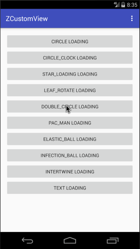

Android自定义动画总结更新一下，增加了对话框Dialog模式，今天来简单的分享下如何使用吧。效果图如下：

**GIF有点大，手机流量请三思。**

<!--more-->

## 效果图



## 目前拥有的类型

索引 | 类名 | 枚举值（Z_TYPE）| 昵称
:------:|:------:|:------:|:-------:
0|CircleBuilder | CIRCLE | 圆
1|ClockBuilder | CIRCLE_CLOCK | 计时器
2|StarBuilder | STAR_LOADING | 跳舞的星星
3|LeafBuilder | LEAF_ROTATE | 旋转的叶子
4|DoubleCircleBuilder | DOUBLE_CIRCLE | 画两个圈圈
5|PacManBuilder | PAC_MAN | PacMan
6|ElasticBallBuilder | ELASTIC_BALL | 颤抖吧！球球
7|InfectionBallBuilder | INFECTION_BALL | 感染体
8|IntertwineBuilder | INTERTWINE | 交织
9|TextBuilder | TEXT | 文字
10|SearchPathBuilder | SEARCH_PATH | 搜索等待
11|RotateCircleBuilder | ROTATE_CIRCLE | 多圆旋转
12|SingleCircleBuilder | SINGLE_CIRCLE | 单圆简单动画
13|SnakeCircleBuilder | SNAKE_CIRCLE | 引蛇出洞
14|StairsPathBuilder | STAIRS_CIRCLE | 舞动阶梯
15|MusicPathBuilder | MUSIC_PATH | 跳动音符
16|StairsRectBuilder | STAIRS_RECT | 递增方块
17|ChartRectBuilder | CHART_RECT | 跳动的柱状图

## 链接如下

[第一个，ClockBuilder](../Android自定义动画-ClockLoadingView/README.md)

[第二个，StarBuilder](../Android自定义动画-StarLoadingView/README.md)

[第三个，LeafBuilder](../旋转的叶子-LeafLoadingView/README.md)

[第四个，DoubleCircleBuilder](../Android自定义加载动画-DoubleCircleBuilder/README.md)

[第五个，PacManBuilder](../2017/03/26/Android自定义加载动画-PacMan/README.md)

[第六个，ElasticBallBuilder](../Android自定义加载动画-颤抖吧！球球/README.md)

[第七个，InfectionBallBuilder](../Android自定义加载动画-感染体/README.md)

[第八个，IntertwineBuilder](../Android自定义加载动画-交织/README.md)

## 引入

1. Gradle方式引用

```groovy
compile 'com.zyao89:zloading:1.0.0'
```

2. GitHub下载工程
[zyao89/ZCustomView](https://github.com/zyao89/ZCustomView)（这里应该比较新）

## 使用

1. 可以直接使用等待框模式，如下：

```java
ZLoadingDialog dialog = new ZLoadingDialog(MainActivity.this);
dialog.setLoadingBuilder(type)//设置类型
        .setLoadingColor(Color.BLACK)//颜色
        .setHintText("Loading...")
        .show();
```

2. 也可以直接使用LoadingView动画，如下：

```java
ZLoadingView zLoadingView_1 = (ZLoadingView) findViewById(R.id.loadingView_1);
zLoadingView_1.setLoadingBuilder(Z_TYPE.DOUBLE_CIRCLE);
zLoadingView_1.setColorFilter(Color.BLACK);
```

也可以如下使用xml配置：

```xml
<com.zyao89.view.zloading.ZLoadingView
        android:id="@+id/loadingView_1"
        android:layout_width="wrap_content"
        android:layout_height="wrap_content"
        app:z_type="DoubleCircleBuilder"
        app:z_color="@android:color/holo_green_light"/>
```

 效果实现图可以看前面几篇文章介绍的。

> **如果有什么需要补充的接口等，可以评论@我**

## 总结

小伙伴们，要是想看更多细节，可以前往文章最下面的Github链接，如果大家觉得ok的话，希望能给个喜欢，最渴望的是在Github上给个star。谢谢了。

如果大家有什么更好的方案，或者想要实现的加载效果，可以给我留言或者私信我，我会想办法实现出来给大家。谢谢支持。

Github：[zyao89/ZCustomView](https://github.com/zyao89/ZCustomView)

`作者：Zyao89；转载请保留此行，谢谢；`

个人博客：[https://zyao89.cn](https://zyao89.cn)
