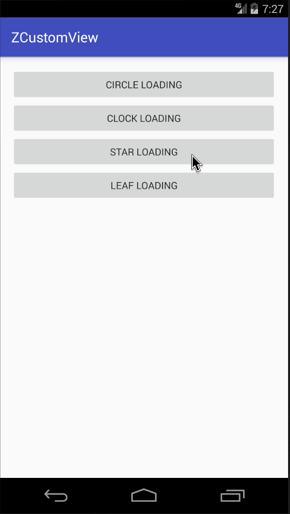

今天来分享第二个自定义loading的动画，起了个名字叫 `蹦跶的星星` ，还是老规矩先介绍，后上图。

**实现效果在最后，GIF有点大，手机流量慎重。**

## 介绍

首先声明做这个动画的初衷是为了学习和分享，所以从这里起，我准备做一个系列的加载动画（截止时间：我放弃的时候）。
上一个动画连接：[Android自定义动画-ClockLoadingView](https://zyao89.cn/2017/03/20/Android自定义动画-ClockLoadingView/)

<!--more-->

## 正文

阴影及下落的动画：

```java
    private final ValueAnimator.AnimatorUpdateListener mAnimatorUpdateListener = new ValueAnimator.AnimatorUpdateListener()
    {
        @Override
        public void onAnimationUpdate(ValueAnimator animation)
        {
            float value = (float) animation.getAnimatedValue();
            mOffsetTranslateY = getViewCenterY() * 0.4f * value;
            mShadowWidth = (mOffsetTranslateY + 10) * 0.9f;
        }
    };
```

初始化参数：

```java
    @Override
    protected void initParams(Context context)
    {
        mFullPaint = new Paint(Paint.ANTI_ALIAS_FLAG);
        mFullPaint.setStyle(Paint.Style.FILL_AND_STROKE);
        mFullPaint.setStrokeWidth(2);
        mFullPaint.setColor(Color.BLACK);
        mFullPaint.setDither(true);
        mFullPaint.setFilterBitmap(true);

        initValue(context);
        initAnimator();
    }

    private void initAnimator()
    {
        mShadowAnimator = ValueAnimator.ofFloat(0.0f, 1.0f, 0.0f);
        mShadowAnimator.setRepeatCount(Animation.INFINITE);
        mShadowAnimator.setDuration(ANIMATION_DURATION);
        mShadowAnimator.setStartDelay(ANIMATION_START_DELAY);
        mShadowAnimator.setInterpolator(new AccelerateDecelerateInterpolator());
    }

    private void initValue(Context context)
    {
        float allSize = getAllSize();
        mStarOutR = allSize - dip2px(context, 5);
        mStarOutMidR = mStarOutR * 0.9f;
        mStarInR = mStarOutMidR * 0.6f;
        mStarInMidR = mStarInR * 0.9f;
        mStartAngle = 0;
        mOffsetTranslateY = 0;

        //星路径
        mStarPath = createStarPath(5, -18);

        //阴影宽度
        mShadowWidth = mStarOutR;
        mOvalRectF = new RectF();
    }

```

绘制步骤，这里是通过偏移和旋转画布来实现部分动画的。

```java

    @Override
    protected void onDraw(Canvas canvas)
    {
        canvas.save();
        canvas.translate(0, mOffsetTranslateY);
        canvas.rotate(mStartAngle, getViewCenterX(), getViewCenterY());
        canvas.drawPath(mStarPath, mFullPaint);
        canvas.restore();

        //  绘制底部阴影
        mOvalRectF.set(getViewCenterX() - mShadowWidth, getIntrinsicHeight() - 20, getViewCenterX() + mShadowWidth, getIntrinsicHeight() - 10);
        canvas.drawOval(mOvalRectF, mFullPaint);
    }

```

下面是关键步骤，绘制计算五角星路径，这是我自己写的算法，可以传入角数量和初始角度偏移量。**这里最关键的是通过贝塞尔曲线对五角星的内角和外角做了弧度处理。** 很完美！！！😄

```java
    /**
     * 绘制五角星
     *
     * @param num        角数量
     * @param startAngle 初始角度
     * @return
     */
    private Path createStarPath(int num, int startAngle)
    {
        final Path path = new Path();
        int angle = 360 / num;
        int roundSize = 5;//圆角弧度
        int offsetAngle = angle / 2;
        path.moveTo(getViewCenterX() + mStarOutMidR * cos(startAngle - roundSize), getViewCenterY() + mStarOutMidR * sin(startAngle - roundSize));
        for (int i = 0; i < num; i++)
        {
            int value = angle * i + startAngle;
            path.lineTo(getViewCenterX() + mStarOutMidR * cos(value - roundSize), getViewCenterY() + mStarOutMidR * sin(value - roundSize));
            //圆角
            path.quadTo(getViewCenterX() + mStarOutR * cos(value), getViewCenterY() + mStarOutR * sin(value), getViewCenterX() + mStarOutMidR * cos(value + roundSize), getViewCenterY() + mStarOutMidR * sin(value + roundSize));
            path.lineTo(getViewCenterX() + mStarInR * cos(value + offsetAngle - roundSize), getViewCenterY() + mStarInR * sin(value + offsetAngle - roundSize));
            //内圆角
            path.quadTo(getViewCenterX() + mStarInMidR * cos(value + offsetAngle), getViewCenterY() + mStarInMidR * sin(value + offsetAngle), getViewCenterX() + mStarInR * cos(value + offsetAngle + roundSize), getViewCenterY() + mStarInR * sin(value + offsetAngle + roundSize));
        }
        path.close();
        return path;
    }
```

下面是部分动画的基本设定和开启，按照基类走的，看不懂的可以去Github上看源码。

```java
    @Override
    protected void prepareStart(ValueAnimator floatValueAnimator)
    {
        floatValueAnimator.setInterpolator(new DecelerateInterpolator());

        mShadowAnimator.setRepeatCount(Animation.INFINITE);
        mShadowAnimator.setDuration(ANIMATION_DURATION);
        mShadowAnimator.setStartDelay(ANIMATION_START_DELAY);
        mShadowAnimator.addUpdateListener(mAnimatorUpdateListener);
        mShadowAnimator.start();
    }

    @Override
    protected void prepareEnd()
    {
        mShadowAnimator.removeAllUpdateListeners();
        mShadowAnimator.removeAllListeners();
        mShadowAnimator.setRepeatCount(0);
        mShadowAnimator.setDuration(0);
        mShadowAnimator.end();
    }

    @Override
    protected void computeUpdateValue(@FloatRange(from = 0.0, to = 1.0) float animatedValue)
    {
        mStartAngle = (int) (360 * animatedValue);
    }
```

## 总结

小伙伴们，动画应该还是可以的吧，如果大家觉得ok的话，希望能给个喜欢，最渴望的是在Github上给个star。谢谢了。

## 演示



Github：[zyao89/ZCustomView](https://github.com/zyao89/ZCustomView)

`作者：Zyao89；转载请保留此行，谢谢；`

个人博客：[zyao89.me](http://zyao89.github.io)
