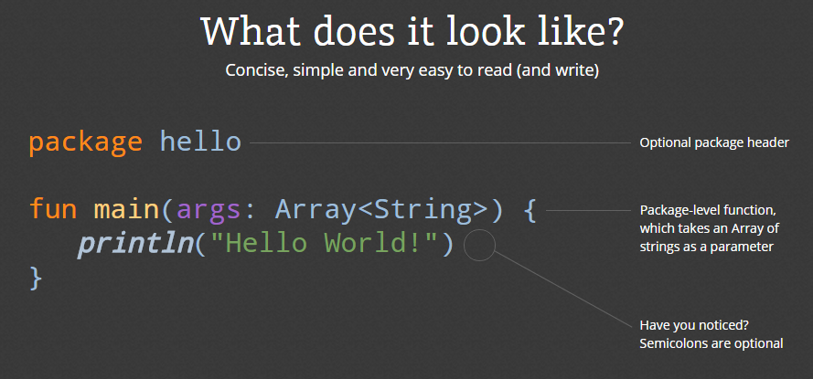

## Kotlin介绍

基于 JVM 的编程语言 **Kotlin**

Kotlin 是一个基于 JVM 的新的编程语言，由 [**JetBrains**](https://www.jetbrains.com/)开发。



<!--more-->

其主要设计目标：
创建一种兼容 Java 的语言

让它比 Java 更安全，能够静态检测常见的陷阱。如：引用空指针

让它比 Java 更简洁，通过支持 variable type inference，higher-order functions (closures)，extension functions，mixins and first-class delegation 等实现。

让它比最成熟的竞争对手 `Scala` 语言更加简单。

## Kotlin for JavaScript

>Kotlin1.1版本正式加入了对JavaScript的支持，也就是说我们可以Kotlin进行网页开发，并且Kotlin也支持了与JavaScript的相互操作。众所周知，JavaScript是动态类型的语言，而相对来说，Kotlin和Java都是静态类型的。同时，两者在编译运行也很不一样，Java更偏向与编译型语言，而JavaScript更偏向于解释型语言。所以，在Kotlin完美兼容Java的同时，增加了JavaScript的支持，让人好奇不已。接下来，我们就来谈谈Kotlin是如何支持JavaScript，以及它的一个简单实现。

```html
<!-- 优先加载kotlin.js-->
<script type="text/javascript" src="out/production/KotlinJsSample/lib/kotlin.js"></script>
```

在Kotlin代码中，如果想要调用JavaScript代码，基本上有两种方式： js() 内联模式和头文件模式。

#### js()内联JavaScript

我们可以使用 js("...") 函数将一些JavaScript代码直接嵌入到Kotlin代码中。但是，有一点要求，js函数的参数必须是字符串常量。

举个例子：

```kotlin
//Main.kt
fun main(args: Array<String>) {
    val message = "Hello JavaScript"
    js("console.log(message)")
}
```

对于js()函数里的参数，Kotlin编译器选择了不处理，直接输出。所以，这也就说明了为什么js()函数为什么必须是要常量的原因了。

#### external修饰符定义头文件

如果你用过内联JavaScript的方式，你就会知道，真的很鸡肋！做点log的工作，还能干嘛？？？

所以，Kotlin又搞了一个强大一些的方式，通过 external 修饰符定义JavaScript文件头的方式进行引入调用。

举个例子：

```kotlin
//Mian.kt
external fun alert(message: Any?)

fun main(args: Array<String>) {
    val message = "Hello JavaScript"
    alert(message)
}
```

这种方式下，当你在Kotlin中要使用JavaScript代码之前，必须加上相关的JavaScript头文件声明。这么做的目的，就是为了让Kotlin知道相关JavaScript函数的存在，以保证可以正常的调用到，然后在Kotlin编译器环节，直接使用到JavaScript代码。看上去挺麻烦的，但是总的来说，比内联来的强大。

#### JavaScript中调用Kotlin

Kotlin编译器会将原生的Kotlin代码转换成相应的JavaScript代码，并且对于原先Kotlin中定义的函数名和变量都不会改变，这意味着在JavaScript中我们可以自由的使用相关的函数和属性。

## Kotlin for Vue.js

长话短说，前面介绍这么多，现在直接进入正题了。
针对Kotlin语言，需要先建立Vue的头文件声明，让Kotlin知道Vue的函数存在，大部分实现如下：

```kotlin
// Vue.kt
/**
 * Created by Zyao89 on 2017/6/2.
 */
import org.w3c.dom.HTMLElement

@JsName("Vue")
external class Vue (options: Any?){
    var paramAttributes: Array<Any>
    var template: String
    var replace: Boolean
    var created: VueCallback
    var beforeCompile: VueCallback
    var compiled: VueCallback
    var ready: VueCallback
    var attached: VueCallback
    var detached: VueCallback
    var beforeDestroy: VueCallback
    var destroyed: VueCallback
    var inherit: Boolean
    var mixins: Array<Any>
    var name: String
    var `$el`: HTMLElement
    var `$parent`: Vue
    var `$root`: Vue
    fun `$watch`(expression: String, callback: VueCallback, deep: Boolean?, immediate: Boolean?):Unit
    fun `$get`(expressopn: String): dynamic
    fun `$set`(keypath: String, value: Any): Unit
    fun `$add`(keypath: String, value: Any): Unit
    fun `$delete`(keypath: String):Unit
    fun `$eval`(expression: String): dynamic
    fun `$interpolate`(templateString: String): String
    fun `$log`(keypath: String?): Unit
    fun `$dispatch`(evant: String, args: Any?): Vue
    fun `$broadcast`(evant: String, args: Any?): Vue
    fun `$emit`(event: String, args: Any?): Vue
    fun `$on`(event: String, callback: Any): Vue
    fun `$once`(event: String, callback: Any): Vue
    fun `$off`(event: String?, callback: Any?): Vue
    fun `$appendTo`(element: Any, callback: Any?): Vue
    fun `$prependTo`(element: Any, callback: Any?): Vue
    fun `$before`(element: Any, callback: Any?): Vue
    fun `$after`(element: Any, callback: Any?): Vue
    fun `$remove`(callback: Any?): Vue
    fun `$mount`(element: Any?): Vue
    fun `$destroy`(remove: Boolean?): Unit
    fun `$compile`(element: HTMLElement): VueCallback
    fun `$addChild`(options: Any, constructor: Any?): Vue
    fun _init(options: Any): Unit
    fun _cleanup(): Unit
    companion object {
        var config: VueConfig
        fun extend(options: Any): Vue
        fun directive(id: String, definition: Any?): Unit
        fun filter(id: String, definition: FilterCallback?): Unit
        fun component(id: String, definition: Vue): Unit
        fun transition(id: String, definition: Any?): Unit
        fun partial(id: String, definition: String?): Unit
        fun nextTick(callback: Any): Unit
        fun require(module: String): Unit
        fun use(plugin: Any, args: Any?): Vue
    }
    var `$data`: dynamic
}
@JsName("config")
external class VueConfig {
    var prefix: String
    var debug: Boolean
    var silent: Boolean
    var proto: Boolean
    var interpolate: Boolean
    var async: Boolean
    var delimiters: Array<String>
}
interface ValueCallback {
    fun apply(newValue: Any, oldValue: Any): Unit
}

interface VueCallback {
    fun apply(): Unit
}

interface FilterCallback {
    fun apply(value: Any, begin: Any?, end: Any?): Any
}
```

Kotlin调用时，是从 `main` 函数开始的，先创建一个简单的Vue对象，demo如下：

```kotlin
// Hello.kt
var vue:Vue? = null

fun main(args: Array<String>) {
    vue = Vue(json(
            Pair("el", "#app"),
            Pair("data",
                    json(
                            Pair("message", "ABCDEF123456789")
                    )
            ),
            Pair("methods",
                    json(
                            Pair("reverseMessage", {
                                change()
                            })
                    ))
    ))
}

fun change() {
    vue?.let {
        console.log(it.`$data`?.message)
        it.`$data`?.message = it.`$data`.message.split("").reverse().join("")
    }
}
```

最后就是 `index.html` 的页面展示了，如下：

```html
<!DOCTYPE html>
<html lang="en">
<head>
    <meta charset="UTF-8">
    <title>Test</title>
</head>
<body>
    <h1 id="test"></h1>
    <div id="app">
        {{ message }}
        <button v-on:click="reverseMessage">逆转消息</button>
    </div>
    <a class="cur STRING_BASE" href="javascript:KotlinJS.haha()"><strong>我直接调用Kotlin方法</strong></a>
</body>
<script src="js/app/lib/webjars/vue/2.1.3/vue.min.js"></script>
<script src="js/app/lib/kotlin.js"></script>
<script src="js/app/KotlinJS.js"></script>
</html>
```

### 总结

最后，声明一下这只是一个实验性的Demo，具体项目开发还需要深入研究，多多交流。

GitHub源码：[zyao89/KotlinJS-Vue](https://github.com/zyao89/KotlinJS-Vue)

---

`作者：Zyao89；转载请保留此行，谢谢；`

个人博客：[https://zyao89.cn](https://zyao89.cn)
