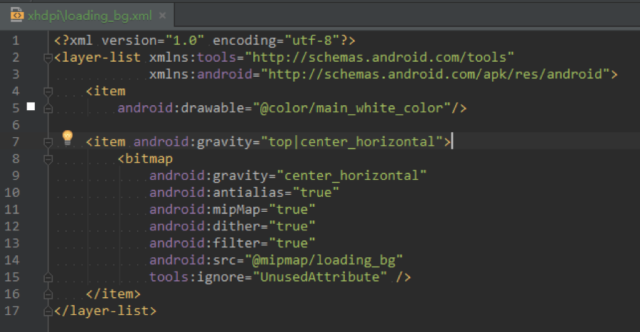
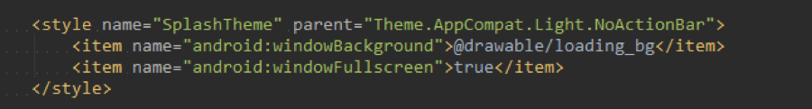
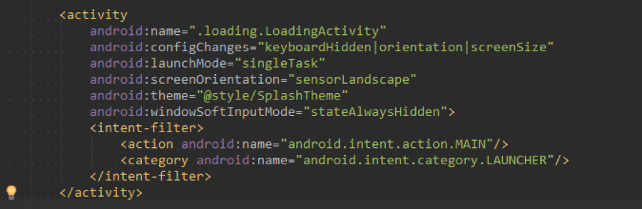

## 问题

APP启动速度慢，如何实现点击ICON后APP秒开。APP启动加速。

**问题描述**：Android系统在APP程序启动过程中，启动速度过慢，导致画面先启动白页或者黑页，再加载出引导页面；

**问题原因**：当打开一个Activity时，如果这个Activity所属Application还没有在运行，系统会为这个Activity的创建一个进程，但进程的创建与初始化都需要时间，在这个动作完成之前，如果初始化的时间过长，屏幕上可能没有任何动静，用户会以为没有点到按钮。所以既不能停在原来的地方又没到显示新的界面。

 <!--more-->

**解决思路**：通过使用Theme讲述如何解决的方案。

## 解决步骤

### 所需要的环境

Android Studio，任何正常的Android手机

### 调试方案

断点调试，Log日志等观察分析

### 案例思路

1. 首先在res/drawable下新建一个layer-list，名字随便取，比如loading_bg.xml。

2. 设置LoadingActivity的主题和参数。

3. 在AndroidManifest.xml中定义LoadingActivity的theme的主题为SplashTheme。

4. 其他的都是正常启动Activity了，这里甚至可以在onCreate()启动时，不需要不要调用setContentView()方法。

### 原理分析

本案例主要是通过Android系统主题Theme的设置，修改启动Window的背景，从而达到不再白屏或者黑屏的结果。

## 总结

本案例提供Android程序启动优化方案，可以解决很多启动等待造成的黑屏或者白屏等问题，后续可再进一步优化成将启动界面和初始化界面分开编写，从而达到更快速的秒开程序的效果。

---

`作者：Zyao89；转载请保留此行，谢谢；`
