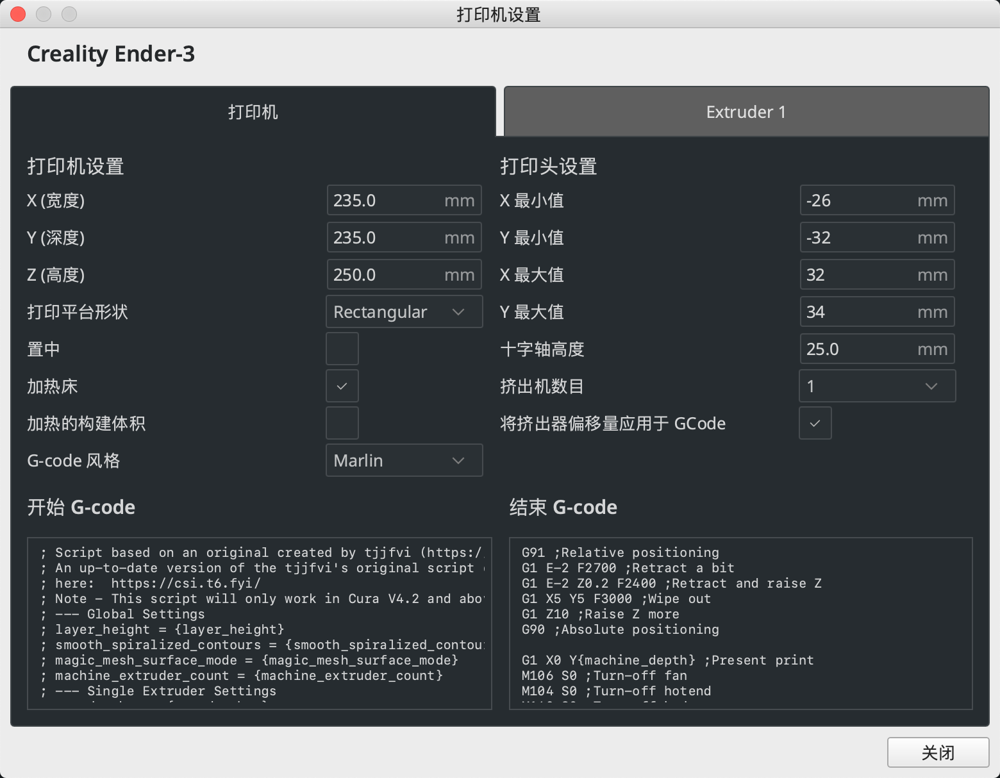

记录 `Cura` 部分配置，防止丢失

<!-- more -->



## 开始 GCode

```
; Script based on an original created by tjjfvi (https://github.com/tjjfvi)
; An up-to-date version of the tjjfvi's original script can be found
; here:  https://csi.t6.fyi/
; Note - This script will only work in Cura V4.2 and above!
; --- Global Settings
; layer_height = {layer_height}
; smooth_spiralized_contours = {smooth_spiralized_contours}
; magic_mesh_surface_mode = {magic_mesh_surface_mode}
; machine_extruder_count = {machine_extruder_count}
; --- Single Extruder Settings
; speed_z_hop = {speed_z_hop}
; retraction_amount = {retraction_amount}
; retraction_hop = {retraction_hop}
; retraction_hop_enabled = {retraction_hop_enabled}
; retraction_enable = {retraction_enable}
; retraction_speed = {retraction_speed}
; retraction_retract_speed = {retraction_retract_speed}
; retraction_prime_speed = {retraction_prime_speed}
; speed_travel = {speed_travel}

; Ender 3 Custom Start G-code
G92 E0 ; Reset Extruder
G28
G29 ; Home all axes
G1 Z2.0 F3000 ; Move Z Axis up little to prevent scratching of Heat Bed
G1 X0.1 Y20 Z0.3 F5000.0 ; Move to start position
G1 X0.1 Y200.0 Z0.3 F1500.0 E15 ; Draw the first line
G1 X0.4 Y200.0 Z0.3 F5000.0 ; Move to side a little
G1 X0.4 Y20 Z0.3 F1500.0 E30 ; Draw the second line
G92 E0 ; Reset Extruder
G1 Z2.0 F3000 ; Move Z Axis up little to prevent scratching of Heat Bed
G1 X5 Y20 Z0.3 F5000.0 ; Move over to prevent blob squish
```


## 结束 GCode

```
G91 ;Relative positioning
G1 E-2 F2700 ;Retract a bit
G1 E-2 Z0.2 F2400 ;Retract and raise Z
G1 X5 Y5 F3000 ;Wipe out
G1 Z10 ;Raise Z more
G90 ;Absolute positioning

G1 X0 Y{machine_depth} ;Present print
M106 S0 ;Turn-off fan
M104 S0 ;Turn-off hotend
M140 S0 ;Turn-off bed

M84 X Y E ;Disable all steppers but Z
```