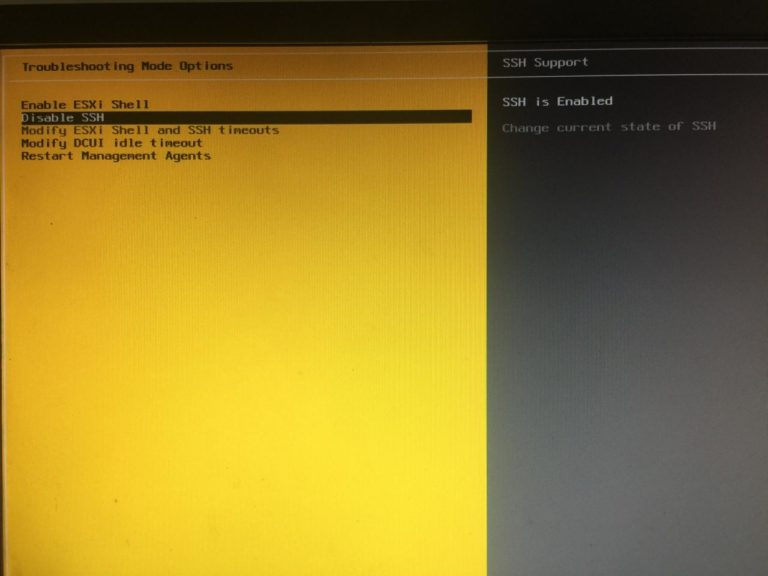
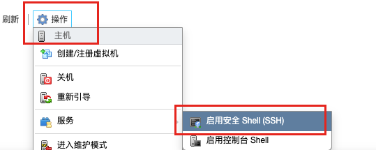
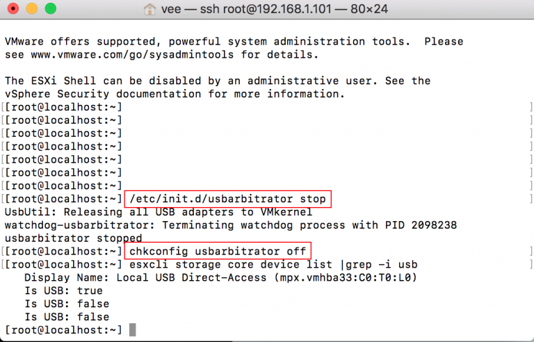
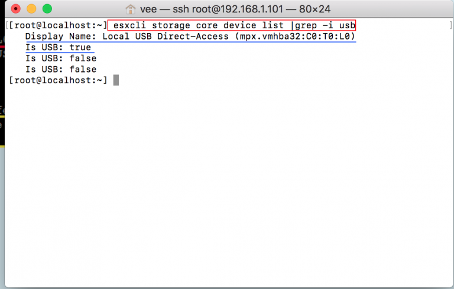
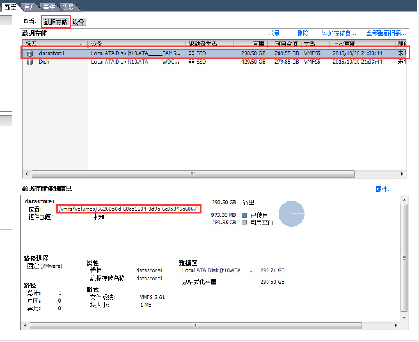
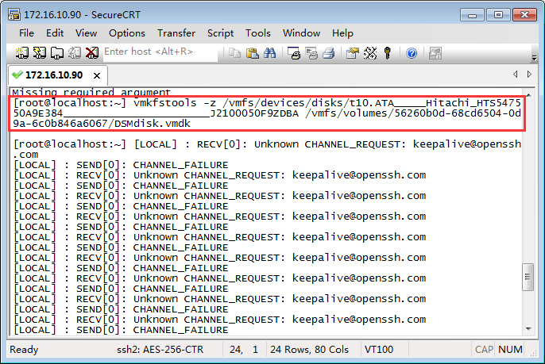

记录 USA 移动硬盘直通挂载及本地 SATA 硬盘直通挂载

首先你得熟悉命令行操作，知道如何使用终端管理工具，使用 SSH 或 ESXi 控制台进入 ESXi 的 Shell 界面。

<!-- more -->

## 一、先后台打开SSH的功能

两种方式：

### 1. 按F2输入密码进入设置界面》》Troubleshoot ing Options》》Enabled



### 2. Web 后台，主机 --> 操作



## 二、在不接入USB硬盘的情况下输入以下命令

```sh
/etc/init.d/usbarbitrator stop
```

```sh
chkconfig usbarbitrator off
```



## 三、接入你的USB硬盘，输入以下命令, 这时我们可以看到（Is USB:true）说明我们的usb硬盘已经被识别出来

```sh
esxcli storage core device list | grep -i usb
```



## 四、输入以下命令，列出我们 USB 硬盘的信息

```sh
ls /dev/disks/
```

## 五、直通挂载硬盘

### 1、分别获取当前内置硬盘和需要映射的硬盘的路径



```sh
vmkfstools -z /vmfs/devices/disks/<内置硬盘名称>[空格]/<映射的硬盘的路径>/<映射文件名>.vmdk
```



成功后无任何信息提示，在 ESXi datastore 中会建立硬盘标识文件，该文件是以 vmdk 为后缀，且可直接挂载
