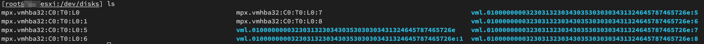
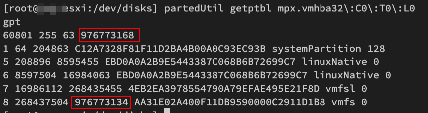
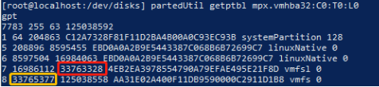

<!-- more -->

## 开启 SSH

打开esxi ssh并root登录

## 停掉ESXI的USB检查

```bash
/etc/init.d/usbarbitrator stop
```

并且不让它开机自动启动

```bash
chkconfig usbarbitrator off
```

## 进入/vmfs/devices/disks目录

```bash
cd /vmfs/devices/disks
```

## 列出磁盘分区

列出磁盘分区，可以看到vmhba32的字样，这里每个人可能会不一样，你可能会出现vmhba34 35 36的情况，所以在输入命令的时候不要无脑抄作业，请自由替换。

```bash
ls
```



## 列出分区信息

列出分区信息，你会看到1 5 6 7的字样，ESXI 7.0已经自动帮你做好减34步骤了，把图中下面那个已经减去34的数值复制一下，然后替换到f步骤的X位置。

```bash
partedUtil getptbl mpx.vmhba32\:C0\:T0\:L0
```



> 正常情况下，红色区域的数据是一致的，如果建立时失败了，则 `-34` 进行尝试，例如 `976773168 - 34 = 976773134`

## 重新建立分区结构

重新建立分区结构，注意最后一行的X位置，替换成你自己的数据，那个120G的分区可以更改数字自由调节大小，这个分区是ESXI 7.0新增的，但不能删除，删除会导致ESXI所有设置无法保存，重启就会还原，包括你新增的虚拟机重启以后也会丢失


```bash
partedUtil setptbl mpx.vmhba32\:C0\:T0\:L0 gpt \
"1 64 204863 C12A7328F81F11D2BA4B00A0C93EC93B 128" \
"5 208896 8595455 EBD0A0A2B9E5443387C068B6B72699C7 0" \
"6 8597504 16984063 EBD0A0A2B9E5443387C068B6B72699C7 0" \
"7 16986112 268435455 4EB2EA3978554790A79EFAE495E21F8D 0" \
"8 268437504 976773134 AA31E02A400F11DB9590000C2911D1B8 0"
```

输出结果：

```bash
[/dev/disks] partedUtil setptbl mpx.vmhba32\:C0\:T0\:L0 gpt \
> "1 64 204863 C12A7328F81F11D2BA4B00A0C93EC93B 128" \
> "5 208896 8595455 EBD0A0A2B9E5443387C068B6B72699C7 0" \
> "6 8597504 16984063 EBD0A0A2B9E5443387C068B6B72699C7 0" \
> "7 16986112 268435455 4EB2EA3978554790A79EFAE495E21F8D 0" \
> "8 268437504 976773134 AA31E02A400F11DB9590000C2911D1B8 0"
gpt
0 0 0 0
1 64 204863 C12A7328F81F11D2BA4B00A0C93EC93B 128
5 208896 8595455 EBD0A0A2B9E5443387C068B6B72699C7 0
6 8597504 16984063 EBD0A0A2B9E5443387C068B6B72699C7 0
7 16986112 268435455 4EB2EA3978554790A79EFAE495E21F8D 0
8 268437504 976773134 AA31E02A400F11DB9590000C2911D1B8 0
```


### 原理

```bash
partedUtil setptbl mpx.vmhba32:C0:T00 gpt \
"1 64 204863 C12A7328F81F11D2BA4B00A0C93EC93B 128" \
"5 208896 8595455 EBD0A0A2B9E5443387C068B6B72699C7 0" \
"6 8597504 16984063 EBD0A0A2B9E5443387C068B6B72699C7 0" \
"7 16986112 此处填写：(16986112+Y*2*1024*1024) 4EB2EA3978554790A79EFAE495E21F8D 0" \
"8 (16986112+Y*2*1024*1024+2049) X AA31E02A400F11DB9590000C2911D1B8 0"
```

简单的说，就是：
你想预留8GB 那么 7号分区第二个位置（红色框框）就填 `8(GB)*2*1024*1024+16986112` 计算出的数值
回过行来 8号分区的第一个位置（黄色框框）填写 `红色框框数值+2049`



## 新建数据存储

新建VMFS6分区，作为数据存储

```bash
vmkfstools -C vmfs6 -b 1m -S UsbDatastore mpx.vmhba32:C0:T0:L0:8
```

输出结果：
```bash
[/dev/disks] vmkfstools -C vmfs6 -b 1m -S UsbDatastore mpx.vmhba32:C0:T0:L0:8
create fs deviceName:'mpx.vmhba32:C0:T0:L0:8', fsShortName:'vmfs6', fsName:'UsbDatastore'
deviceFullPath:/dev/disks/mpx.vmhba32:C0:T0:L0:8 deviceFile:mpx.vmhba32:C0:T0:L0:8
ATS on device /dev/disks/mpx.vmhba32:C0:T0:L0:8: not supported
.
Checking if remote hosts are using this device as a valid file system. This may take a few seconds...
Creating vmfs6 file system on "mpx.vmhba32:C0:T0:L0:8" with blockSize 1048576, unmapGranularity 1048576, unmapPriority default and volume label "UsbDatastore".
Successfully created new volume: 60f44778-7a632b60-7e71-ac1f6be5200c
```


## ESXi7.0 License

```
VMware vSphere ESXi 7.0 Enterprise Plus
JJ2WR-25L9P-H71A8-6J20P-C0K3F
HN2X0-0DH5M-M78Q1-780HH-CN214
JH09A-2YL84-M7EC8-FL0K2-3N2J2

VMware vCenter 7.0 Standard
104HH-D4343-07879-MV08K-2D2H2
410NA-DW28H-H74K1-ZK882-948L4
406DK-FWHEH-075K8-XAC06-0JH08

VMware VSAN 7.0 Enterprise Plus
HN0D8-AAJ1Q-07D00-6U924-CX224
50008-221DH-M7E99-A9CKM-A1030
HN0NH-62051-H75E9-P38RM-0H870

VMware vSphere 7 Enterprise Plus with Add-on for Kubernetes
J1608-4GJEQ-071L8-9VA0H-2MUK6
M10DH-8YL47-474L1-DV3U0-8H054
MM4MR-2G005-H7039-JVCAP-2RAL8
```