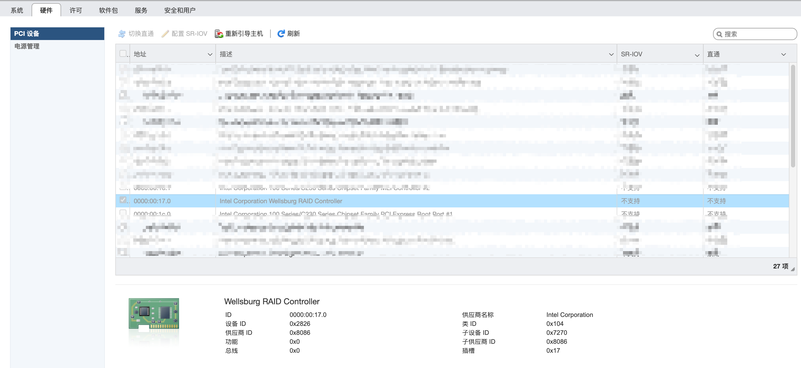
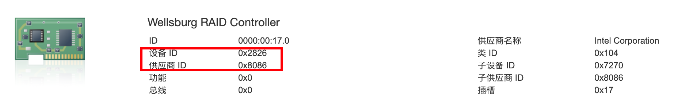

最近重新安装了ESXI，记录一下板载SATA控制器直通做磁盘阵列，要把硬盘直通给虚拟机，所以必须要直通SATA控制器。

<!-- more -->

## 引言

打开 ESXI 的web控制页面，就是https://IP，切换到：管理--硬件--PCI设备，如下



就可以看到很多硬件设备，有的可选，有的不可选。可选的可以直接直通，不可选的，需要设置以后才可以直通。

上图可以看到，RAID 就是这台机器的SATA控制器了，默认是灰色的。选中这个硬件设备，查看下放的详情。

## 操作步骤

### 查看设备信息

1. 选中要直通的硬件设备，记录设备ID和供应商ID，后面会用到



### 登陆机器

2. 用ssh登录到esxi，找到 `/etc/vmware/passthru.map`，在最后一行添加

```
# Intel Corporation Wellsburg RAID Controller
8086 2826 d3d0 false
```

`8086`是供应商ID，`2826`是设备ID，`d3d0`不要动照写，后面写`false`即可

保存后重启，sata控制器就是可选状态了，直通即可。
