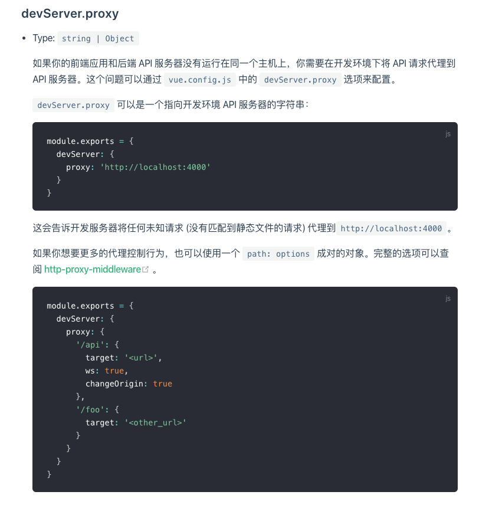
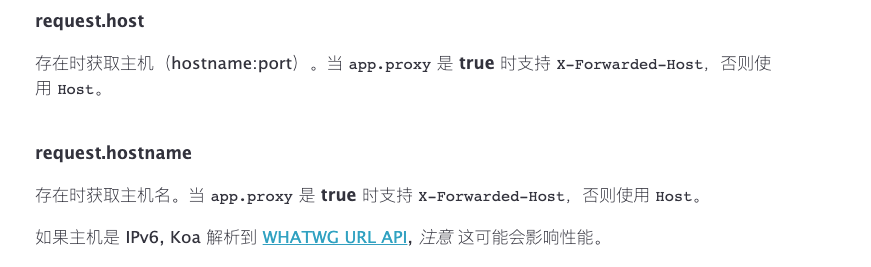

这篇文章只是简单的探讨记录下 `devServer.proxy` 的相关配置和兼容性

<!-- more -->

## 背景

- [`vue-cli-service`](https://cli.vuejs.org/zh/config/#devserver-proxy) > v3.x
- [`http-proxy-middleware`](https://github.com/chimurai/http-proxy-middleware#proxycontext-config)

## 正文



官方文档如图所示，简单的介绍了 `devServer.proxy` 的用法。并给出了对应的 [`http-proxy-middleware`](https://github.com/chimurai/http-proxy-middleware#proxycontext-config) 链接，告诉我们 `完整选项请查阅`.

### 问题

现在问题来了，这个参数真的和官方文档所说的一样兼容吗？

就目前来看，答案肯定是 `不`。

我们从源码开始分析吧。

[源码 prepareProxy.js](packages/@vue/cli-service/lib/util/prepareProxy.js)

### 问题一 proxy类型

源码：[prepareProxy.js#L30](https://github.com/vuejs/vue-cli/blob/dev/packages/%40vue/cli-service/lib/util/prepareProxy.js#L30)

```js
module.exports = function prepareProxy (proxy, appPublicFolder) {
  // `proxy` lets you specify alternate servers for specific requests.
  // It can either be a string or an object conforming to the Webpack dev server proxy configuration
  // https://webpack.github.io/docs/webpack-dev-server.html
  if (!proxy) {
    return undefined
  }
  if (Array.isArray(proxy) || (typeof proxy !== 'object' && typeof proxy !== 'string')) {
    console.log(
      chalk.red(
        'When specified, "proxy" in package.json must be a string or an object.'
      )
    )
    console.log(
      chalk.red('Instead, the type of "proxy" was "' + typeof proxy + '".')
    )
    console.log(
      chalk.red(
        'Either remove "proxy" from package.json, or make it an object.'
      )
    )
    process.exit(1)
  }
  ...
}
```

从上面的源码中，我们可以看出 `vue-cli` 对 `devServer.proxy` 的入参进行了校验，首先就排除它不能是 `Array`, 并且给出的提示也不完全正确 `"proxy" in package.json`，其实这里并不知道这个配置是在 `vue.config.js` 中，还是 `package.json` 中。

但是 `http-proxy-middleware` 的配置是支持数组的。

**解决方法：**

等待官方更新，或者将数组转换成对象。

### 问题二 context参数

源码：[prepareProxy.js#L73](https://github.com/vuejs/vue-cli/blob/dev/packages/%40vue/cli-service/lib/util/prepareProxy.js#L73)

```js
context (pathname, req) {
    // is a static asset
    if (!mayProxy(pathname)) {
        return false
    }
    if (context) {
        // Explicit context, e.g. /api
        return pathname.match(context)
    } else {
        // not a static request
        if (req.method !== 'GET') {
            return true
        }
        // Heuristics: if request `accept`s text/html, we pick /index.html.
        // Modern browsers include text/html into `accept` header when navigating.
        // However API calls like `fetch()` won’t generally accept text/html.
        // If this heuristic doesn’t work well for you, use a custom `proxy` object.
        return (
            req.headers.accept &&
            req.headers.accept.indexOf('text/html') === -1
        )
    }
},
```

从上面的源码中，我们可以看出 `vue-cli` 的 `devServer.proxy` 不支持 `context`, 因为内部源码自己实现了一个 `context` 的封装，最终覆盖你设置的参数。

这都不是问题，问题在于 `context` 内不支持 `glob` 表达式了。而且只支持标准的 `正则表达式`。

官方通过 `pathname.match(context)` 这个方法，进行了一次正则校验。导致 `http-proxy-middleware` 下的 `glob` 写法报错。坑呀。

这个问题也被别人作为 `PR`[#2869](https://github.com/vuejs/vue-cli/pull/2869) 提交了采纳了，应该会在后面的版本进行同步修复了。

**解决方法：**

等待官方更新，或者将所有 `glob` 表达式转换为标准的 `正则表达式`。

### 问题三 onError监听

源码：[prepareProxy.js#L100](https://github.com/vuejs/vue-cli/blob/dev/packages/%40vue/cli-service/lib/util/prepareProxy.js#L100)

```js
{
    ...
    onError: onProxyError(target)
}
```

```js
...
return Object.assign({}, defaultConfig, config, entry)
```

至于第三个 `onError` 事件监听，官方直接内部实现了，并且最终覆盖了你的方法, [prepareProxy.js#L133](https://github.com/vuejs/vue-cli/blob/dev/packages/%40vue/cli-service/lib/util/prepareProxy.js#L133) 我们可以从这里看到。

**解决方法：**

等待官方更新。

### host获取

当我们使用 `http-proxy-middleware` 时，很多情况下都是直接通过框架内部自动修改 `Host` 头信息等去使用的。

但是当后端采用一些框架如 `koa` 时，本身代理的 `host` 是没有问题的。



看文档，当 `app.proxy = true` 时，`http-proxy-middleware` 本身是不会修改 `X-Forwarded-Host` 这个参数的。所以你需要认为干预一下。

**解决方法：**

在 `proxy` 配置 `onProxyReq` 并在方法中实现如下代码。

```js
const host = '';
onProxyReq(proxyReq, req, res) {
    proxyReq.setHeader('host', host);
    proxyReq.setHeader('x-forwarded-host', host);
},
```

## 总结

综上，简单的总结了下最近迁移和使用 `vue-cli-service` 的代理一些问题。希望可以给大家带来一些帮助。
