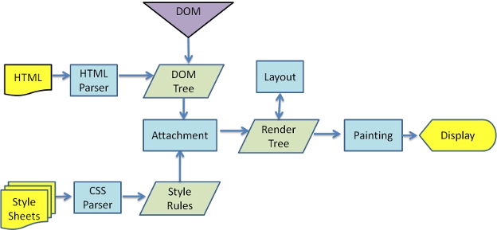
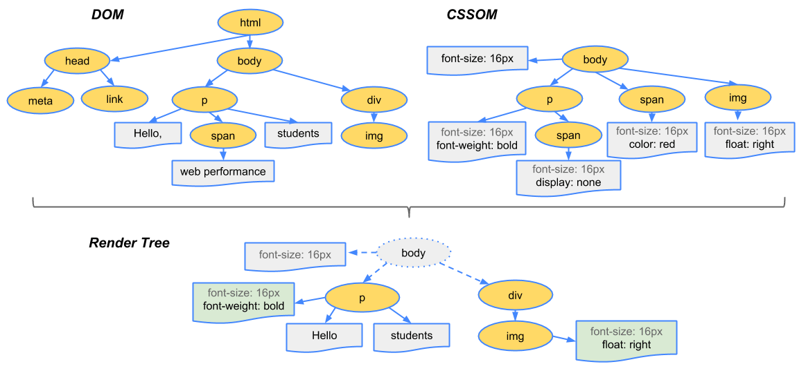
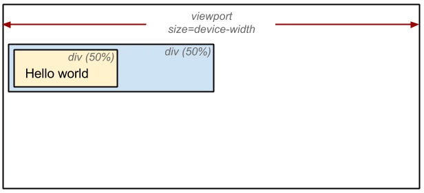
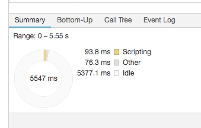

<!-- more -->

## 浏览器的渲染过程

本文先从浏览器的渲染过程来从头到尾的讲解一下回流重绘。

CSSOM 树和 DOM 树合并成渲染树，然后用于计算每个可见元素的布局，并输出给绘制流程，将像素渲染到屏幕上。

可参考：[DOM树和CSSOM树对象模型构建](https://developers.google.com/web/fundamentals/performance/critical-rendering-path/constructing-the-object-model)



从上面这个图上，我们可以看到，浏览器渲染过程如下：

1. 解析HTML，生成 DOM 树，解析CSS，生成 CSSOM 树
2. 将 DOM 树和 CSSOM 树结合，生成渲染树(Render Tree)
3. Layout(回流): 根据生成的渲染树，进行回流(Layout)，得到节点的几何信息（位置，大小）
4. Painting(重绘): 根据渲染树以及回流得到的几何信息，得到节点的绝对像素
5. Display: 将各个节点绘制到屏幕上。

### 构建渲染树

根据 HTML 和 CSS 输入构建了 DOM 树和 CSSOM 树。不过，它们都是独立的对象，分别网罗文档不同方面的信息：一个描述内容，另一个则是描述需要对文档应用的样式规则。我们该如何将两者合并，让浏览器在屏幕上渲染像素呢？



为构建渲染树，浏览器大体上完成了下列工作：

1. 从 DOM 树的根节点开始遍历每个可见节点。

   - 某些节点不可见（例如脚本标记、元标记等），因为它们不会体现在渲染输出中，所以会被忽略。
   - 某些节点通过 CSS 隐藏，因此在渲染树中也会被忽略，例如，上例中的 span 节点---不会出现在渲染树中，---因为有一个显式规则在该节点上设置了“display: none”属性。

2. 对于每个可见节点，为其找到适配的 CSSOM 规则并应用它们。

3. 根据每个可见节点以及其对应的样式，组合生成渲染树。

::: tip Note
简单提一句，请注意 visibility: hidden 与 display: none 是不一样的。前者隐藏元素，但元素仍占据着布局空间（即将其渲染成一个空框），而后者 (display: none) 将元素从渲染树中完全移除，元素既不可见，也不是布局的组成部分。

**注意：渲染树只包含可见的节点**
:::

### 回流

前面我们通过构造渲染树，我们将可见DOM节点以及它对应的样式结合起来，可是我们还需要计算它们在设备视口(viewport)内的确切位置和大小，这个计算的阶段就是回流。

为了弄清每个对象在网站上的确切大小和位置，浏览器从渲染树的根节点开始遍历，我们可以以下面这个实例来表示：

```html
<!DOCTYPE html>
<html>
  <head>
    <meta name="viewport" content="width=device-width,initial-scale=1">
    <title>Critial Path: Hello world!</title>
  </head>
  <body>
    <div style="width: 50%">
      <div style="width: 50%">Hello world!</div>
    </div>
  </body>
</html>
```

我们可以看到，第一个div将节点的显示尺寸设置为视口宽度的50%，第二个div将其尺寸设置为父节点的50%。而在回流这个阶段，我们就需要根据视口具体的宽度，将其转为实际的像素值。（如下图）



### 重绘

最终，我们通过构造渲染树和回流阶段，我们知道了哪些节点是可见的，以及可见节点的样式和具体的几何信息(位置、大小)，那么我们就可以将渲染树的每个节点都转换为屏幕上的实际像素，这个阶段就叫做重绘节点。

## 何时发生回流重绘

我们前面知道了，回流这一阶段主要是计算节点的位置和几何信息，那么当页面布局和几何信息发生变化的时候，就需要回流。比如以下情况：

- 添加或删除可见的DOM元素
- 元素的位置发生变化
- 元素的尺寸发生变化（包括外边距、内边框、边框大小、高度和宽度等）
- 内容发生变化，比如文本变化或图片被另一个不同尺寸的图片所替代。
- 页面一开始渲染的时候（这肯定避免不了）
- 浏览器的窗口尺寸变化（因为回流是根据视口的大小来计算元素的位置和大小的）

***注意：回流一定会触发重绘，而重绘不一定会回流***

根据改变的范围和程度，渲染树中或大或小的部分需要重新计算，有些改变会触发整个页面的重排，比如，滚动条出现的时候或者修改了根节点。

## 浏览器的优化机制

现代的浏览器都是很聪明的，由于每次重排都会造成额外的计算消耗，因此大多数浏览器都会通过队列化修改并批量执行来优化重排过程。浏览器会将修改操作放入到队列里，直到过了一段时间或者操作达到了一个阈值，才清空队列。但是！当你获取布局信息的操作的时候，会强制队列刷新，比如当你访问以下属性或者使用以下方法：

- offsetTop、offsetLeft、offsetWidth、offsetHeight
- scrollTop、scrollLeft、scrollWidth、scrollHeight
- clientTop、clientLeft、clientWidth、clientHeight
- getComputedStyle()
- getBoundingClientRect()

以上属性和方法都需要返回最新的布局信息，因此浏览器不得不清空队列，触发回流重绘来返回正确的值。因此，我们在修改样式的时候，最好避免使用上面列出的属性，他们都会刷新渲染队列。如果要使用它们，最好将值缓存起来。

## 减少回流和重绘

### 最小化重绘和重排

由于重绘和重排可能代价比较昂贵，因此最好就是可以减少它的发生次数。为了减少发生次数，我们可以合并多次对DOM和样式的修改，然后一次处理掉。考虑这个例子

```js
const el = document.getElementById('test');
el.style.padding = '5px';
el.style.borderLeft = '1px';
el.style.borderRight = '2px';
```

例子中，有三个样式属性被修改了，每一个都会影响元素的几何结构，引起回流。当然，大部分现代浏览器都对其做了优化，因此，只会触发一次重排。但是如果在旧版的浏览器或者在上面代码执行的时候，有其他代码访问了布局信息(上文中的会触发回流的布局信息)，那么就会导致三次重排。

因此，我们可以合并所有的改变然后依次处理，比如我们可以采取以下的方式：

- 使用cssText

```js
const el = document.getElementById('test');
el.style.cssText += 'border-left: 1px; border-right: 2px; padding: 5px;';
```

- 修改CSS的class

```js
const el = document.getElementById('test');
el.className += ' active';
```

### 批量修改DOM

当我们需要对DOM对一系列修改的时候，可以通过以下步骤减少回流重绘次数：

1. 使元素脱离文档流
2. 对其进行多次修改
3. 将元素带回到文档中。

该过程的第一步和第三步可能会引起回流，但是经过第一步之后，对DOM的所有修改都不会引起回流，因为它已经不在渲染树了。

有三种方式可以让DOM脱离文档流：

- 隐藏元素，应用修改，重新显示
- 使用文档片段(document fragment)在当前DOM之外构建一个子树，再把它拷贝回文档。
- 将原始元素拷贝到一个脱离文档的节点中，修改节点后，再替换原始的元素。

考虑我们要执行一段批量插入节点的代码：

```js
function appendDataToElement(appendToElement, data) {
    let li;
    for (let i = 0; i < data.length; i++) {
        li = document.createElement('li');
        li.textContent = 'text';
        appendToElement.appendChild(li);
    }
}

const ul = document.getElementById('list');
appendDataToElement(ul, data);
```

如果我们直接这样执行的话，由于每次循环都会插入一个新的节点，会导致浏览器回流一次。

我们可以使用这三种方式进行优化:

***隐藏元素，应用修改，重新显示***

这个会在展示和隐藏节点的时候，产生两次重绘

```js
function appendDataToElement(appendToElement, data) {
    let li;
    for (let i = 0; i < data.length; i++) {
        li = document.createElement('li');
        li.textContent = 'text';
        appendToElement.appendChild(li);
    }
}
const ul = document.getElementById('list');
ul.style.display = 'none';
appendDataToElement(ul, data);
ul.style.display = 'block';
```

使用文档片段(document fragment)在当前DOM之外构建一个子树，再把它拷贝回文档

```js
const ul = document.getElementById('list');
const fragment = document.createDocumentFragment();
appendDataToElement(fragment, data);
ul.appendChild(fragment);
```

将原始元素拷贝到一个脱离文档的节点中，修改节点后，再替换原始的元素。

```js
const ul = document.getElementById('list');
const clone = ul.cloneNode(true);
appendDataToElement(clone, data);
ul.parentNode.replaceChild(clone, ul);
```

规则:

对于上述那种情况，我写了一个 <Link :href="require('./demo/批量修改DOM.html')">Demo</Link> 来测试修改前和修改后的性能。然而实验结果不是很理想。

原因：其实上面也说过了，浏览器会使用队列来储存多次修改，进行优化，所以对这个优化方案，我们其实不用优先考虑。

### 避免触发同步布局事件

上文我们说过，当我们访问元素的一些属性的时候，会导致浏览器强制清空队列，进行强制同步布局。举个例子，比如说我们想将一个p标签数组的宽度赋值为一个元素的宽度，我们可能写出这样的代码：

```js
function initP() {
    for (let i = 0; i < paragraphs.length; i++) {
        paragraphs[i].style.width = box.offsetWidth + 'px';
    }
}
```

这段代码看上去是没有什么问题，可是其实会造成很大的性能问题。在每次循环的时候，都读取了box的一个offsetWidth属性值，然后利用它来更新p标签的width属性。这就导致了每一次循环的时候，浏览器都必须先使上一次循环中的样式更新操作生效，才能响应本次循环的样式读取操作。每一次循环都会强制浏览器刷新队列。我们可以优化为:

```js
const width = box.offsetWidth;
function initP() {
    for (let i = 0; i < paragraphs.length; i++) {
        paragraphs[i].style.width = width + 'px';
    }
}
```

同样，我也写了个 <Link :href="require('./demo/避免快速连续的布局.html')">Demo</Link> 来比较两者的性能差异。你可以自己点开这个demo体验下。这个对比差距就比较明显。

### 对于复杂动画效果,使用绝对定位让其脱离文档流

对于复杂动画效果，由于会经常的引起回流重绘，因此，我们可以使用绝对定位，让它脱离文档流。否则会引起父元素以及后续元素频繁的回流。这个我们就直接上个 <Link :href="require('./demo/将复杂动画浮动化.html')">例子</Link>。

打开这个例子后，我们可以打开控制台，控制台上会输出当前的帧数(虽然不准)。

我们可以看到，帧数一直都没到60。这个时候，只要我们点击一下那个按钮，把这个元素设置为绝对定位，帧数就可以稳定60。

### css3硬件加速（GPU加速）

比起考虑如何减少回流重绘，我们更期望的是，根本不要回流重绘。这个时候，css3硬件加速就闪亮登场啦！！

划重点：使用css3硬件加速，可以让transform、opacity、filters这些动画不会引起回流重绘 。但是对于动画的其它属性，比如background-color这些，还是会引起回流重绘的，不过它还是可以提升这些动画的性能。

本篇文章只讨论如何使用，暂不考虑其原理，之后有空会另外开篇文章说明。

#### 如何使用

常见的触发硬件加速的css属性：

- transform
- opacity
- filters
- Will-change

#### 效果

我们可以先看个例子。我通过使用chrome的Performance捕获了一段时间的回流重绘情况，实际结果如下图：



从图中我们可以看出，在动画进行的时候，没有发生任何的回流重绘。如果感兴趣你也可以自己做下实验。

#### 重点

- 使用css3硬件加速，可以让transform、opacity、filters这些动画不会引起回流重绘
- 对于动画的其它属性，比如background-color这些，还是会引起回流重绘的，不过它还是可以提升这些动画的性能。

#### css3硬件加速的坑

- 如果你为太多元素使用css3硬件加速，会导致内存占用较大，会有性能问题。
- 在GPU渲染字体会导致抗锯齿无效。这是因为GPU和CPU的算法不同。因此如果你不在动画结束的时候关闭硬件加速，会产生字体模糊。

## 总结

本文主要讲了浏览器的渲染过程、浏览器的优化机制以及如何减少甚至避免回流和重绘，希望可以帮助大家更好的理解回流重绘。

## 参考

- <https://segmentfault.com/a/1190000017329980>
- <https://developers.google.com/web/fundamentals/performance/critical-rendering-path/render-tree-construction>
