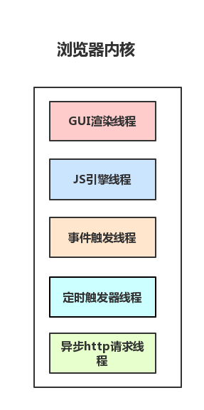
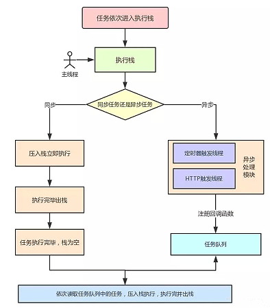
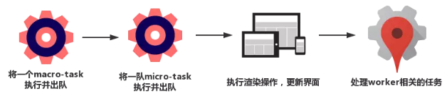
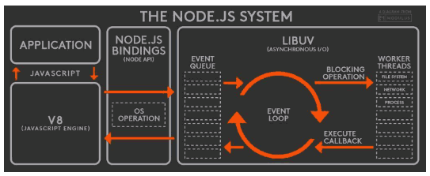
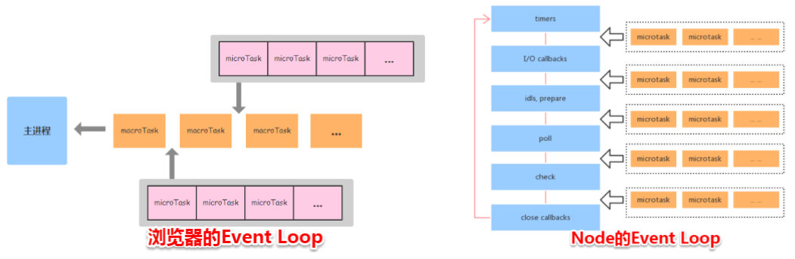

本文我们将会介绍 JS 实现异步的原理，并且了解了在浏览器和 Node 中 Event Loop 其实是不相同的。

<!-- more -->

## 线程与进程

### 为什么JavaScript是单线程

JavaScript语言的一大特点就是单线程，也就是说，同一个时间只能做一件事。那么，为什么JavaScript不能有多个线程呢？这样能提高效率啊。

JavaScript的单线程，与它的用途有关。作为浏览器脚本语言，JavaScript的主要用途是与用户互动，以及操作DOM。这决定了它只能是单线程，否则会带来很复杂的同步问题。比如，假定JavaScript同时有两个线程，一个线程在某个DOM节点上添加内容，另一个线程删除了这个节点，这时浏览器应该以哪个线程为准？

所以，为了避免复杂性，从一诞生，JavaScript就是单线程，这已经成了这门语言的核心特征，将来也不会改变。

为了利用多核CPU的计算能力，HTML5提出Web Worker标准，允许JavaScript脚本创建多个线程，但是子线程完全受主线程控制，且不得操作DOM。所以，这个新标准并没有改变JavaScript单线程的本质。

### 多进程与多线程

- **多进程**：在同一个时间里，同一个计算机系统中如果允许两个或两个以上的进程处于运行状态。多进程带来的好处是明显的，比如你可以听歌的同时，打开编辑器敲代码，编辑器和听歌软件的进程之间丝毫不会相互干扰。
- **多线程**：程序中包含多个执行流，即在一个程序中可以同时运行多个不同的线程来执行不同的任务，也就是说允许单个程序创建多个并行执行的线程来完成各自的任务。

以 Chrome 浏览器中为例，当你打开一个 Tab 页时，其实就是创建了一个进程，一个进程中可以有多个线程（下文会详细介绍），比如渲染线程、JS 引擎线程、HTTP 请求线程等等。当你发起一个请求时，其实就是创建了一个线程，当请求结束后，该线程可能就会被销毁。

- GUI 渲染线程:
  负责渲染页面，解析 HTML，CSS 构成 DOM 树等，当页面重绘或者由于某种操作引起回流都会调起该线程。
  和 JS 引擎线程是互斥的，当 JS 引擎线程在工作的时候，GUI 渲染线程会被挂起，GUI 更新被放入在 JS 任务队列中，等待 JS 引擎线程空闲的时候继续执行。

- JS 引擎线程:
  单线程工作，负责解析运行 JavaScript 脚本。
  和 GUI 渲染线程互斥，JS 运行耗时过长就会导致页面阻塞。

- 事件触发线程:
  当事件符合触发条件被触发时，该线程会把对应的事件回调函数添加到任务队列的队尾，等待 JS 引擎处理。

- 定时器触发线程:
  浏览器定时计数器并不是由 JS 引擎计数的，阻塞会导致计时不准确。
  开启定时器触发线程来计时并触发计时，计时完成后会被添加到任务队列中，等待 JS 引擎处理。

- http 请求线程:
  http 请求的时候会开启一条请求线程。
  请求完成有结果了之后，将请求的回调函数添加到任务队列中，等待 JS 引擎处理。



## 任务队列

### 同步任务 VS 异步任务

- 同步任务指的是，在主线程上排队执行的任务，只有前一个任务执行完毕，才能执行后一个任务；
- 异步任务指的是，不进入主线程、而进入"任务队列"（task queue）的任务，只有"任务队列"通知主线程，某个异步任务可以执行了，该任务才会进入主线程执行。

同步任务与异步任务在一起时，主线程总是要等同步任务执行完成后，才有空闲去执行异步任务的“任务队列”中的任务。( js的单线程的体现 )

```js
console.log('同步任务开始');
// 异步任务
setTimeout(() => {
   console.log('异步任务开始');
}, 0);
for(var i = 0; i < 10; i++ ) {
  console.log(i);
}
```

在这个例子中，异步任务就是setTimeout，当浏览器解释到这一句的时候，发现其是异步任务，将其回调函数放入task queue,等待执行。所以会先打印最后的0 ～9 ，当执行完同步任务后，主线程开始空闲，于是去执行任务队列中的task。

## 浏览器中的 Event Loop

### MacroTask VS MicroTask

事件循环中的异步队列有两种：`macro`（宏任务）队列和 `micro`（微任务）队列。宏任务队列可以有多个，微任务队列只有一个。

- 常见的 `macro-task` 比如：`setTimeout`、`setInterval`、 `setImmediate`、`script`（整体代码）、 `I/O 操作`、`UI 渲染`等。
- 常见的 `micro-task` 比如: `process.nextTick`、`new Promise().then(回调)`、`MutationObserver`(html5 新特性) 等。

### Event Loop 过程解析

一个完整的 Event Loop 过程，可以概括为以下阶段：



- 一开始执行栈空,我们可以把执行栈认为是一个存储函数调用的栈结构，遵循先进后出的原则。micro 队列空，macro 队列里有且只有一个 script 脚本（整体代码）。

- 全局上下文（script 标签）被推入执行栈，同步代码执行。在执行的过程中，会判断是同步任务还是异步任务，通过对一些接口的调用，可以产生新的 macro-task 与 micro-task，它们会分别被推入各自的任务队列里。同步代码执行完了，script 脚本会被移出 macro 队列，这个过程本质上是队列的 macro-task 的执行和出队的过程。

- 上一步我们出队的是一个 macro-task，这一步我们处理的是 micro-task。但需要注意的是：当 macro-task 出队时，任务是一个一个执行的；而 micro-task 出队时，任务是一队一队执行的。因此，我们处理 micro 队列这一步，会逐个执行队列中的任务并把它出队，直到队列被清空。

- 执行渲染操作，更新界面

- 检查是否存在 Web worker 任务，如果有，则对其进行处理

- 上述过程循环往复，直到两个队列都清空

我们总结一下，每一次循环都是一个这样的过程：



当某个宏任务执行完后,会查看是否有微任务队列。如果有，先执行微任务队列中的所有任务，如果没有，会读取宏任务队列中排在最前的任务，执行宏任务的过程中，遇到微任务，依次加入微任务队列。栈空后，再次读取微任务队列里的任务，依次类推。

接下来我们看道例子来介绍上面流程：

```js
Promise.resolve().then(()=>{
  console.log('Promise1')
  setTimeout(()=>{
    console.log('setTimeout2')
  },0)
})
setTimeout(()=>{
  console.log('setTimeout1')
  Promise.resolve().then(()=>{
    console.log('Promise2')
  })
},0)
```

最后输出结果是 Promise1，setTimeout1，Promise2，setTimeout2

- 一开始执行栈的同步任务（这属于宏任务）执行完毕，会去查看是否有微任务队列，上题中存在(有且只有一个)，然后执行微任务队列中的所有任务输出 Promise1，同时会生成一个宏任务 setTimeout2
- 然后去查看宏任务队列，宏任务 setTimeout1 在 setTimeout2 之前，先执行宏任务 setTimeout1，输出 setTimeout1
- 在执行宏任务 setTimeout1 时会生成微任务 Promise2 ，放入微任务队列中，接着先去清空微任务队列中的所有任务，输出 Promise2
- 清空完微任务队列中的所有任务后，就又会去宏任务队列取一个，这回执行的是 setTimeout2

## Node 中的 Event Loop

### Node 简介

Node 中的 Event Loop 和浏览器中的是完全不相同的东西。Node.js 采用 V8 作为 js 的解析引擎，而 I/O 处理方面使用了自己设计的 libuv，libuv 是一个基于事件驱动的跨平台抽象层，封装了不同操作系统一些底层特性，对外提供统一的 API，事件循环机制也是它里面的实现（下文会详细介绍）。



Node.js 的运行机制如下:

- V8 引擎解析 JavaScript 脚本。
- 解析后的代码，调用 Node API。
- libuv 库负责 Node API 的执行。它将不同的任务分配给不同的线程，形成一个 Event Loop（事件循环），以异步的方式将任务的执行结果返回给 V8 引擎。
- V8 引擎再将结果返回给用户。

### 什么是事件轮询

事件轮询是 Node.js 处理非阻塞 I/O 操作的机制——尽管 JavaScript 是单线程处理的——当有可能的时候，它们会把操作转移到系统内核中去。

既然目前大多数内核都是多线程的，它们可在后台处理多种操作。当其中的一个操作完成的时候，内核通知 Node.js 将适合的回调函数添加到 `轮询` 队列中等待时机执行。我们在本文后面会进行详细介绍。

### 事件轮询机制解析

当 Node.js 启动后，它会初始化事件轮询；处理已提供的输入脚本（或丢入 REPL，本文不涉及到），它可能会调用一些异步的 API、调度定时器，或者调用 `process.nextTick()`，然后开始处理事件循环。

下面的图表展示了事件循环操作顺序的简化概览。

```
   ┌───────────────────────────┐
┌─>│           timers          │
│  └─────────────┬─────────────┘
│  ┌─────────────┴─────────────┐
│  │     pending callbacks     │
│  └─────────────┬─────────────┘
│  ┌─────────────┴─────────────┐
│  │       idle, prepare       │
│  └─────────────┬─────────────┘      ┌───────────────┐
│  ┌─────────────┴─────────────┐      │   incoming:   │
│  │           poll            │<─────┤  connections, │
│  └─────────────┬─────────────┘      │   data, etc.  │
│  ┌─────────────┴─────────────┐      └───────────────┘
│  │           check           │
│  └─────────────┬─────────────┘
│  ┌─────────────┴─────────────┐
└──┤      close callbacks      │
   └───────────────────────────┘
```

注意：每个框被称为事件循环机制的一个阶段。

- timers 阶段：这个阶段执行 timer（setTimeout、setInterval）的回调
- I/O callbacks 阶段：处理一些上一轮循环中的少数未执行的 I/O 回调
- idle, prepare 阶段：仅 node 内部使用
- poll 阶段：获取新的 I/O 事件, 适当的条件下 node 将阻塞在这里
- check 阶段：执行 setImmediate() 的回调
- close callbacks 阶段：执行 socket 的 close 事件回调

接下去我们详细介绍 `timers`、`poll`、`check` 这 3 个阶段，因为日常开发中的绝大部分异步任务都是在这 3 个阶段处理的。

#### timer

timers 阶段会执行 setTimeout 和 setInterval 回调，并且是由 poll 阶段控制的。
同样，在 Node 中定时器指定的时间也不是准确时间，只能是尽快执行。

#### poll

poll 是一个至关重要的阶段，这一阶段中，系统会做两件事情

- 回到 timer 阶段执行回调
- 执行 I/O 回调

并且在进入该阶段时如果没有设定了 timer 的话，会发生以下两件事情

- 如果 poll 队列不为空，会遍历回调队列并同步执行，直到队列为空或者达到系统限制
- 如果 poll 队列为空时，会有两件事发生
  - 如果有 setImmediate 回调需要执行，poll 阶段会停止并且进入到 check 阶段执行回调
  - 如果没有 setImmediate 回调需要执行，会等待回调被加入到队列中并立即执行回调，这里同样会有个超时时间设置防止一直等待下去

当然设定了 timer 的话且 poll 队列为空，则会判断是否有 timer 超时，如果有的话会回到 timer 阶段执行回调。

#### check 阶段

setImmediate()的回调会被加入 check 队列中，从 event loop 的阶段图可以知道，check 阶段的执行顺序在 poll 阶段之后。

我们先来看个例子:

```js
console.log('start')
setTimeout(() => {
  console.log('timer1')
  Promise.resolve().then(function() {
    console.log('promise1')
  })
}, 0)
setTimeout(() => {
  console.log('timer2')
  Promise.resolve().then(function() {
    console.log('promise2')
  })
}, 0)
Promise.resolve().then(function() {
  console.log('promise3')
})
console.log('end')
//start=>end=>promise3=>timer1=>timer2=>promise1=>promise2
```

- 一开始执行栈的同步任务（这属于宏任务）执行完毕后（依次打印出 start end，并将 2 个 timer 依次放入 timer 队列）,会先去执行微任务（这点跟浏览器端的一样），所以打印出 promise3

- 然后进入 timers 阶段，执行 timer1 的回调函数，打印 timer1，并将 promise.then 回调放入 microtask 队列，同样的步骤执行 timer2，打印 timer2；这点跟浏览器端相差比较大，timers 阶段有几个 setTimeout/setInterval 都会依次执行，并不像浏览器端，每执行一个宏任务后就去执行一个微任务（关于 Node 与浏览器的 Event Loop 差异，下文还会详细介绍）。

### 注意点

#### setTimeout 和 setImmediate

二者非常相似，区别主要在于调用时机不同。

- setImmediate 设计在 poll 阶段完成时执行，即 check 阶段；
- setTimeout 设计在 poll 阶段为空闲时，且设定时间到达后执行，但它在 timer 阶段执行

```js
setTimeout(function timeout () {
  console.log('timeout');
},0);
setImmediate(function immediate () {
  console.log('immediate');
});
```

- 对于以上代码来说，setTimeout 可能执行在前，也可能执行在后。
- 首先 setTimeout(fn, 0) === setTimeout(fn, 1)，这是由源码决定的. 进入事件循环也是需要成本的，如果在准备时候花费了大于 1ms 的时间，那么在 timer 阶段就会直接执行 setTimeout 回调
- 如果准备时间花费小于 1ms，那么就是 setImmediate 回调先执行了

但当二者在异步 i/o callback 内部调用时，总是先执行 setImmediate，再执行 setTimeout

```js
const fs = require('fs')
fs.readFile(__filename, () => {
    setTimeout(() => {
        console.log('timeout');
    }, 0)
    setImmediate(() => {
        console.log('immediate')
    })
})
// immediate
// timeout
```

在上述代码中，setImmediate 永远先执行。因为两个代码写在 IO 回调中，IO 回调是在 poll 阶段执行，当回调执行完毕后队列为空，发现存在 setImmediate 回调，所以就直接跳转到 check 阶段去执行回调了。

#### process.nextTick

这个函数其实是独立于 Event Loop 之外的，它有一个自己的队列，当每个阶段完成后，如果存在 nextTick 队列，就会清空队列中的所有回调函数，并且优先于其他 microtask 执行。

```js
setTimeout(() => {
 console.log('timer1')
 Promise.resolve().then(function() {
   console.log('promise1')
 })
}, 0)
process.nextTick(() => {
 console.log('nextTick')
 process.nextTick(() => {
   console.log('nextTick')
   process.nextTick(() => {
     console.log('nextTick')
     process.nextTick(() => {
       console.log('nextTick')
     })
   })
 })
})
// nextTick=>nextTick=>nextTick=>nextTick=>timer1=>promise1
```

## Node 与浏览器的 Event Loop 差异

浏览器环境下，microtask 的任务队列是每个 macrotask 执行完之后执行。而在 Node.js 中，microtask 会在事件循环的各个阶段之间执行，也就是一个阶段执行完毕，就会去执行 microtask 队列的任务。



接下我们通过一个例子来说明两者区别：

```js
setTimeout(()=>{
    console.log('timer1')
    Promise.resolve().then(function() {
        console.log('promise1')
    })
}, 0)
setTimeout(()=>{
    console.log('timer2')
    Promise.resolve().then(function() {
        console.log('promise2')
    })
}, 0)
```

### 浏览器端

运行结果：`timer1=>promise1=>timer2=>promise2`

浏览器端的处理过程如下：


### Node 端

运行结果：`timer1=>timer2=>promise1=>promise2`

- 全局脚本（main()）执行，将 2 个 timer 依次放入 timer 队列，main()执行完毕，调用栈空闲，任务队列开始执行；
- 首先进入 timers 阶段，执行 timer1 的回调函数，打印 timer1，并将 promise1.then 回调放入 microtask 队列，同样的步骤执行 timer2，打印 timer2；
- 至此，timer 阶段执行结束，event loop 进入下一个阶段之前，执行 microtask 队列的所有任务，依次打印 promise1、promise2

Node 端的处理过程如下：


## 总结

浏览器和 Node 环境下，microtask 任务队列的执行时机不同

- Node 端，microtask 在事件循环的各个阶段之间执行
- 浏览器端，microtask 在事件循环的 macrotask 执行完之后执行

## 参考

- <http://www.ruanyifeng.com/blog/2014/10/event-loop.html>
- <https://blog.csdn.net/Fundebug/article/details/86487117>
- <https://zhuanlan.zhihu.com/p/46110865>
- <https://jakearchibald.com/2015/tasks-microtasks-queues-and-schedules>
- <https://nodejs.org/zh-cn/docs/guides/event-loop-timers-and-nexttick>
