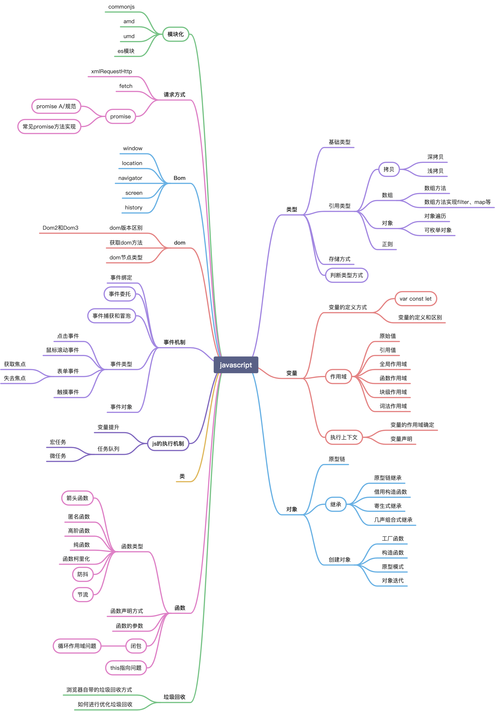
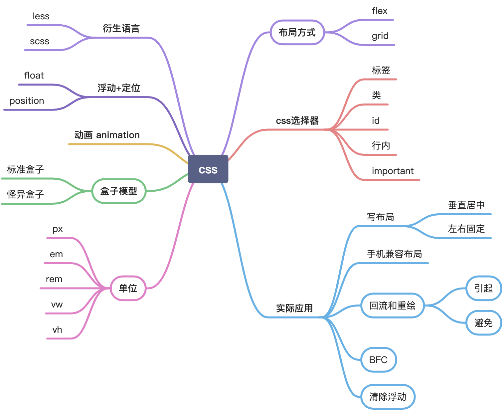
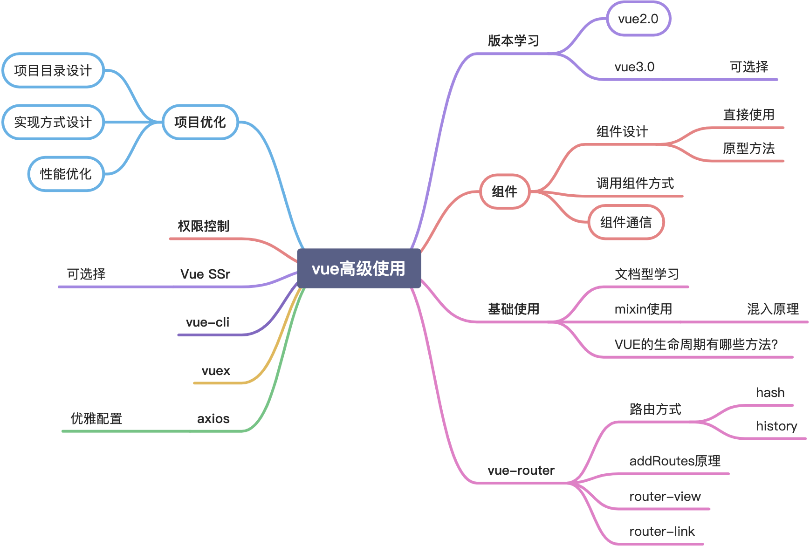
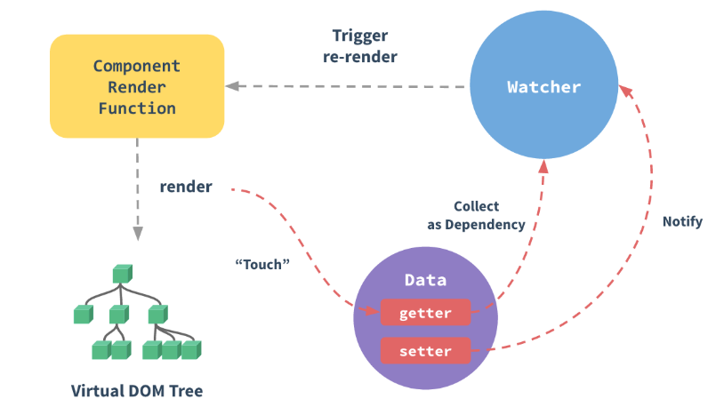

<!-- more -->

## js基础



## css基础



### scoped

[https://vue-loader.vuejs.org/zh/guide/scoped-css.html](https://vue-loader.vuejs.org/zh/guide/scoped-css.html)

### css-module

[http://www.ruanyifeng.com/blog/2016/06/css_modules.html](http://www.ruanyifeng.com/blog/2016/06/css_modules.html)

### 简述一下Sass、Less，且说明区别？

他们是动态的样式语言，是CSS预处理器,CSS上的一种抽象层。他们是一种特殊的语法/语言而编译成CSS。

区别：
变量符不一样，less是@，而Sass是$;
Sass支持条件语句，可以使用if{}else{},for{}循环等等。而Less不支持;
Sass是基于Ruby的，是在服务端处理的，而Less是需要引入less.js来处理Less代码输出Css到浏览器

## git相关

1. 列举工作中常用的几个git命令？
> 新增文件的命令：git add file或者git add .
提交文件的命令：git commit –m或者git commit –a
查看工作区状况：git status –s
拉取合并远程分支的操作：git fetch/git merge或者git pull
查看提交记录命令：git reflog

2. 提交时发生冲突，你能解释冲突是如何产生的吗？你是如何解决的？
> 通过git stash命令，把工作区的修改提交到栈区，目的是保存工作区的修改；
通过git pull命令，拉取远程分支上的代码并合并到本地分支，目的是消除冲突；
通过git stash pop命令，把保存在栈区的修改部分合并到最新的工作空间中；

3. 使用过git cherry-pick，有什么作用？
> 命令git cherry-pick可以把branch A的commit复制到branch B上。
在branch B上进行命令操作：
```
复制单个提交：git cherry-pick commitId
复制多个提交：git cherry-pick commitId1…commitId3
注意：复制多个提交的命令不包含commitId1.
```

## vue相关



1、谈谈你对MVVM开发模式的理解
> MVVM分为Model、View、ViewModel三者；
> Model代表数据模式，数据和业务逻辑都在Model层中定义；
> View代表UI视图，负责数据的展示；
> ViewModel负责监听Model中数据的改变并且控制视图的更新，处理用户交互操作；
> Model和View并无直接关联，而是通过ViewModel来进行联系的，Model和ViewModel之间有着双向数据绑定的联系。因此当Model中的数据改变时会触发View层的刷新，View中由于用户交互操作而改变的数据也会在Model中同步；
> 这种模式实现了Model和View的数据自动同步，因此开发者只需要专注对数据的维护操作即可，而不需要自己操作dom。

2、Vue有哪些指令
> v-html， v-show ， v-if , v-for 等等

3、v-if 和 v-show
> v-show仅仅控制元素的显示方式，将display属性在block和none来回切换；而v-if会控制这个DOM节点的存在与否。当我们需要经常切换某个元素的显示/隐藏时，使用v-show会更加节省性能上的开销；当只需要一次显示或隐藏时，使用v-if更加合理。

4、简述Vue的响应式原理
> 当一个Vue实例创建时，vue会遍历data选项的属性，用Object.defineProperty将它们转为getter/setter并且在内部追踪相关依赖，在属性被访问和修改时通知变化。
> 每个组件实例都有相应的watcher程序实例，它会在组件渲染的过程中把属性记录为依赖，之后当依赖项的setter被调用时，会通知watcher重新计算，从而致使它关联的组件得以更新。



5、Vue中如何在组件内部实现一个双向数据绑定
> 假设有一个输入框组件，用户输入时，同步父组件页面中的数据
> 思路：父组件通过props传值给子组件，子组件通过$emit来通知父组件修改相应的

6、Vue中给data中的对象属性添加一个新的属性时会发生什么，如何解决
> 点击button会发现，obj.b 已经成功添加，但是视图并未刷新：
> 原因在于在Vue实例创建时，obj.b并未声明，因此就没有被Vue转换为响应式的属性，
> 自然就不会触发视图的更新，这时就需要使用Vue的全局api $set()：

### vue基础

- 过滤器和插槽

- 计算属性和侦听器

- 组件生命周期
> 它可以总共分为8个阶段：创建前/后, 载入前/后,更新前/后,销毁前/销毁后

- $nextTick有什么作用？

- 你知道v-model的原理吗？说说看

- 你知道vue中key的原理吗？说说你对它的理解

- vue中怎么重置data？
> `Object.assign(this.$data, this.$options.data())`

- 如何在子组件中访问父组件的实例？
> `this.$parent`

- vue给组件绑定自定义事件无效怎么解决？
> 两种方式
> 1、组件外部加修饰符.navtive
> 2、组件内部声明$emit('自定义事件')

- 怎么访问到子组件的实例或者子元素？
> `this.$refs`

### vue-router

1、嵌套路由怎么定义？
> 在 VueRouter 的参数中使用 children 配置，这样就可以很好的实现路由嵌套。

```js
//引入两个组件
import home from "./home.vue"
import game from "./game.vue" //定义路由

const routes = [
    { path: "/", redirect: "/home" },//重定向,指向了home组件  
    {  
        path: "/home", component: home,  
        children: [  
            { path: "/home/game", component: game }  
        ]  
    }  
]
```

2、怎么定义vue-router的动态路由？怎么获取传过来的动态参数？
> 在router目录下的index.js文件中，对path属性加上/:id。
> 使用router对象的params.id。


3、vue-router有哪几种导航钩子？
```
有三种方式可以植入路由导航过程中：
第一种：是全局导航钩子：router.beforeEach(to,from,next)，作用：跳转前进行判断拦截。
第二种：组件内的钩子
第三种：单独路由独享组件
```

> beforeRouteEnter 不能获取组件实例 this，因为当守卫执行前，组件实例被没有被创建出来，剩下两个钩子则可以正常获取组件实例 this
但是并不意味着在 beforeRouteEnter 中无法访问组件实例，我们可以通过给 next 传入一个回调来访问组件实例。在导航被确认是，会执行这个回调，这时就可以访问组件实例了，如：

```js
beforeRouteEnter(to, from, next) {
    next (vm => {
        // 这里通过 vm 来访问组件实例解决了没有 this 的问题
    })
}
```

### vuex

vue框架中状态管理。
场景有：单页应用中，组件之间的状态。音乐播放、登录状态、加入购物车

- vuex中actions和mutations有什么区别？
- vuex的state、getter、mutation、action、module特性分别是什么？
- 你觉得vuex有什么缺点？

### vue-loader是什么？使用它的用途有哪些？

解析 `.vue` 文件的一个加载器，使template/js/style转换成js模块。
用途：js可以写es6、style样式可以scss或less、template可以加jade等


### ElementUI

- ElementUI是怎么做表单验证的？在循环里对每个input验证怎么做呢？
- 你有二次封装过ElementUI组件吗？
- ElementUI怎么修改组件的默认样式？
- ElementUI的穿梭组件如果数据量大会变卡怎么解决不卡的问题呢？
- ElementUI表格组件如何实现动态表头？
- ElementUI使用表格组件时有遇到过问题吗？
- 有阅读过ElementUI的源码吗？
- 项目中有使用过ElementUI吗？有遇到过哪些问题？它的使用场景主要是哪些？


## 工具基础

- 了解前端常用工具：npm、VSCode 等。
- lodash

## Node.js（可选）

- Node.js 的相关模块 http, fs, path, events
- Koa 简介
- http-proxy 如何实现代理

## 业务相关

### 登录鉴权

### 请求嵌套

## 通用能力判断

### 沟通能力

### 学习能力

### 团队意识

### 责任感

### 应变能力

## 其它综合

### 前端如何优化网站性能

1.减少 HTTP 请求数量
> 在浏览器与服务器进行通信时，主要是通过 HTTP 进行通信。浏览器与服务器需要经过三次握手，每次握手需要花费大量时间。而且不同浏览器对资源文件并发请求数量有限（不同浏览器允许并发数），一旦 HTTP 请求数量达到一定数量，资源请求就存在等待状态，这是很致命的，因此减少 HTTP 的请求数量可以很大程度上对网站性能进行优化。
	1.CSS Sprites：
		国内俗称 CSS 精灵，这是将多张图片合并成一张图片达到减少 HTTP 请求的一种解决方案，可以通过 CSS background 属性来访问图片内容。这种方案同时还可以减少图片总字节数。
	2.合并 CSS 和 JS 文件：
		现在前端有很多工程化打包工具，如：grunt、gulp、webpack等。为了减少 HTTP 请求数量，可以通过这些工具再发布前将多个 CSS 或者 多个 JS 合并成一个文件。
	3.采用 lazyLoad：
		俗称懒加载，可以控制网页上的内容在一开始无需加载，不需要发请求，等到用户操作真正需要的时候立即加载出内容。这样就控制了网页资源一次性请求数量。

2.控制资源文件加载优先级
> 浏览器在加载 HTML 内容时，是将 HTML 内容从上至下依次解析，解析到 link 或者 script 标签就会加载 href 或者 src 对应链接内容，为了第一时间展示页面给用户，就需要将 CSS 提前加载，不要受 JS 加载影响。一般情况下都是 CSS 在头部，JS 在底部。
	1.利用浏览器缓存
		浏览器缓存是将网络资源存储在本地，等待下次请求该资源时，如果资源已经存在就不需要到服务器重新请求该资源，直接在本地读取该资源。
	2.减少重排（Reflow）
		基本原理：重排是 DOM 的变化影响到了元素的几何属性（宽和高），浏览器会重新计算元素的几何属性，会使渲染树中受到影响的部分失效，浏览器会验证 DOM 树上的所有其它结点的 visibility 属性，这也是 Reflow 低效的原因。如果 Reflow 的过于频繁，CPU 使用率就会急剧上升。
	3.减少 Reflow
		如果需要在 DOM 操作时添加样式，尽量使用 增加 class 属性，而不是通过 style 操作样式。减少 DOM 操作，图标使用 IconFont 替换

### 网页从输入网址到渲染完成经历了哪些过程

> 大致可以分为如下7步：
   1.输入网址；
   2.发送到DNS服务器，并获取域名对应的web服务器对应的ip地址；
   3.与web服务器建立TCP连接；
   4.浏览器向web服务器发送http请求；
   5.web服务器响应请求，并返回指定url的数据（或错误信息，或重定向的新的url地址）；
   6.浏览器下载web服务器返回的数据及解析html源文件；
   7.生成DOM树，解析css和js，渲染页面，直至显示完成；


## 精简问题点

### vue

- 你知道v-model的原理吗？说说看
- 在使用计算属性的时，函数名和data数据源中的数据可以同名吗？
- vue中data的属性可以和methods中的方法同名吗？为什么？
- 怎么给vue定义全局的方法？
- 跟keep-alive有关的生命周期是哪些？描述下这些生命周期
- 如果现在让你从vue/react/angularjs三个中选择一个，你会选哪个？说说你的理由
- 你知道vue中key的原理吗？说说你对它的理解
- 你知道style加scoped属性的用途和原理吗？
- 在vue项目中如果methods的方法用箭头函数定义结果会怎么样？
- vue怎么实现强制刷新组件？
- 说下attrs和attrs和listeners的使用场景
- vue组件里写的原生addEventListeners监听事件，要手动去销毁吗？为什么？
- vue组件里的定时器要怎么销毁？
- vue能监听到数组变化的方法有哪些？为什么这些方法能监听到呢？
- vue在created和mounted这两个生命周期中请求数据有什么区别呢？
- 删除数组用delete和Vue.delete有什么区别？
- 动态给vue的data添加一个新的属性时会发生什么？怎样解决？
- v-show和v-if有什么区别？使用场景分别是什么？

### vue-router

- vue-router怎么配置404页面？
- vue-router路由有几种模式？说说它们的区别？
- vue-router有哪几种导航钩子（ 导航守卫 ）？
- 切换到新路由时，页面要滚动到顶部或保持原先的滚动位置怎么做呢？
- 路由之间是怎么跳转的？有哪些方式？
- 如果vue-router使用history模式，部署时要注意什么？

### vuex

- vuex中actions和mutations有什么区别？
- 你觉得vuex有什么缺点？
- 你觉得要是不用vuex的话会带来哪些问题？


### ElementUI

- ElementUI是怎么做表单验证的？在循环里对每个input验证怎么做呢？
- 你有二次封装过ElementUI组件吗？
- ElementUI怎么修改组件的默认样式？
- ElementUI使用表格组件时有遇到过问题吗？
- 项目中有使用过ElementUI吗？有遇到过哪些问题？它的使用场景主要是哪些？

### js基础

- 字符串和数组的常用方法
- 函数和箭头函数
- Promise 和 async/await
- 作用域，let 和 const，解构赋值

## 参考

- [vue 248+个知识点（面试题）为你保驾护航](https://zhuanlan.zhihu.com/p/71229672)
- [复习知识点总结（简单脑图版本）](https://juejin.cn/post/6939707197135781924#heading-13)