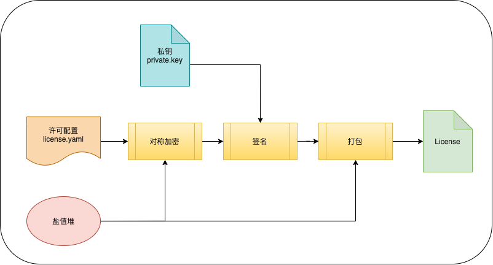
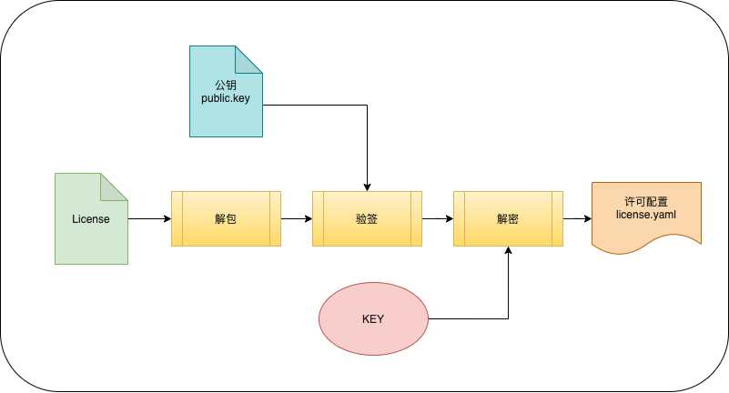

# 什么是License

license 翻译为许可证。理解为协议或版权声明，违反协议的后果就是商业纠纷。用原创作品类比，我发布这篇文章时声明了原创，别人如果要转载这篇文章，要经过我允许，否则就侵犯了我的权益。当然文章的版权与软件版权还是不一样的，不做过多比较。

<!-- more -->

# 商业许可证与开源许可证
商业许可证理解为使用该软件的门票，比如要使用 IDEA，你需要付费购买 license。

原创文章，你可以免费看，但不可以抄袭或者用作商业用途。类似的，开源软件，你可以免费使用、修改代码、与别人分享，但有一定的约束，通过开源许可证进行约束，它就像文章原创声明，但比原创声明复杂得多。

开源许可证有很多种类型，包含的内容各不相同，也就是对使用者的约束不一样。比如开源代码如果使用 GPL 协议，那么你就不能将这个代码利用在自己的商业产品中。

# 轻舟 License

> 轻舟 License 功能的具体实现涉及到安全性问题，因此以下部分描述将相对隐晦

轻舟 License 采用 非对称加密 + 对称加密 的方式。

## 加密



授权文件采用对称加密的方式先进行加密，然后再用客户独有的私钥进行签名，最后把签名结果+加密内容进行打包处理，其中为了安全性还加入了部分盐值。

## 解密



# 授权限制

我们采用 yaml 的文件配置格式，对资源和信息进行授权限制，格式大致如下：

## v1 版本

```yaml
# 客户
customer:
    name: xxxx
# MAC 地址
envs: '*'
# 版本
version: '*'
# 模块
modules:
    ... # 各个模块信息
# 日期
date:
    created: 2019-04-26
    expired: 2019-05-20
# 系统用量
system_usage:
    xxxx_count: 10

```

## v2 版本

```yaml
# 客户
customer:
    name: xxxx
# MAC 地址
envs: '*'
# 版本
version: '*'
# 模块
modules:
    ... # 各个模块信息
# 日期
date:
    created: 2019-04-26
    # 需要取各个模块过期时间最晚的时间进行配置
    expired: 2019-05-20
# 系统用量 v1
system_usage:
    xxxx_count: 10
    yyyyy_count: 10
# 模块用量限制 v2
modules_system_usage:
    - key: xxx
      expired: 2019-05-20
      xxx_count: 20
    - key: yyy
      expired: 2019-05-20
      yyy_count: 10
```

其中 v2 版本进行模块的独立拆解
- 新增 `modules_system_usage`，用于独立限制各个模块用量，其中 `expired` 为过期时间（必填）
- 需注意全局的 `date.expired`，需要取各个模块过期时间最晚的时间进行配置（重要）

需要注意，`modules_system_usage` 中的 `key`，需要与 `modules` 中的模块保持一致，且最终要与平台的 `domains` 配置保持一致
