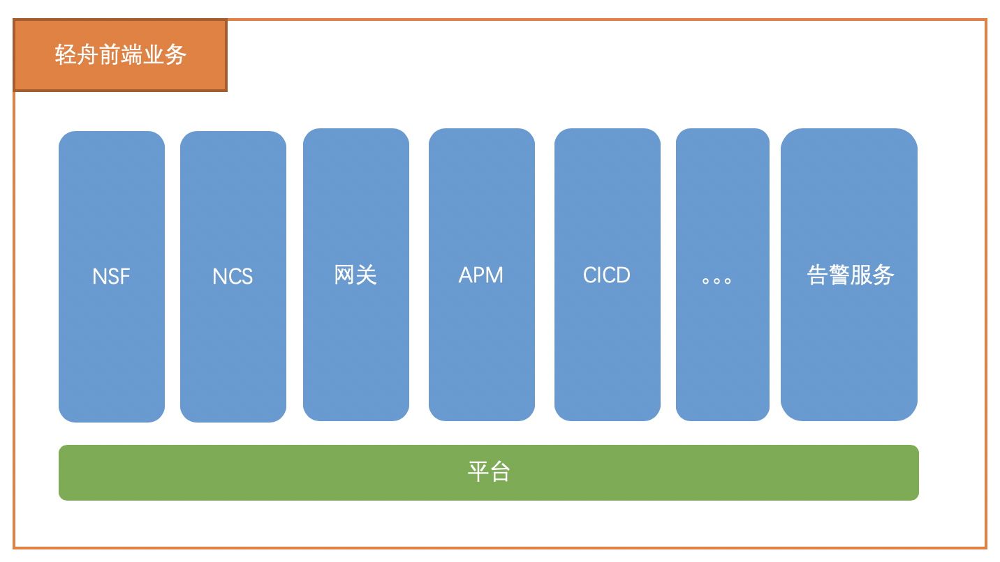
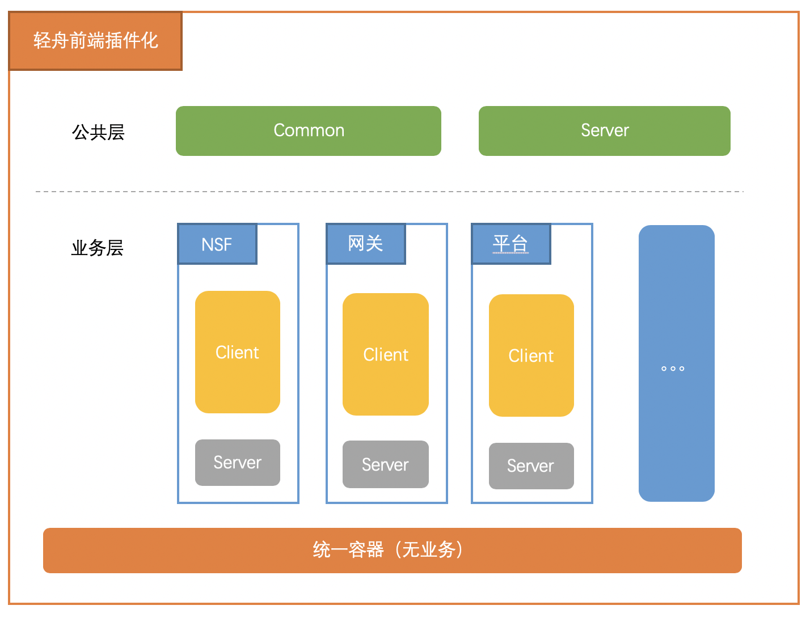

用过构建工具的同学都知道，grunt, webpack, gulp 都支持插件开发。后端框架比如 egg koa 都支持插件机制拓展，前端页面也有许多可拓展性的要求。插件化无处不在，所有的框架都希望自身拥有最强大的可拓展能力，可维护性，而且都选择了插件化的方式达到目标。

<!-- more -->

## 背景

用过构建工具的同学都知道，grunt, webpack, gulp 都支持插件开发。后端框架比如 egg koa 都支持插件机制拓展，前端页面也有许多可拓展性的要求。插件化无处不在，所有的框架都希望自身拥有最强大的可拓展能力，可维护性，而且都选择了插件化的方式达到目标。

我认为插件化思维是一种通过拆分来达到工程拆分治理的方案，可以解决工程膨胀、开发维护困难等问题。

没有插件化，核心库的代码会变得冗余，功能耦合越来越严重，最后导致维护困难。

轻舟前端项目原始工程目录如下；

```
- src
   |- client
   |    |- base # 通用
   |    |- components # 公共组件
   |    |- utils # 通用工具
   |    |- views # 各个子业务模块
   |        ｜- apm
   |        ｜- cicd
   |        ｜- gtxs
   |        ｜- login
   |        ｜- ncs
   |        ｜- nsf
   |        ｜- platform
   |- server # nodejs 服务相关
```

虽然结构清晰，但是所有的子业务模块都用堆积在一个项目仓库中，面临着版本维护成本高，且多人开发时的代码各模块耦合严重，合并代码时冲突情况的发生也会愈发频繁等很多问题。

## 分析

诚然，任何技术的实现都要依托业务场景才会变得有意义，所以在阐述轻舟前端团队的插件化实践之前，我们先来简单展示一下轻舟前端各个子业务的基本形态。



从图中我们很容易发现各个子业务都是相互独立的，而平台则是为了横向服务于各个子业务，提供各个子业务入口等公共而诞生的。

而且随着业务产品线的不断扩张，工程管理成本也在迅速增长。具体来说，包括如下五个方面：

- 新业务线产品急速增加，同时为了保证快速接入且复用率的最大化，把文件放入同一仓库管理，导致文件数量增长极快，管理及协同开发难度也在不断加大。
- 文件越来越多，文件结构越不受控制，业务开发寻址变得越来越困难。
- 文件越来越多，开发、构建、部署速度变得越来越慢，开发体验在持续下降。
- 不同业务线间没有物理隔离，出现了跨业务线互相引用混乱，例如 A 业务线出现了 B 业务线名字的组件。
- 不同客户所需要的功能不同，子业务的版本也会不同，一个仓库无法管理多个子业务的不同版本组合。

## 方案选择

为了要解决这些问题，我们意识到需要拆分这些子业务，即进行工程优化的常规手段进行“分治”。

那么要怎么拆呢？我们考虑了很多方案，其中也包括现阶段业界流行的微前端方案。也从这个概念出发，我们也深度结合了轻舟前端的实际业务的开发情况，对现有工程进行了调研。

为什么不采用微前端方案？这个问题我们考虑很久，其中很大一部分原因是“中心化”的依赖。由于轻舟的大部分客户都是私有网络，定制化需求大，且轻舟前端应用属于中后台管理系统，出于安全问题，很大程度上不便于提供一个公共的存储服务作为版本控制中心。

其次就是整改周期中要不影响现有业务工程，做到平滑迁移，对现有工程中的代码基本做到不修改等。最主要的是要考虑兼容原有的客户代码（这点很难）。

最终我们另辟蹊径，采用了一种`插件化`的方案，“一切模块业务皆是插件”。

## 方案落地

插件化就是将不断扩张的功能分散在插件中，内部集中维护逻辑，这就有点像数据库横向扩容，结构不变，拆分数据。

理想情况下，我们都希望一个库，或者一个框架具有足够的可拓展性。这个可拓展性体现在这三个方面：

- 支持产品形态业务等自由组合转换，针对不同客户需求提供不同时期的业务版本组合，以实现功能。
- 支持二次开发，满足不同业务场景的特定需求。
- 让代码以业务功能为纬度聚合起来，而不是某个片面的逻辑结构，在代码数量庞大的场景尤为重要。

我们最终的方案依赖于 NPM 中的 git 依赖的功能机制。

所有业务都是独立的 git 仓库子工程，可以独立打包，也可以由一个统一的容器工程管理，打包时集成。

大致的方案图如下：



- 公共层：属于通用公共逻辑，存放整个平台通用的组件及后端业务逻辑。
- 业务层：针对不同业务拆分成不同等价的业务仓库，各个业务向上依赖，每个业务都可以当做独立插件。
- 统一容器：可选，不包含实际的业务逻辑，可以对所有业务层进行组合，并对外输出一个完整的项目产品。

其中每一个块都是相互独立的仓库和业务，且都可以独立运行。通过 “git分支” 与 “npm依赖管理” 相结合, 使业务模块之间成为依赖库，相互解耦, 利于开发.

现在来试着解决最初的五个问题：

1. 通过拆分仓库，使各个业务文件分散管理，并且提取了公共的common仓库，作为业务统一依赖。
2. 通过拆分仓库，减少各个仓库中具体业务的代码量，开发时只需要关注自身业务和通用组件等部分。
3. 通过拆分仓库，减少开发时的构建成本，减少开发文件依赖，使构建速度提升。
4. 通过拆分仓库，不同业务线建立物理隔离。
5. 通过各个子业务独立分支的方式，做到不同客户子业务级别的功能版本不同的自由组合。

### 举例

通过拆分，现在我们可以把`common`、`server`、`NSF`、`网关`、`平台`等多个业务模块当成独立的插件。
以下会简单的通过两个例子描述下具体的使用场景。

#### 业务组合

我们可以通过`统一容器`增加不同的业务依赖，也就是在`统一容器`中，增加各个业务插件，让这个容器拥有相应的业务功能。如：在配置文件中增加了`login`登录业务，此时容器就会拥有一个登陆界面，同时后端node层也会拥有登录鉴权的相关逻辑。

#### 新增子业务

当我们新增一个子业务时（如：cicd 业务），我们只需要创建一个 cicd 的新仓库，并且该仓库结构依然完全按照独立项目开发。只需要依赖公共层的`common`和`server`，并且在根目录增加一个基本配置文件`config.js`，就可以完全接入了。

## 总结

由于轻舟前端方案采用的是插件化的架构，所以组件库升级、优化打包方案等一系列工程都可以在插件方式下完成，而无需改变源码本身。

配置插件化，可参考 `vue-cli` 插件原理。

### 优点

1. 分支合并时的冲突可控 (不再采取分支合并进行最终输出).
2. 业务模块之间相互解耦, 降低业务之间强耦合度.
3. 代码结构规范化 (分治思想, 业务独立维护).
4. 提高代码复用性 (通过规范化, 明确了可暴露的模块).
5. 业务中, 优化了多个模块自由组合需求. (通过不同的分支引用, 进行自由组合)

### 不足

1. 线上部署更新都是以全量的前端资源进行打包，耗时较长。(可进行优化成单个业务独立打包)
2. 由于插件化的机制，导致`webpack`配置等存在部分黑盒情况，不方便维护。(以通过打印输出最终配置)
