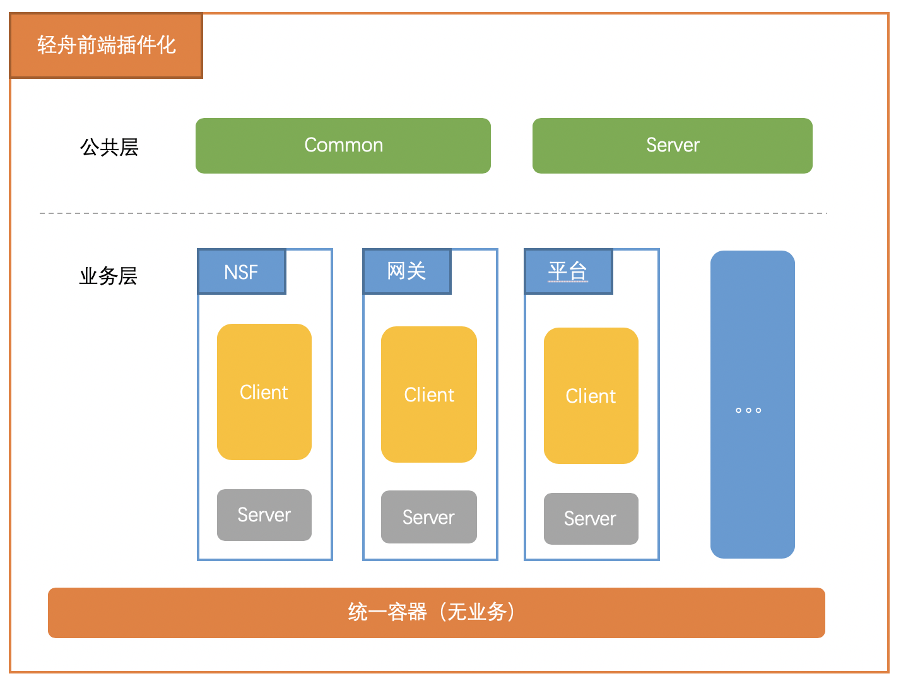
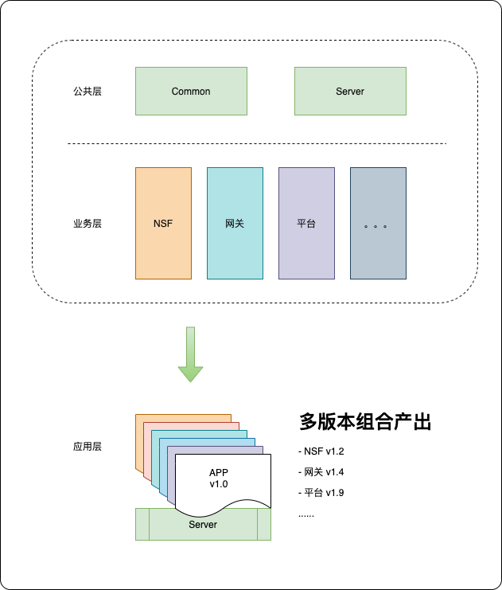
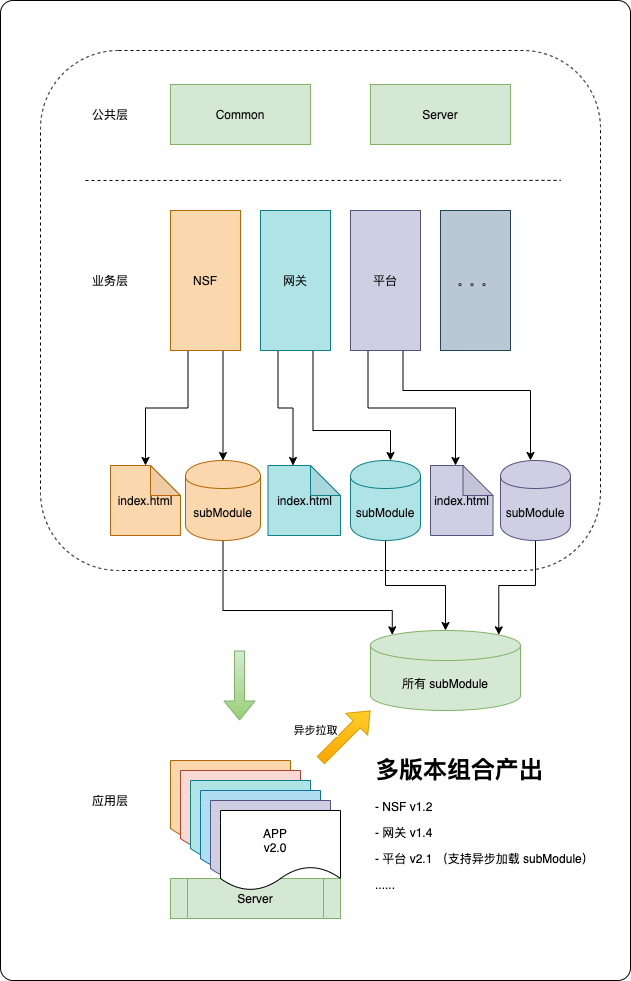

对于 ToB 业务而言，随着业务的不断壮大，接入的客户逐渐增加，相同页面的差异化的需求越来越多，不同业务模块面临的差异化定制也随之增多。各个业务模块也需要通过客户的需求进行随意搭配组合。

一旦这种差异化需求随着业务量的增长而膨胀起来，各个模块的迭代周期差异变大，模块之间的相互依赖的兼容性代码中的 IF ELSE 越来越多，项目就越来越难以维护。

基于这个问题，比较普遍的解决方案要么是项目拆分，要么相同项目的代码分割。而我们选择了一个折中的方式。

<!-- more -->

## 前言

微前端架构是一种类似于微服务的架构，它将微服务的理念应用于浏览器端，即将 Web 应用由单一的单体应用转变为多个小型前端应用聚合为一的应用。

由此带来的变化是，这些前端应用可以独立运行、独立开发、独立部署。以及，它们应该可以在共享组件的同时进行并行开发——这些组件可以通过 NPM 或者 Git Tag、Git Submodule 来管理。

声明：本文不强行归类到微前端技术中，也不阐述微前端的相关技术与本方案的优缺点。只针对轻舟前端的相关业务框架演进进行一些解析。

## 背景

轻舟现阶段前端人力颇为紧张（4人），支持的业务模块达到 12 个之多，仓库数量达到了 15 个左右。需要支持的内外客户数量那就更多了...

为了能尽可能满足所有客户的需求，我们对轻舟前端整体进行了拆分，让业务更细化的同时也是为了方便开发人员更好的维护精通业务。

当前轻舟前端的脚手架是组内自研的一套多仓库微服务框架，框架基本都在公共层 common 中，并且适配了vusion、vue-cli等一些主流库。当底层进行迁移演进时，上层业务开发人员无需感知。

## 演进

### 第一阶段（初探）

第一阶段的历史背景可以参考我之前的文章 [轻舟前端插件化架构方案](https://kms.netease.com/article/14784)，这里就不再赘述了。

### 第二阶段（过渡）

这个阶段中，由于各个模块中都包含了 `client` 和 `server` 两层，我们在实际的开发场景中发现，`server` 中的代码变动率极低，且大部分开发人员不需要去了解 nodejs 中的相关逻辑，切容易被开发人员误解。

因此，内部人员经讨论分析后给出的一致结论是回收所有的模块的 `server` 代码，并放入独立的 `server` 仓库进行统一管理。

同时，我们演进了各模块的组合和加载方式，使其能快速的响应客户的定制化需求，组合输出不同功能的整体版本。

### 第三阶段

现在这个方案是目前我们轻舟前端的整体架构了。虽然不是最优解，但是就目前来看却是最适合我们业务的了。

#### 公共层

- Common：用于承载所有通用组件、框架、webpack配置、eslint配置、vusion组件及配置、vue-cli配置等。原则上只要是通用的，都在这里面。

- Server：基于Nodejs的BFF层，这一层很轻，但是我们做了很多定制化和异步模块化的事情。并且上图中的所有 SubModule 的文件配置都是从这里调度的。

#### 业务层

各个业务层拥有统一的结构、规范等等，并且也可以做一些独立的配置，以表现业务的不同之处。

#### 应用层

这是一个虚构的层，其实就是某种产出物的承载方式，可以是 Docker、纯前端文件等。我们基于脚本、K8s配置或者轻舟内部的CICD对业务层进行整合，可以输出多种客户版本，从而降低了人力成本、维护成本。

其中涉及的 SubModule 那快的异步模块加载逻辑，可以参考微前端等相关文案，这里不再赘述。

## 结尾

由于轻舟前端的各个模块非常独立且耦合度极低，因此可以承载很多独立部署，自由组合等相关的需求输出。