<!-- more -->

## CentOS7 镜像

[aliyun 镜像仓库](https://mirrors.aliyun.com/centos/?spm=a2c6h.13651104.0.0.16d312b2utc849)

### 安装过程

略

### 安装依赖

```sh
yum -y install perl gcc gcc-c++ make cmake kernel kernel-headers kernel-devel net-tools nano vim
```

### 配置 SBM 支持

远程挂在 Nas 磁盘
#### 安装

```sh
yum install cifs-utils -y
```

#### 配置启动时自动 mount

```sh
echo "mount -t cifs //{SMB服务器IP地址}/AppData ~/AppData -o username=docker123,password=docker123,nobrl" >> /etc/rc.local

# 修改权限
chmod 755 /etc/rc.local
chmod -R 755 /etc/rc.d
```

#### 脚本

创建脚本

```sh
mkdir -p ~/logs
vim ~/mountRemoteDisk.sh
```
都是内网IP，请自行脑补修改

```sh
#!/bin/bash
#execute mount windows share folder

parm=$(mount | grep "/AppData")
if [ "$parm" == "" ]; then
   mount.nfs4 10.10.10.10:/mnt/DataStore/AppData ~/AppData  > ~/logs/mountAppData.log 2>&1
else
   echo "AppData has been mounted."  > ~/logs/mountAppData.log 2>&1
fi

parm1=$(mount | grep "/Shared")
if [ "$parm1" == "" ]; then
   mount -t cifs //10.10.10.10/Shared ~/Shared -o username=docker,password=docker,nobrl > ~/logs/mountShared.log 2>&1
else
   echo "Shared has been mounted." > ~/logs/mountShared.log 2>&1
fi

parm2=$(mount | grep "/Downloads")
if [ "$parm2" == "" ]; then
   mount -t cifs //10.10.10.20/Downloads ~/Downloads -o guest,nobrl > ~/logs/mountDownloads.log 2>&1
else
   echo "Downloads has been mounted." > ~/logs/mountDownloads.log 2>&1
fi

parm3=$(mount | grep "/FTP")
if [ "$parm3" == "" ]; then
   mount -t cifs //10.10.10.20/FTP ~/FTP -o guest,nobrl > ~/logs/mountFTP.log 2>&1
else
   echo "FTP has been mounted." > ~/logs/mountFTP.log 2>&1
fi
```

增加定时器

```sh
crontab -e

# 十分钟运行一次
*/10  *  *  *  * ~/mountRemoteDisk.sh
```

增加开机自动运行脚本

```sh
# /etc/rc.local
sh ~/mountRemoteDisk.sh
```

### 关闭防火墙

> 关闭防火墙后，服务器不要再暴露到公网上了

```sh
systemctl disable firewalld
```

## Docker

### 安装

使用官方安装脚本自动安装

```sh
# 使用 Shell 脚本进行安装
curl -fsSL https://get.docker.com | bash -s docker --mirror Aliyun
```

也可以使用国内 daocloud 一键安装命令：

```sh
curl -sSL https://get.daocloud.io/docker | sh
```

### 启动

```sh
systemctl start docker
```

### 开机启动

```sh
systemctl enable docker
```

### Docker 换源

> 注意：如果拉取速度没问题，可以不用换

```sh
# 编辑配置文件
nano /etc/docker/daemon.json
```

配置文件的内容

```json
{
  "registry-mirrors": ["https://docker.mirrors.ustc.edu.cn"]
}
```


## 常用 Docker 镜像

### Portainer

Portainer是一个可视化的容器镜像的图形管理工具，利用Portainer可以轻松构建，管理和维护Docker环境。 而且完全免费，基于容器化的安装方式，方便高效部署。

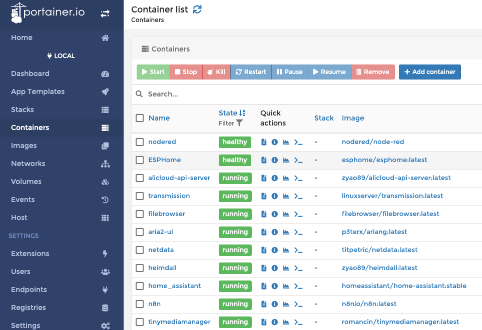

```sh
# 安装 Portainer：
docker run -d -p 9000:9000 -v /var/run/docker.sock:/var/run/docker.sock -v ~/AppData/portainer:/data --name portainer --restart=always portainer/portainer
```

### Speedtest

内网测速

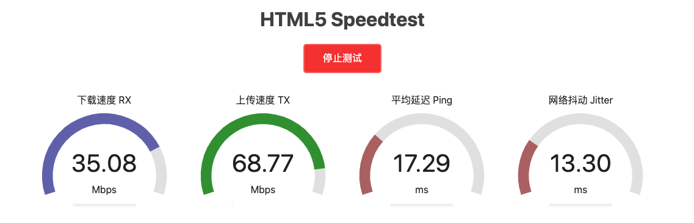

```sh
# 安装 Speedtest：
docker run -d -p 6688:80 --restart=always --name speedtest ilemonrain/html5-speedtest:alpine
```

### Node-RED

Node-RED是一种基于Node.js的编程工具，用于以新颖有趣的方式将硬件设备，API和在线服务连接在一起。它提供了一个基于浏览器的编辑器，可以使用调色板中的各种节点轻松地将流连接在一起，只需单击即可将其部署到运行时。

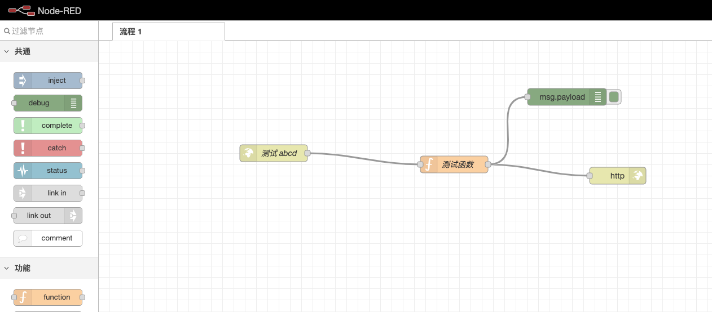

```sh
docker run -d --restart=always --name="nodered" -p 1880:1880 nodered/node-red:latest-minimal
```

### ESPHome

ESP8266 系列开发框架，通过配置实现简单的 IOT

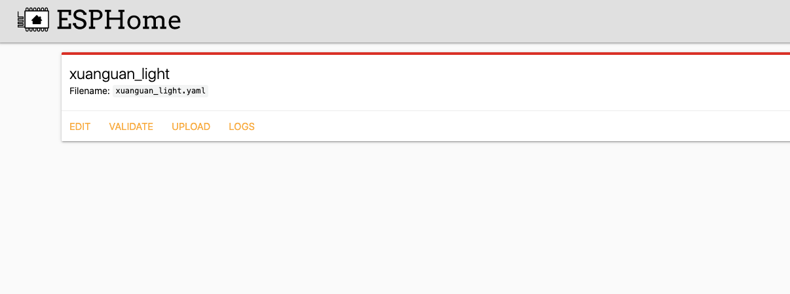

```sh
docker run -d \
    -p 6052:6052 \
    --name="ESPHome" \
    -e TZ=Asia/Shanghai \
    --hostname="esphome" \
    -v ~/AppData/esphome:/config \
    -v /run/udev:/run/udev \
    --privileged \
    --restart unless-stopped \
    esphome/esphome
```

### Home-Assistant

Home Assistant 是一款基于 Python 的智能家居开源系统，支持众多品牌的智能家居设备，可以轻松实现设备的语音控制、自动化等。

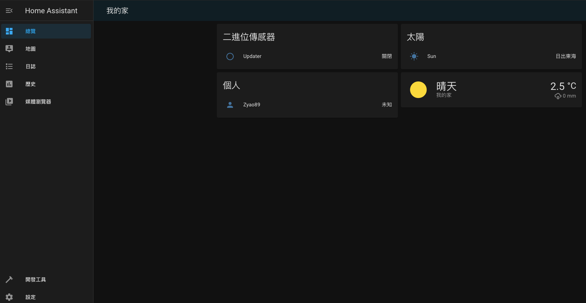

```sh
docker run -d \
--name=home_assistant \
-e TZ="Asia/Shanghai" \
-v ~/AppData/homeassistant:/config \
-v /dev/bus/usb:/dev/bus/usb \
-v /var/run/dbus:/var/run/dbus \
-v /etc/localtime:/etc/localtime:ro \
--net=host \
--privileged \
--restart always \
homeassistant/home-assistant:stable
```

### Jellyfin

开源的家庭影音中心

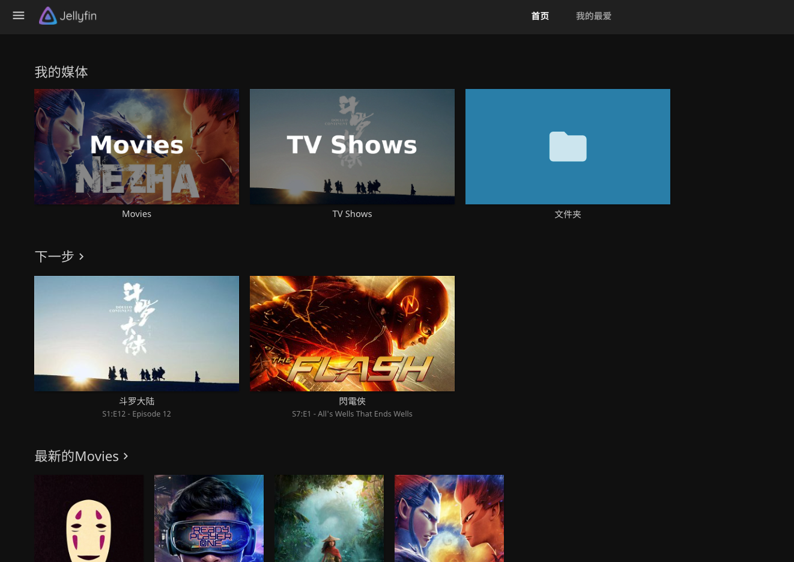

```sh
docker run -d \
    --name jellyfin \
    --user $UID:$GID \
    -p 8096:8096 \
    -p 8920:8920 \
    -p 7359:7359/udp \
    -p 1900:1900/udp \
    --volume ~/AppData/jellyfin/config:/config \
    --volume ~/AppData/jellyfin/cache:/cache \
    --volume ~/Shared/Movies:/media \
    --volume ~/Shared/Movies:/data/movies \
    --volume ~/Shared/TVSeries:/data/tvshows \
    --device /dev/dri:/dev/dri \
    --restart=unless-stopped \
    jellyfin/jellyfin
```

### Adguardhome

自建DNS广告拦截器

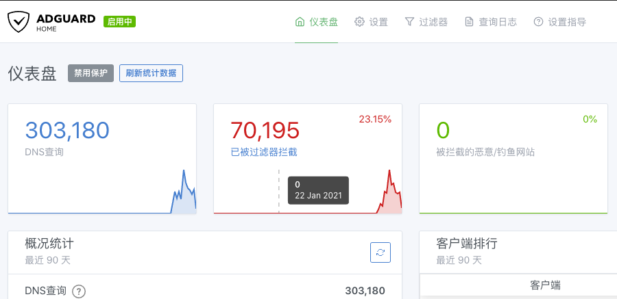

```sh
docker run --name adguardhome \
    -v ~/AppData/adguardhome/workdir:/opt/adguardhome/work \
    -v ~/AppData/adguardhome/confdir:/opt/adguardhome/conf \
    -p 53:53/tcp -p 53:53/udp \
    -p 5380:80/tcp -p 5381:3000/tcp \
    -p 4467:67/udp -p 4468:68/tcp -p 4468:68/udp \
    -p 5343:443/tcp \
    -p 853:853/tcp \
    -p 784:784/udp \
    -p 5443:5443/tcp -p 5443:5443/udp \
    --restart unless-stopped \
    -d adguard/adguardhome
```

### heimdall

最好用的地址导航

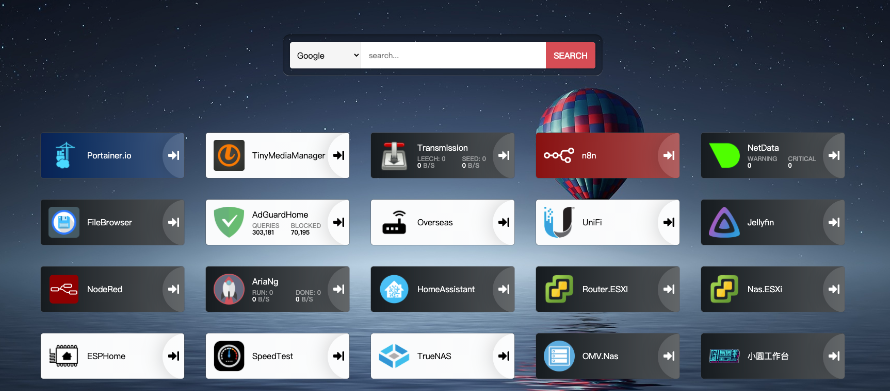

```sh
docker run -d \
    --name=heimdall \
    -e PUID=$UID \
    -e PGID=$GID \
    -e TZ="Asia/Shanghai" \
    -p 80:80 \
    -p 443:443 \
    -v ~/AppData/heimdall:/config \
    --restart unless-stopped \
    zyao89/heimdall
```

### unifi-controller

unifi-controller 路由控制器

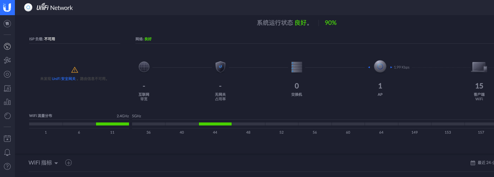

> 此操作可能找不到设备，需要通过 `Ubiquiti Device Discovery Tool` 工具查找并修改 `set-inform` 地址
> set-inform http://x.x.x.x:8080/inform

```sh
docker run -d \
    --name=unifi-controller \
    -e PUID=$UID \
    -e PGID=$GID \
    -e MEM_LIMIT=1024M \
    -p 3478:3478/udp \
    -p 10001:10001/udp \
    -p 8080:8080 \
    -p 8443:8443 \
    -p 8843:8843 \
    -p 8880:8880 \
    -p 6789:6789 \
    -v ~/AppData/unifi-controller:/config \
    --restart unless-stopped \
    linuxserver/unifi-controller
```

### tinymediamanager

自动收集影音资源图片，并且可以整理文件夹等

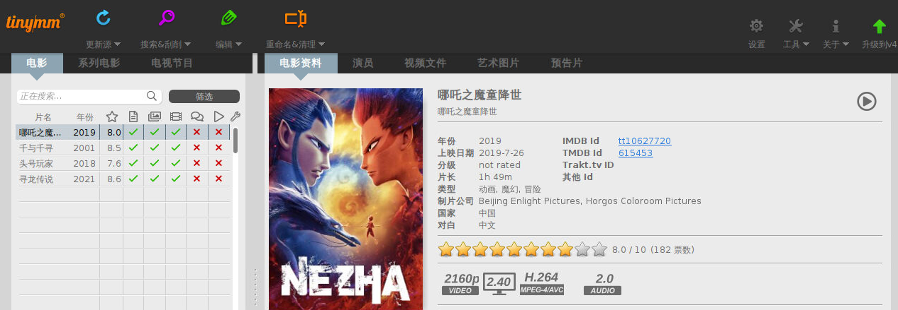

```sh
docker run -d --name=tinymediamanager \
    -v ~/AppData/tinymediamanager/config:/config \
    -v ~/Shared/Movies:/media \
    -v ~/Shared/Movies:/data/movies \
    -v ~/Shared/TVSeries:/data/tvshows \
    -e GROUP_ID=0 -e USER_ID=0 -e TZ="Asia/Shanghai" \
    -p 5800:5800 \
    -p 5900:5900 \
    -e ENABLE_CJK_FONT=1 \
    -e KEEP_APP_RUNNING=1 \
    romancin/tinymediamanager:latest
```

可以通过定时任务触发脚本，自动整理

```sh
# 定时脚本任务
docker run --rm --name=tinymediamanagerscript \
    -v ~/AppData/tinymediamanager/config:/config \
    -v ~/Shared/Movies:/media \
    -v ~/Shared/Movies:/data/movies \
    -v ~/Shared/TVSeries:/data/tvshows \
    -e GROUP_ID=0 -e USER_ID=0 -e TZ="Asia/Shanghai" \
    romancin/tinymediamanager:develop /config/tinyMediaManagerCMD.sh -updateMovies -scrapeNew
```

### transmission

下载神器

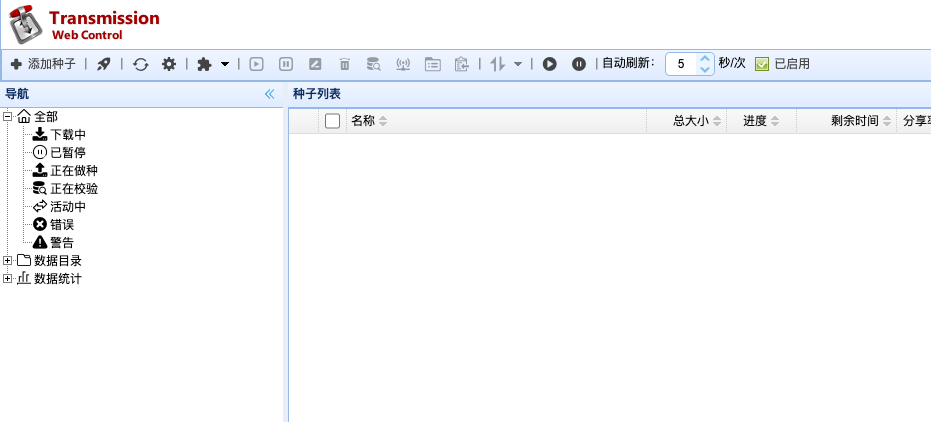

```
docker run -d \
    --name=transmission \
    -e PUID=$UID \
    -e PGID=$GID \
    -e TZ=Asia/Shanghai \
    -e WHITELIST=10.10.10.99 \
    -p 9091:9091 \
    -p 51413:51413 \
    -p 51413:51413/udp \
    -v ~/AppData/transmission/config:/config \
    -v ~/AppData/transmission/watch:/watch \
    -v ~/Downloads/transmission:/downloads \
    --restart unless-stopped \
    linuxserver/transmission
```

### aria2

下载工具

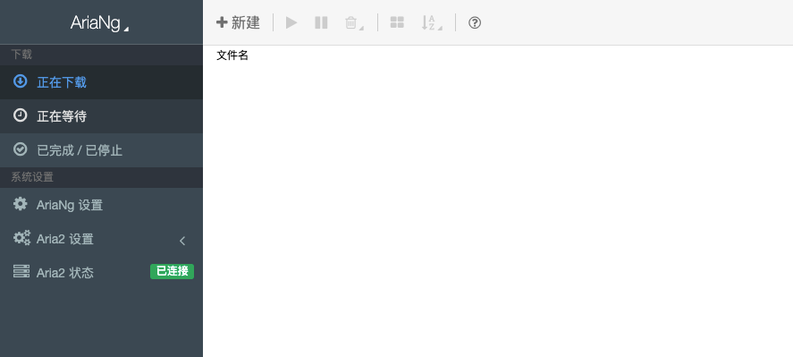

```sh
docker run -d \
    --name aria2-pro \
    -p 6800:6800 \
    -p 6888:6888 \
    -p 6888:6888/udp \
    --restart unless-stopped \
    --log-opt max-size=1m \
    -e PUID=$UID \
    -e PGID=$GID \
    -e RPC_SECRET=1234567 \
    -e RPC_PORT=6800 \
    -e LISTEN_PORT=6888 \
    -v ~/AppData/aria2/config:/config \
    -v ~/Downloads/aria2:/downloads \
    p3terx/aria2-pro
```

```sh
# 前端 web ui
docker run -d \
    --name aria2-ui \
    --restart unless-stopped \
    --log-opt max-size=1m \
    -p 6880:6880 \
    p3terx/ariang
```

### filebrowser

文件管理器

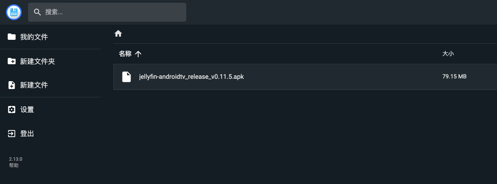

```sh
docker run -d \
    --name filebrowser \
    -e PUID=$UID \
    -e PGID=$GID \
    -e TZ=Asia/Shanghai \
    -v ~/FTP:/srv \
    -p 10086:80 \
    filebrowser/filebrowser
```

> 注意，需要先运行，再修改 `volume` 映射文件

```sh
docker run -d \
    --name filebrowser \
    -e PUID=$UID \
    -e PGID=$GID \
    -e TZ=Asia/Shanghai \
    -v ~/FTP:/srv \
    -v ~/AppData/filebrowser/custom:/custom \
    -v ~/AppData/filebrowser/database.db:/database.db \
    -v ~/AppData/filebrowser/filebrowser.json:/.filebrowser.json \
    -p 10086:80 \
    --restart unless-stopped \
    filebrowser/filebrowser
```

### netdata

监控，可以监控 docker 容器状态

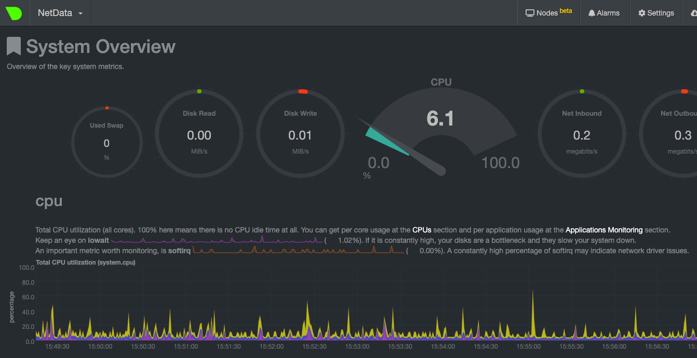

```sh
docker run -d --name=netdata \
    -p 19999:19999 \
    -e PUID=$UID \
    -e PGID=$GID \
    -e TZ=Asia/Shanghai \
    -v /proc:/host/proc:ro \
    -v /sys:/host/sys:ro \
    -v /var/run/docker.sock:/var/run/docker.sock:ro \
    --cap-add SYS_PTRACE \
    --security-opt apparmor=unconfined \
    --restart unless-stopped \
    titpetric/netdata
```
  


### registry

自定义镜像仓库

```sh
docker run -d --name registry -p 5000:5000 -v ~/AppData/registry:/var/lib/registry --restart=always registry:latest
```

### 私人仓库镜像

#### 配置私人仓库地址

```sh
vim /etc/docker/daemon.json
```

配置以下内容

```json
{
    "insecure-registries": ["docker.local:5000"],
    "registry-mirrors": [
      "https://registry.docker-cn.com",
      "http://hub-mirror.c.163.com",
      "https://docker.mirrors.ustc.edu.cn"
    ]
}
```

> 重启 docker 

#### STATIC_SERVER（私有）

简单的静态服务器

```sh
docker run -d --name STATIC_SERVER -p 1314:1314 -v ~/AppData/STATIC_SERVER:/home/project/root --restart=unless-stopped docker.local:5000/static_server:latest
```

#### C2V（私有）

私人工作台

```sh
docker run -d --name C2V -p 1234:1234 -v ~/AppData/C2V_DB:/home/project/database --restart=unless-stopped docker.local:5000/canvas-to-video:latest
```
