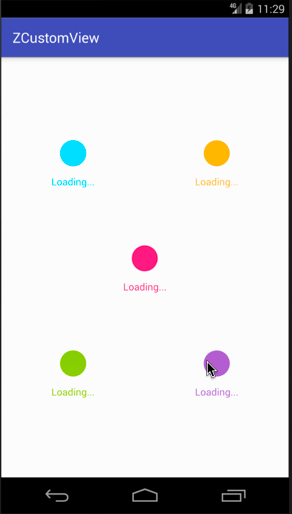

Android自定义动画系列八，今天来分享第八个自定义Loaidng动画（IntertwineBuilder），名字就叫`交织`，这个动画效果一般，简单分享下吧。效果图如下：

**GIF有点大，手机流量请三思。**

<!-- more -->

## 效果图



## 介绍

首先依旧是声明，我做这些动画的初衷是为了学习和分享，所以希望大家可以指点错误，让我更好的进步。（系列加载动画的截止时间：我放弃的时候）。

今天放假第一天，心还没回来，还想玩，想玩，玩～😄。

上一个动画链接：[Android自定义加载动画-感染体](https://zyao89.cn/2017/04/06/Android自定义加载动画-感染体/)

## 正文

与前一个动画相似，继承基类 `BaseBallBuilder`，具体的介绍可以见[上一个动画](https://zyao89.cn/2017/04/06/Android自定义加载动画-感染体/)，或者[前往Github](https://github.com/zyao89/ZCustomView)上进行查看（进去了就给个star吧，😁），这里简单分享下实现方法吧。

```java
    @Override
    protected void initParams(Context context)
    {//参数初始化
        mBallR = getAllSize();//圆半径
        mPath = new Path();//路径
        initPaint(5);//画笔
        initPoints(mBallR);//初始化圆点
    }

    @Override
    protected void onDraw(Canvas canvas)
    {
        drawBall(canvas);//画圆
    }

    /**
     * 绘制小球
     *
     * @param canvas
     */
    private void drawBall(Canvas canvas)
    {
        canvas.save();
        mPaint.setStyle(Paint.Style.FILL_AND_STROKE);
        super.drawBall(canvas, mPath, mPaint);
        canvas.restore();
    }
```

下面对圆的各个点偏移量进行处理，也是这个动画的主要方法。关注这里就行了，大概的注视都写在旁边了，应该很简单的。

```java
    @Override
    protected void computeUpdateValue(ValueAnimator animation, @FloatRange(from = 0.0, to = 1.0) float animatedValue)
    {
        switch (mCurrAnimatorState)
        {
            case 0://交织
                animation.setInterpolator(new AccelerateInterpolator());
                for (int i = 0; i < mBallPoints.size(); i++)
                {
                    CirclePoint circlePoint = mBallPoints.get(i);
                    if (2 <= i && i <= 7)
                    {//处理右下方的所有点
                        circlePoint.setOffsetX(-mBallR * (1 - animatedValue));
                        circlePoint.setOffsetY(-mBallR * (1 - animatedValue));
                    }
                    else
                    {
                        circlePoint.setOffsetX(mBallR * (1 - animatedValue));
                        circlePoint.setOffsetY(mBallR * (1 - animatedValue));
                    }
                }
                break;
            case 1://还原
                animation.setInterpolator(new AccelerateInterpolator());
                for (int i = 0; i < mBallPoints.size(); i++)
                {
                    CirclePoint circlePoint = mBallPoints.get(i);
                    if (2 <= i && i <= 7)
                    {//处理右下方的所有点
                        circlePoint.setOffsetX(-mBallR * (animatedValue));
                        circlePoint.setOffsetY(-mBallR * (animatedValue));
                    }
                    else
                    {
                        circlePoint.setOffsetX(mBallR * (animatedValue));
                        circlePoint.setOffsetY(mBallR * (animatedValue));
                    }
                }
                break;
        }
    }

    @Override
    public void onAnimationRepeat(Animator animation)
    {
        if (++mCurrAnimatorState > FINAL_STATE)
        {//还原到第一阶段
            mCurrAnimatorState = 0;
            for (CirclePoint point : mBallPoints)
            {//恢复偏移量
                point.setOffsetY(0);
                point.setOffsetX(0);
            }
        }
    }
```

## 总结

小伙伴们，要是想看更多细节，可以前往文章最下面的Github链接，如果大家觉得ok的话，希望能给个喜欢，最渴望的是在Github上给个star。谢谢了。

如果大家有什么更好的方案，或者想要实现的加载效果，可以给我留言或者私信我，我会想办法实现出来给大家。谢谢支持。

Github：[zyao89/ZCustomView](https://github.com/zyao89/ZCustomView)

`作者：Zyao89；转载请保留此行，谢谢；`

个人博客：[https://zyao89.cn](https://zyao89.cn)
