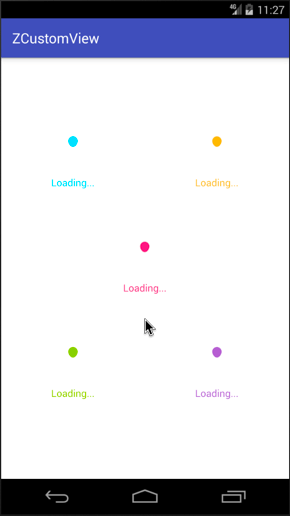

Android自定义动画系列七，今天来分享第七个自定义Loaidng动画（InfectionBallBuilder），看上去感觉有种病毒源被感染的感觉，所以名字就叫`感染体`，这个动画做出来的效果，我不怎么满意，但是实现方式还是可以介绍介绍的。效果图如下：

**GIF有点大，手机流量请三思。**

<!--more-->

## 效果图



## 介绍

首先依旧是声明，我做这些动画的初衷是为了学习和分享，所以希望大家可以指点错误，让我更好的进步。（系列加载动画的截止时间：我放弃的时候）。

最近清明放假，我也给我自己放了一个假，放松之余，玩了几天几夜的 `王者荣耀` 。 五黑上分的感觉--爽歪歪呀。假期的最后一天了，收收心，继续来一波动画。

上一个动画链接：[Android自定义加载动画-颤抖吧！球球](https://zyao89.cn/2017/03/27/Android自定义加载动画-颤抖吧！球球/)

言归正传，开始新的动画。

## 正文

这里先把之前一个动画进行了简单的重构，然后提取了一个基类 `BaseBallBuilder` ，包含了画笔的初始化，贝塞尔曲线画圆方法，以及圆点内部类。具体的实现方法可以见[上一个动画](https://zyao89.cn/2017/03/27/Android自定义加载动画-颤抖吧！球球/)，或者[前往Github](https://github.com/zyao89/ZCustomView)上进行查看，这里就不做具体说明了。

```java
abstract class BaseBallBuilder extends ZLoadingBuilder
{
    //贝塞尔曲线常量
    private static final float                   PROP_VALUE  = 0.551915024494f;
    //小球点集合
    protected final      LinkedList<CirclePoint> mBallPoints = new LinkedList<>();
    //画笔
    protected Paint mPaint;

    /**
     * 初始化画笔
     */
    protected void initPaint(float lineWidth)
    {
      ...
    }

    /**
     * p10    p9      p8
     * ------  ------
     * p11                     p7
     * |                       |
     * |                       |
     * p0 |      (0,0)         | p6
     * |                       |
     * |                       |
     * p1                      p5
     * ------  ------
     * p2      p3      p4
     */
    protected final void initPoints(float ballR)
    {
     ...
    }

    protected final void drawBall(Canvas canvas, Path path, Paint paint)
    {
        ...
    }

    /**
     * 圆点内部类
     */
    static class CirclePoint
    {
       ...
    }
}
```

这里开始今天的正题了 `InfectionBallBuilder` ，部分源码如下，具体步骤介绍就都写在注释里面了。很多方式都和前面的动画介绍类似，大家可以往前翻看。因为动画简单所以我这里就偷个懒，不再一一分析了。

```java
public class InfectionBallBuilder extends BaseBallBuilder
{
    //动画间隔时间
    private static final long DURATION_TIME   = 888;
    private static final long DURATION_TIME_1 = 222;
    private static final long DURATION_TIME_2 = 333;
    private static final long DURATION_TIME_3 = 1333;
    private static final long DURATION_TIME_4 = 1333;
    //最终阶段
    private static final int  FINAL_STATE     = 4;
    private static final int  SUM_POINT_POS   = 3;
    private float mBallR;
    private Path  mPath;
    //当前动画阶段
    private int mCurrAnimatorState = 0;
    //每个小球的偏移量
    private float mCanvasTranslateOffset;

    @Override
    protected void initParams(Context context)
    {
        mBallR = getAllSize() / SUM_POINT_POS;
        mCanvasTranslateOffset = getIntrinsicWidth() / SUM_POINT_POS;
        mPath = new Path();
        initPaint(5);
        initPoints(mBallR);
    }

    @Override
    protected void onDraw(Canvas canvas)
    {
        drawBall(canvas);
    }

    /**
     * 绘制小球
     *
     * @param canvas
     */
    private void drawBall(Canvas canvas)
    {
        canvas.save();
        mPaint.setStyle(Paint.Style.FILL_AND_STROKE);
        canvas.translate(0, -mCanvasTranslateOffset);
        super.drawBall(canvas, mPath, mPaint);
        canvas.restore();
    }

    @Override
    protected void computeUpdateValue(ValueAnimator animation, @FloatRange(from = 0.0, to = 1.0) float animatedValue)
    {
        float offset = mCanvasTranslateOffset;
        switch (mCurrAnimatorState)//这里分阶段对每个圆点进行偏移量设置
        {
            case 0:
                animation.setDuration(DURATION_TIME);
                animation.setInterpolator(new AccelerateInterpolator());
                mBallPoints.get(2).setOffsetY(animatedValue * offset);
                mBallPoints.get(3).setOffsetY(animatedValue * offset);
                mBallPoints.get(4).setOffsetY(animatedValue * offset);
                break;
            case 1:
                animation.setDuration(DURATION_TIME_1);
                animation.setInterpolator(new LinearInterpolator());
                mBallPoints.get(5).setOffsetY(animatedValue * offset);
                mBallPoints.get(6).setOffsetY(animatedValue * offset);
                mBallPoints.get(7).setOffsetY(animatedValue * offset);
                mBallPoints.get(1).setOffsetY(animatedValue * offset);
                mBallPoints.get(0).setOffsetY(animatedValue * offset);
                mBallPoints.get(11).setOffsetY(animatedValue * offset);
                break;
            case 2:
                animation.setDuration(DURATION_TIME_2);
                animation.setInterpolator(new AccelerateInterpolator());
                for (int i = 0; i < mBallPoints.size(); i++)
                {
                    if (i > 10 || i < 8)
                    {
                        mBallPoints.get(i).setOffsetY(animatedValue * offset + offset);
                    }
                    else
                    {
                        mBallPoints.get(i).setOffsetY(animatedValue * offset);
                    }
                }
                break;
            case 3:
                animation.setDuration(DURATION_TIME_3);
                animation.setInterpolator(new DecelerateInterpolator());

                mBallPoints.get(8).setOffsetY(animatedValue * offset + offset);
                mBallPoints.get(9).setOffsetY(animatedValue * offset + offset);
                mBallPoints.get(10).setOffsetY(animatedValue * offset + offset);


                mBallPoints.get(5).setOffsetX(animatedValue * offset);
                mBallPoints.get(6).setOffsetX(animatedValue * offset);
                mBallPoints.get(7).setOffsetX(animatedValue * offset);
                mBallPoints.get(1).setOffsetX(-animatedValue * offset);
                mBallPoints.get(0).setOffsetX(-animatedValue * offset);
                mBallPoints.get(11).setOffsetX(-animatedValue * offset);
                break;
            case 4:
                animation.setDuration(DURATION_TIME_4);
                mPaint.setAlpha((int) ((1 - animatedValue) * 255));
                break;
        }
    }

    @Override
    public void onAnimationRepeat(Animator animation)
    {
        if (++mCurrAnimatorState > FINAL_STATE)
        {//还原到第一阶段
            mCurrAnimatorState = 0;
            for (CirclePoint point : mBallPoints)
            {
                point.setOffsetY(0);
                point.setOffsetX(0);
            }
            mPaint.setAlpha(255);
        }
    }

}
```

## 总结

小伙伴们，要是想看更多细节，可以前往文章最下面的Github链接，如果大家觉得ok的话，希望能给个喜欢，最渴望的是在Github上给个star。谢谢了。

如果大家有什么更好的方案，或者想要实现的加载效果，可以给我留言或者私信我，我会想办法实现出来给大家。谢谢支持。

Github：[zyao89/ZCustomView](https://github.com/zyao89/ZCustomView)

`作者：Zyao89；转载请保留此行，谢谢；`

个人博客：[https://zyao89.cn](https://zyao89.cn)
