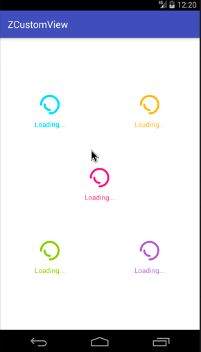

Android自定义动画系列四，今天来分享第四个自定义Loading动画（DoubleCircleBuilder），同样的先起了一个名字叫 `画两个圈圈` ，还是老规矩先介绍，后上图。

**实现效果在最后，GIF有点大，手机流量请三思。**

## 介绍

首先依旧是声明，做这些动画的初衷是为了学习和分享，所以希望大家可以指点错误，让我更好的进步。从这里起，我做一个系列的加载动画（截止时间：我放弃的时候）。
上一个动画链接：[Android自定义加载动画-旋转的叶子](http://www.jianshu.com/p/ef6db8217c7c)

## 正文

今天分享的这个动画很简单，适合用于基本的等待界面，或者视频加载界面，部分代码如下：

首先还是初始化：

```java
@Override
    protected void initParams(Context context)
    {
        //最大尺寸
        float outR = getAllSize();
        //小圆尺寸
        float inR = outR * 0.6f;
        //初始化画笔
        initPaint(inR * 0.4f);
        //旋转角度
        mRotateAngle = 0;
        //圆范围
        mOuterCircleRectF = new RectF();
        mOuterCircleRectF.set(getViewCenterX() - outR, getViewCenterY() - outR, getViewCenterX() + outR, getViewCenterY() + outR);
        mInnerCircleRectF = new RectF();
        mInnerCircleRectF.set(getViewCenterX() - inR, getViewCenterY() - inR, getViewCenterX() + inR, getViewCenterY() + inR);

    }

    /**
     * 初始化画笔
     */
    private void initPaint(float lineWidth)
    {
        mStrokePaint = new Paint(Paint.ANTI_ALIAS_FLAG);
        mStrokePaint.setStyle(Paint.Style.STROKE);
        mStrokePaint.setStrokeWidth(lineWidth);
        mStrokePaint.setColor(Color.WHITE);
        mStrokePaint.setDither(true);
        mStrokePaint.setFilterBitmap(true);
        mStrokePaint.setStrokeCap(Paint.Cap.ROUND);
        mStrokePaint.setStrokeJoin(Paint.Join.ROUND);
    }
```

之所以起名字叫`画两个圈圈`，就是因为，这个动画就是只画了两个圈圈，嘿嘿😁。一个270度的外圆，一个90度的内圆。绘制如下：

```java

    @Override
    protected void onDraw(Canvas canvas)
    {
        canvas.save();
        //外圆
        canvas.drawArc(mOuterCircleRectF, mRotateAngle % 360, OUTER_CIRCLE_ANGLE, false, mStrokePaint);
        //内圆
        canvas.drawArc(mInnerCircleRectF, 270 - mRotateAngle % 360, INTER_CIRCLE_ANGLE, false, mStrokePaint);
        canvas.restore();
    }

```

最后是旋转动画，修改每次绘制的角度。

```java

    @Override
    protected void computeUpdateValue(@FloatRange(from = 0.0, to = 1.0) float animatedValue)
    {
        mRotateAngle = (int) (360 * animatedValue);
    }

```

## 总结

小伙伴们，要是想看更多细节，可以前往文章最下面的Github链接，如果大家觉得ok的话，希望能给个喜欢，最渴望的是在Github上给个star。谢谢了。

如果大家有什么更好的方案，或者想要实现的加载效果，可以给我留言或者私信我，我会想办法实现出来给大家。谢谢支持。

## 演示



Github：[zyao89/ZCustomView](https://github.com/zyao89/ZCustomView)

`作者：Zyao89；转载请保留此行，谢谢；`

个人博客：[https://zyao89.cn](https://zyao89.cn)
