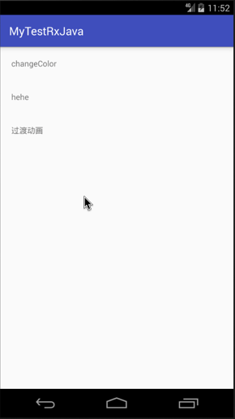

过渡动画是在 **Android4.4** 引入的新的动画框架，它本质还是属性动画，只不过是对属性动画做了一层封装，目的是方便开发者实现Activity或者View的过渡动画效果。

如果我们把属性动画比作微整容的话，那过渡动画就是换皮手术了。

过渡动画与属性动画最大的不同是需要为动画前后准备不同的布局文件，并通过对应的API实现两个布局之间的过渡动画。

<!-- more -->

## 介绍

在使用Transition Animation框架实现动画效果之前，我们先来做些简单的概念介绍。

* Scene: 定义了页面的当前状态信息， `Scene`的实例化一般通过静态工厂方法实现。

```java
public static Scene getSceneForLayout(ViewGroup sceneRoot, int layoutId, Context context) {
        ...
}
```

* Transition: 定义了界面之间切换的动画信息，我们可以使用`TransitionManager`指定使用那个`Transition`，如果不指定则会默认使用`AutoTransition`。

* TransitionManager: 控制`Scene`之间切换的控制器，切换常用的方法有以下两个，其中的`sDefaultTransition`就是默认的`AutoTransition`实例。

```java
public static void go(Scene scene) {
    changeScene(scene, sDefaultTransition);
}

public static void go(Scene scene, Transition transition) {
    changeScene(scene, transition);
}
```

## 使用方式

过渡动画被封装后，使用起来还是很简单的。

首先，定义同一个页面的两个布局，分别是动画前的布局和动画后的布局，我们将其命名为`activity_main.xml`和`activity_main_after.xml`，这两个布局文件的根布局具有相同的`android:id`值。

activity_main.xml 布局如下：

```java
<?xml version="1.0" encoding="utf-8"?>
<LinearLayout
    android:id="@+id/activity_main"
    xmlns:android="http://schemas.android.com/apk/res/android"
    android:layout_width="match_parent"
    android:layout_height="match_parent"
    android:orientation="vertical">

    <TextView
        android:layout_width="wrap_content"
        android:layout_height="wrap_content"
        android:padding="20dp"
        android:onClick="transitionAnimation"
        android:text="过渡动画"/>

    <TextView
        android:layout_width="wrap_content"
        android:layout_height="wrap_content"
        android:padding="20dp"
        android:onClick="showSnackbar"
        android:text="showSnackbar"/>
</LinearLayout>
```

动画后布局如下：

```java
<?xml version="1.0" encoding="utf-8"?>
<LinearLayout
    android:id="@+id/activity_main"
    xmlns:android="http://schemas.android.com/apk/res/android"
    android:layout_width="match_parent"
    android:layout_height="match_parent"
    android:orientation="vertical"
    android:gravity="bottom|right">

    <TextView
        android:layout_width="wrap_content"
        android:layout_height="wrap_content"
        android:padding="20dp"
        android:onClick="transitionAnimation_2"
        android:text="过渡动画"/>
</LinearLayout>
```

Activity代码实现如下：

```java
public class MainActivity extends AppCompatActivity
{

    @Override
    protected void onCreate (Bundle savedInstanceState)
    {
        super.onCreate(savedInstanceState);
        setContentView(R.layout.activity_main);
    }

    public void transitionAnimation (View view)
    {
        LinearLayout container = (LinearLayout) findViewById(R.id.activity_main);

        Scene scene1 = Scene.getSceneForLayout(container, R.layout.activity_main, this);
        Scene scene2 = Scene.getSceneForLayout(container, R.layout.activity_main_after, this);

        TransitionInflater transitionInflater = TransitionInflater.from(this);
        TransitionManager transitionManager = transitionInflater.inflateTransitionManager(R.transition.transition_manager, container);

        ChangeBounds changeBounds = new ChangeBounds();
        changeBounds.setDuration(5000);
        Fade fadeOut = new Fade(Fade.OUT);
        fadeOut.setDuration(3000);
        Fade fadeIn = new Fade(Fade.IN);
        fadeIn.setDuration(2000);
        TransitionSet transitionSet = new TransitionSet();
        transitionSet.setOrdering(TransitionSet.ORDERING_SEQUENTIAL)
                .addTransition(fadeOut)
                .addTransition(changeBounds)
                .addTransition(fadeIn);

        transitionManager.go(scene2, transitionSet);
    }

    public void transitionAnimation_2 (View view)
    {
        LinearLayout container = (LinearLayout) findViewById(R.id.activity_main);

        Scene scene1 = Scene.getSceneForLayout(container, R.layout.activity_main, this);
        Scene scene2 = Scene.getSceneForLayout(container, R.layout.activity_main_after, this);

        TransitionInflater transitionInflater = TransitionInflater.from(this);
        TransitionManager transitionManager = transitionInflater.inflateTransitionManager(R.transition.transition_manager, container);

        ChangeBounds changeBounds = new ChangeBounds();
        changeBounds.setDuration(5000);
        Fade fadeOut = new Fade(Fade.OUT);
        fadeOut.setDuration(3000);
        Fade fadeIn = new Fade(Fade.IN);
        fadeIn.setDuration(2000);
        TransitionSet transitionSet = new TransitionSet();
        transitionSet.setOrdering(TransitionSet.ORDERING_SEQUENTIAL)
                .addTransition(fadeOut)
                .addTransition(changeBounds)
                .addTransition(fadeIn);

        transitionManager.go(scene1, transitionSet);
    }

    public void showSnackbar (View view)
    {
        Snackbar.make(view, "Hello Zyao!!", Snackbar.LENGTH_LONG)
                .setAction("Cancel", new View.OnClickListener()
                {
                    @Override
                    public void onClick (View v)
                    {
                        showSnackbar(v);
                    }
                })
                .show();
    }
}
```

上面中的过渡动画XML文件需要放在`res/transition`目录中，其中`transition_manager.xml`定义如下。

```xml
<?xml version="1.0" encoding="utf-8"?>
<transitionManager xmlns:android="http://schemas.android.com/apk/res/android">
    <transition
        android:fromScene="@layout/activity_main"
        android:toScene="@layout/activity_main_after"
        android:transition="@transition/slow_auto_transition"/>
</transitionManager>
```

其中`slow_auto_transition`也是定义在`res/transition`目录中的自定义动画文件，如下。

```xml
<?xml version="1.0" encoding="utf-8"?>
<transitionSet xmlns:android="http://schemas.android.com/apk/res/android" android:transitionOrdering="sequential">
    <fade
        android:fadingMode="fade_out"
        android:duration="1000"/>
    <changeBounds
        android:duration="2000"
        android:interpolator="@android:interpolator/anticipate_overshoot"/>
    <fade
        android:fadingMode="fade_in"
        android:duration="1000"/>
</transitionSet>
```

## 动画演示



## 总结

虽然这种转场动画实现方式有很多，这次介绍的也不是什么新东西，也不是什么高科技，但是总要体验一把，感觉还是可以的，可以的，以的，的。

---

`作者：Zyao89；转载请保留此行，谢谢；`
