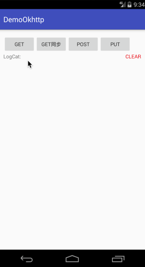

上一篇文章写的是 [Retrofit2.2说明-简单使用](../Retrofit2.2说明-简单使用/README.md)，文中主要介绍的是Retrofit的简单使用方法，具体涉及到的网络请求方面的内容，在这里一并介绍。

> Retrofit与okhttp共同出自于Square公司，retrofit就是对okhttp做了一层封装。网络请求依赖Okhttp，我们现在通过一些栗子，对OkHttp进行一定的了解。

首先说下OkHttp3是Java和Android都能用，Android还有一个著名网络库叫Volley，那个只有Android能用。

> 官网：<https://square.github.io/okhttp/>

## 引入

```groovy
compile 'com.squareup.okhttp3:okhttp:3.6.0'
```

## 初始化

```java
mOkHttpClient = new OkHttpClient.Builder()
                .connectTimeout(60, TimeUnit.SECONDS)
                .authenticator(new Authenticator()
                {
                    @Override
                    public Request authenticate(Route route, Response response) throws IOException
                    {//401，认证
                        String credential = Credentials.basic("zyao89", "password1");
                        return response.request().newBuilder().header("Authorization", credential).build();
                    }
                })
                .cookieJar(new CookieJar()
                {//这里可以做cookie传递，保存等操作
                    @Override
                    public void saveFromResponse(HttpUrl url, List<Cookie> cookies)
                    {//可以做保存cookies操作
                        System.out.println("cookies url: " + url.toString());
                        for (Cookie cookie : cookies)
                        {
                            System.out.println("cookies: " + cookie.toString());
                        }
                    }

                    @Override
                    public List<Cookie> loadForRequest(HttpUrl url)
                    {//加载新的cookies
                        ArrayList<Cookie> cookies = new ArrayList<>();
                        Cookie cookie = new Cookie.Builder()
                                .hostOnlyDomain(url.host())
                                .name("SESSION").value("zyao89")
                                .build();
                        cookies.add(cookie);
                        return cookies;
                    }
                })
                .build();
```

* `authenticator()` 此方法可进行请求认证操作。
* `cookieJar ()` 次方法可进行cookies保留，和自定义cookies。（可用于存储sessionID等信息，保存链接身份）

## Get请求

* 异步

```java
public void get()
    {
        Request request = new Request.Builder()
                .url("http://200.200.200.182:9999/login")
                .build();

        Call call = mOkHttpClient.newCall(request);
        call.enqueue(getCallback());
    }
```

```java
/**
     * 请求回调
     * @return
     */
    private Callback getCallback()
    {
        return new Callback()
        {//子线程回调
            @Override
            public void onResponse(Call call, Response response)
            {
                printLogCat("Code: " + response.code());
                printLogCat("Message: " + response.message());

                if (response.isSuccessful())
                {
                    try
                    {
                        printLogCat("Body: " + response.body().string());
                    }
                    catch (IOException e)
                    {
                        e.printStackTrace();
                        printLogCat("ERROR: " + "response'body is error");
                    }
                }
                else
                {
                    printLogCat("ERROR: " + "okHttp is request error");
                }
                printLogCat("");
            }

            @Override
            public void onFailure(Call call, IOException e)
            {
                printLogCat("ERROR: " + e.getMessage());
                printLogCat("");
            }
        };
    }
```

* 同步

```java
public void getSyc()
    {
        new Thread(new Runnable() {
            @Override
            public void run()
            {
                Request request = new Request.Builder()
                        .url("http://200.200.200.182:9999/login")
                        .build();
                Call call = mOkHttpClient.newCall(request);
                try
                {
                    Response response = call.execute();
                    sycCallback(response);
                }
                catch (IOException e)
                {
                    e.printStackTrace();
                }
            }
        }).start();
    }
```

```java
private void sycCallback(Response response)
    {
        printLogCat("Code: " + response.code());
        printLogCat("Message: " + response.message());

        if (response.isSuccessful())
        {
            try
            {
                printLogCat("Body: " + response.body().string());
            }
            catch (IOException e)
            {
                e.printStackTrace();
                printLogCat("ERROR: " + "response'body is error");
            }
        }
        else
        {
            printLogCat("ERROR: " + "okHttp is request error");
        }
        printLogCat("");
    }
```

response的body有很多种输出方法，`string()`只是其中之一，注意是`string()`不是toString()。如果是下载文件就是`response.body().bytes()`。
另外可以根据`response.code()`获取返回的状态码。

## Post请求

同步异步都与get方法一致，后面提供异步栗子：

```java
public void post()
    {
        String data = "{\"username\" : \"admin\", \"password\" : \"12345\"}";
        RequestBody requestBody = RequestBody.create(JSON, data);
        Request request = new Request.Builder()
                .url("http://200.200.200.182:9999/login")
                .post(requestBody)
                .build();

        Call call = mOkHttpClient.newCall(request);
        call.enqueue(getCallback());
    }
```

RequestBody的数据格式都要指定Content-Type，常见的有：

- application/x-www-form-urlencoded 数据是个普通表单
- multipart/form-data 数据里有文件
- application/json 数据是个Json
- text/x-markdown  文本MarkDown

除了`RequestBody`，也可用`FormBody`（继承于RequestBody），如：

```java
RequestBody formBody = new FormBody.Builder()
                .add("username", "admin2")
                .add("password", "12222333")
                .add("message", "zyao89")
                .build();
```

从源码中可看到，`FormBody`中已指定Content-Type格式为`application/x-www-form-urlencoded`

```java
private static final MediaType CONTENT_TYPE =
      MediaType.parse("application/x-www-form-urlencoded");
```

假如是个Json数据，则：

```java
private static final MediaType JSON =
      MediaType.parse("application/json; charset=utf-8");
```

图片文件数据，则：

```java
public void postFile(File file)
    {
        MultipartBody multipartBody = new MultipartBody.Builder()
                .setType(MultipartBody.FORM)
                .addFormDataPart("file", file.getName(), RequestBody.create(MediaType.parse("image/png"), file))
                .build();
        Request request = new Request.Builder()
                .url("http://200.200.200.182:9999/file")
                .post(multipartBody)
                .build();

        Call call = mOkHttpClient.newCall(request);
        call.enqueue(getCallback());
    }
```

`MultipartBody`也是继承了`RequestBody`，从源码可知它适用于这五种Content-Type:

```java
  public static final MediaType MIXED = MediaType.parse("multipart/mixed");

  public static final MediaType ALTERNATIVE = MediaType.parse("multipart/alternative");

  public static final MediaType DIGEST = MediaType.parse("multipart/digest");

  public static final MediaType PARALLEL = MediaType.parse("multipart/parallel");

  public static final MediaType FORM = MediaType.parse("multipart/form-data");
```

MediaType类型可参考W3Scholl [MIME 参考手册](http://www.w3school.com.cn/media/media_mimeref.asp)

## PUT \ DELETE 等其它请求

这里只对**PUT**举个栗子，其它类型差不多。

```java
    public void put()
    {
        FormBody formBody = new FormBody.Builder()
                .add("username", "admin2")
                .add("password", "12222333")
                .add("message", "zyao89")
                .build();
        Request request = new Request.Builder()
                .url("http://200.200.200.182:9999/put")
                .header("Accept", "application/json; q=0.5")//添加请求头，方式一
                .addHeader("Accept", "*")//添加请求头，方式二
                .put(formBody)
                .build();

        Call call = mOkHttpClient.newCall(request);

        call.enqueue(getCallback());
    }
```

上面栗子中，`Request`在创建时，可自行增加`header`请求头:

```java
.header("Accept", "application/json; q=0.5")//添加请求头，方式一
.addHeader("Accept", "*")//添加请求头，方式二
```

## 客户端Cookie 与 服务器Session 自动管理

业务中经常出现客户端登录请求结束后，服务端会返回一个带有唯一登录认证信息Session的Response，其中Session就藏在Cookie中，那么如何让下一次Request请求创建时，可以将这个认证信息放入其中呢？

OkHttp为我们提供了简便的管理方法，可自动携带，保存和更新Cookie信息；方法如下：

```java
//cookie存储
private ConcurrentHashMap<String, List<Cookie>> cookieStore = new ConcurrentHashMap<>();

mOkHttpClient = new OkHttpClient.Builder()
                .cookieJar(new CookieJar()
                {//这里可以做cookie传递，保存等操作
                    @Override
                    public void saveFromResponse(HttpUrl url, List<Cookie> cookies)
                    {//可以做保存cookies操作
                        cookieStore.put(url.host(), cookies);
                    }

                    @Override
                    public List<Cookie> loadForRequest(HttpUrl url)
                    {//加载新的cookies
                        List<Cookie> cookies = cookieStore.get(url.host());
                        return cookies != null ? cookies : new ArrayList<Cookie>();
                    }
                })
                .build();
```

如此设置后，在同一个域名地址情况下，发送Request都不用管理Cookie了，并且可以通过cookieStore获取已存储的Cookie，如此可达到自动管理。

## Demo演示图



Github项目地址：[zyao89/DemoOkHttp](https://github.com/zyao89/DemoOkHttp)

## Author Blog

[zyao89.cn](https://zyao89.cn)

---

`作者：Zyao89；转载请保留此行，谢谢；`
`原文网站：https://www.zyao89.cn`
`祝你好运，谢谢支持`
