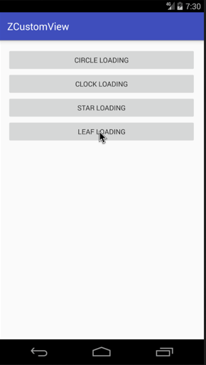

Android自定义动画系列三，今天来分享第三个自定义Loaidng动画，同样的先起了一个名字叫 `旋转的叶子` ，还是老规矩先介绍，后上图。

**实现效果在最后，GIF有点大，手机流量请三思。**

## 介绍

首先依旧是声明，做这些动画的初衷是为了学习和分享，所以希望大家可以指点错误，让我更好的进步。从这里起，我做一个系列的加载动画（截止时间：我放弃的时候）。
上一个动画链接：[Android自定义动画-StarLoadingView](../Android自定义动画-StarLoadingView/README.md)

<!-- more -->

## 正文

今天这个动画是我做上个`蹦跶的星星`时，无意中绘制出来的图形，感觉挺好看的，就把它做了出来，部分代码如下：

先是初始化，参数定义如下注释

```java
    @Override
    protected void initParams(Context context)
    {
        initPaint();

   //最外层半径
        mStarOutR = getAllSize();
        //外层贝塞尔曲线中间值
        mStarOutMidR = mStarOutR * 0.9f;
        //内层半径
        mStarInR = mStarOutR * 0.7f;
        //内层贝塞尔曲线中间值
        mStarInMidR = mStarOutR * 0.3f;

        //中心圆半径
        mCenterCircleR = dip2px(context, 3);
        //旋转角度
        mRotateAngle = 0;
    }

    /**
     * 初始化画笔
     */
    private void initPaint()
    {
        mFullPaint = new Paint(Paint.ANTI_ALIAS_FLAG);
        mFullPaint.setStyle(Paint.Style.FILL);
        mFullPaint.setStrokeWidth(2);
        mFullPaint.setColor(Color.WHITE);
        mFullPaint.setDither(true);
        mFullPaint.setFilterBitmap(true);
    }

```

```java

    @Override
    protected void onDraw(Canvas canvas)
    {
        canvas.save();
        //旋转
        canvas.rotate(mRotateAngle, getViewCenterX(), getViewCenterY());
        //路径
        Path starPath = createStarPath(5, -18);
        //路径加入中心圆
        starPath.addCircle(getViewCenterX(), getViewCenterY(), mCenterCircleR, Path.Direction.CW);
        //这个很关键，选择路径填充方式
        starPath.setFillType(Path.FillType.EVEN_ODD);
        //绘制
        canvas.drawPath(starPath, mFullPaint);
        canvas.restore();
    }

```

以下是绘制的方法，和动画三个阶段的切换，很关键。这次弄了个动画阶段来丰富动画内容，感觉还是不错的。😄

```java
    /**
     * 绘制五叶草
     *
     * @param num        角数量
     * @param startAngle 初始角度
     * @return
     */
    private Path createStarPath(int num, int startAngle)
    {
        final Path path = new Path();
        int angle = 360 / num;
        int roundSize = 5;//圆角弧度
        int offsetAngle = angle / 2;
        path.moveTo(getViewCenterX() + mStarOutMidR * cos(startAngle - roundSize), getViewCenterY() + mStarOutMidR * sin(startAngle - roundSize));
        for (int i = 0; i < num; i++)
        {
            int value = angle * i + startAngle;
            path.lineTo(getViewCenterX() + mStarOutMidR * cos(value - roundSize), getViewCenterY() + mStarOutMidR * sin(value - roundSize));
            //圆角
            path.quadTo(getViewCenterX() + mStarOutR * cos(value), getViewCenterY() + mStarOutR * sin(value), getViewCenterX() + mStarOutMidR * cos(value + roundSize), getViewCenterY() + mStarOutMidR * sin(value + roundSize));
            path.lineTo(getViewCenterX() + mStarInR * cos(value + offsetAngle - roundSize), getViewCenterY() + mStarInR * sin(value + offsetAngle - roundSize));
            //内圆角
            path.quadTo(getViewCenterX() + mStarInMidR * cos(value + offsetAngle), getViewCenterY() + mStarInMidR * sin(value + offsetAngle), getViewCenterX() + mStarInR * cos(value + offsetAngle + roundSize), getViewCenterY() + mStarInR * sin(value + offsetAngle + roundSize));
        }
        path.close();
        return path;
    }

    @Override
    protected void computeUpdateValue(@FloatRange(from = 0.0, to = 1.0) float animatedValue)
    {
        switch (mCurrAnimatorState)//以下分为三个阶段
        {
            case 0://第一阶段，旋转、放大
                mStarOutMidR = getAllSize() * animatedValue;
                mRotateAngle = (int) (360 * animatedValue);
                break;
            case 1://第二阶段，逆时针旋转
                mRotateAngle = (int) (360 * (1 - animatedValue));
                break;
            case 2://第三阶段，缩小
                mStarOutMidR = getAllSize() * (1 - animatedValue);
                break;
        }
    }

    @Override
    public void onAnimationRepeat(Animator animation)
    {
        if (++mCurrAnimatorState > FINAL_STATE)
        {//还原到第一阶段
            mCurrAnimatorState = 0;
        }
    }


```

## 总结

小伙伴们，动画应该还是可以的吧，要是想看更多细节，可以前往文章最下面的Github链接，如果大家觉得ok的话，希望能给个喜欢，最渴望的是在Github上给个star。谢谢了。

## 演示



Github：[zyao89/ZCustomView](https://github.com/zyao89/ZCustomView)

`作者：Zyao89；转载请保留此行，谢谢；`

个人博客：[zyao89.cn](http://zyao89.github.io)
