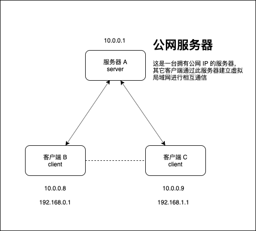

<!-- more -->

## 需求

通过 OpenVPN 实现无公网IP的内网穿透。

内网穿透方法很多，常用得有ngrok，frp，花生壳等。我选择OpenVpn主要是安全性更好点。花生壳、ngrok和frp，实现得内网穿透。知道你域名或者外网IP就能直接连到你得对应机器得端口上。
而openvpn方式有点不一样。A服务器运行server，B客户机运行client连接A服务器，C客户机运行client连接A服务器。然后B就能直接与C通信。

其中只要 A服务器 拥有公网IP即可。



## 搭建server

```sh
wget https://git.io/vpn -O openvpn-install.sh && bash openvpn-install.sh
```

备用地址

> wget {{ $withDemoBase(require('./demo/openvpn-install.sh')) }} -O openvpn-install.sh && bash openvpn-install.sh

一键傻瓜式，只要填入相关信息就可搭建成功。

## 配置调整

其实任何东西都不修改的情况下，客户机直接使用生成的client.ovpn即可跑起来了。
不过这样的话。所有流量都是走的服务器上，对于我来说。只是想要B和C能通信，并不需要全局走openvpn。那么需要修改下2个东西即可。

## 修改server.ovpn

在 `/etc/openvpn/server.conf` 文件中，注释掉以下这一行

```sh
# push "redirect-gateway def1 bypass-dhcp"
```

## 修改client.ovpn

在生成的 `client.ovpn` 文件中，注释掉这一行

```sh
# setenv opt block-outside-dns
```

或者

在 `/etc/openvpn/client-template.txt` 模版文件中，注释掉这一行

```sh
# setenv opt block-outside-dns
```

## 最后

修改后，所有流量还是正常走本地，但是B和C可以使用openvpn分配的内网IP进行通信。

至于用途，比如用ipad连上openvpn后。就可以直接访问家里PC的后台服务等等。

## 其它

### 区分用户配置

可以根据客户端用户名区分配置，例如：

在 `/etc/openvpn/` 目录下创建 `ccd` 文件夹，可以根据不同的用户名创建相应的配置文件

创建用户名对应的文件，并编辑内容：

```sh
# 分配固定的ip
ifconfig-push 10.8.0.20 255.255.255.0
# 推送当前客户端下的路由段
push "route 192.168.1.0 255.255.255.0"
```

#### 例如

客户端 A，提供了 `192.168.1.0/24` 网段，则可增加配置 `/etc/openvpn/ccd/clientA`

```sh
# 分配固定的ip
ifconfig-push 10.8.0.100 255.255.255.0
# 推送当前客户端下的路由段
push "route 192.168.1.0 255.255.255.0"
```

同理，客户端 B，提供了 `192.168.2.0/24` 网段，则可增加配置 `/etc/openvpn/ccd/clientB`

```sh
# 分配固定的ip
ifconfig-push 10.8.0.110 255.255.255.0
# 推送当前客户端下的路由段
push "route 192.168.2.0 255.255.255.0"
```

这时候 客户端A 下的网络就可以访问到 客户端B 下的内网网络了。

### 查看当前链接

在 `/var/log/openvpn/` 文件下可查看当前接入的输出日志

```sh
cat /var/log/openvpn/status.log
```

参考：

- <https://caibaoz.com/blog/2014/12/21/openvpn-connect-two-lans-asus-ac87u/>
- <https://caibaoz.com/blog/2015/07/12/openvpn-connect-two-lans-windows/>
- <https://zlxdike.github.io/2019/04/28/OpenVpn%E5%86%85%E7%BD%91%E7%A9%BF%E9%80%8F/>
